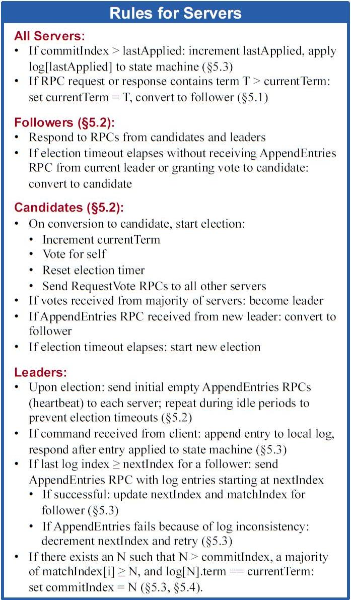

# 共识算法

## 拜占庭错误

### POW -- Proof of Work 工作量证明

1. 通过体现对哈希算法问题的解答获得证明

### POS -- Proof of Stake 股权证明

1. 根据持有数字货币的量和时间, 分配相应的利息

### DPOS -- Delegated Proof of Stake 委任权益证明

1. 比特股的 DPoS 机制, 股份授权证明机制 (又称受托人机制)
3. DPOS的出现最主要是因为矿机的产生, 大量的算力集中在不了解也不关心比特币的人身上
2. 让每一个持有比特股的人进行投票, 由此产生101位代表 (权利相等的超级节点/矿池), 通过代表生成区块, 再分成

### PBFT -- Practical Byzantine Fault Tolerance 实用拜占庭容错算法

1. PBFT 是一种状态机副本复制算法, 即服务作为状态机进行建模, 状态机在分布式系统的不同节点进行副本复制
2. 每个状态机的副本都保存了服务的状态, 同时也实现了服务的操作
3. 将所有的副本组成的集合使用大写字母 R 表示, 使用0到 |R|-1 的整数表示每一个副本
4. 假设 |R|=3f+1, 这里 f 是有可能失效的副本的最大个数, 尽管可以存在多于 3f+1 个副本, 但是额外的副本除了降低性能之外不能提高可靠性

至于说算法的选择, 这里引用万达季总的这一段话作为结束:

一言以蔽之, 共识最好的设计是模块化, 例如Notary
共识算法的选择与应用场景高度相关, 可信环境使用 paxos 或者 raft. 带许可的联盟可使用 pbft , 非许可链可以是 pow, pos, ripple 共识等
根据对手方信任度分级, 自由选择共识机制, 这样才是真的最优

## 非拜占庭错误

### Paxos

场景: MySQL cluster

### Multi-Paxos

### Raft

场景: TiDB

Raft 与 Multi-Paxos 相似的概念:

Raft 与 Multi-Paxos 不同的概念:

#### 总结

Raft 算法各节点维护的状态:

Leader 的选举:

日志同步:

Raft 状态机:

安装 snapshot:

#### vote

vote 原则:
- 在任一任期内, 单个节点最多只能投一票(因此单数节点更容易保证 majority vote)
- 候选人知道的信息不能比自己的少
- `first-come-first-served` 先来先得

candidate 步骤:
- 增加节点本地的 `current term`, 切换到 candidate 状态
- 投自己一票
- 并行给其他节点发送 RequestVote RPCs
- 等待其他节点的回复

在选举 leader 中可能出现:
1. 收到 majority 的投票(含自己的一票), 则赢得选举, 成为 leader
2. 被告知别人已当选, 那么自行切换到 follower
3. 一段时间内没有收到 majority 投票, 则保持 candidate 状态, 重新发出选举

#### client 到 leader 的请求过程

- leader append log entry
- leader issue AppendEntries RPC in parallel
- leader wait for majority response
- leader apply entry to state machine
- leader reply to client
- leader notify follower apply log

#### 总结

leader election 约束:

1. 同一任期内最多只能投一票, 先来先得
2. 选举人必须比自己知道的更多(比较 term, log index)

log replication 约束:
1. 一个 log 被复制到大多数节点(committed), 保证不会回滚
2. leader 一定包含最新的 committed log, 因此 leader 只会追加日志, 不会删除覆盖日志
3. 不同节点, 某个位置上日志相同, 那么这个位置之前的所有日志一定是相同的
4. Raft never commits log entries from previous terms by counting replicas.(通过复制当前 term 的日志并携带旧 term 的日志来保证第 3 点)

### Gossip

场景: Redis cluster
