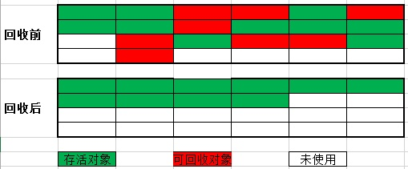
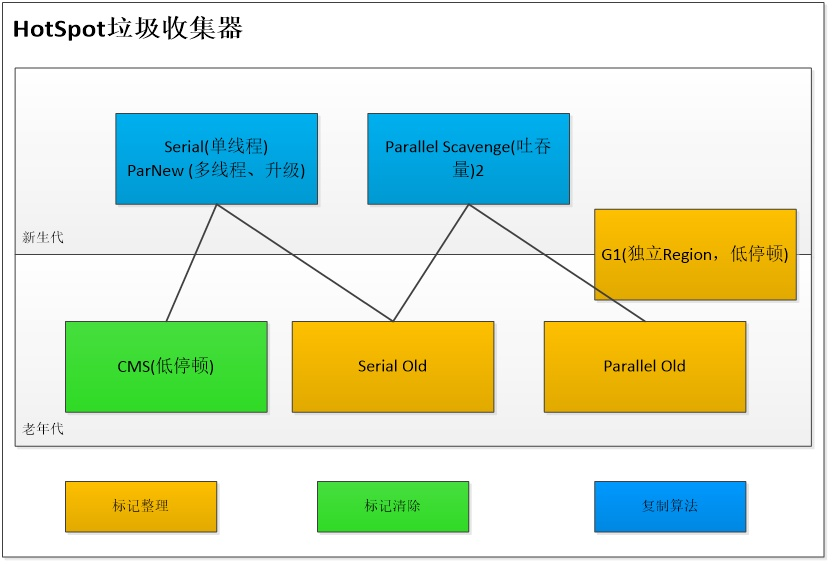

# JVM

## GC

GC 会对 方法区(HotSpot 中的永久代) 进行垃圾收集, 包括收集 无用的类 和 废弃常量

### Java 语言规范

任何一种 JVM-GC 都需要满足:
- 发现无用信息对象
- 回收被无用对象占用的内存空间, 使该空间可被再次使用

### 引用计算法

- 当一个对象被创建时, 给该对象实例分配给一个变量
- 引用 +1 , 解引用 -1
- 当引用为 0 时, 认为该对象可以被回收
- 同时某对象被回收时, 它引用的所有对象的引用计数 -1

优点:
- 执行快

缺点:
- 不解决循环引用问题

### 可达性分析

- 以一系列 "GC Roots" 的对象作为起点, 从这些节点开始向下搜索, 搜索所走过的路径称为引用链(Reference Chain)
- 如果存在某对象, GC Roots 到该对象不可达, 则认为该对象是不可用的
- GC Roots 的不可达只是标记 某对象的必要条件, 后续等待筛选
- 筛选的条件是此对象是否有必要执行 `finalize()` 方法: 当对象没有覆盖 `finalize()` 方法或者 `finalize()` 方法已经被虚拟机调用过, 则虚拟机将这两种情况视为 "没有必要执行"
- 如果该对象被判断为有必要执行 `finalize()` , 那么该对象会被放置到 `F-Queue` 队列中, 该队列由虚拟机创建的低优先级的 Finalizer 线程负责运行, 但是虚拟机不 "承诺" 会等待该线程执行结束

在 Java 中, 可作为 CG Roots 的对象包括:
- 虚拟机栈(栈帧中的本地变量表) 中引用的对象
- 方法区中 类静态属性 引用的变量
- 方法区中 常量 引用的变量
- 本地方法中 JNI(Native 方法) 引用的变量

### 垃圾收集算法

#### 标记-清除算法


#### 标记-整理算法



#### 复制算法

- 把堆分为一个对象面和多个空闲面
- 对象面用于为对象分配内存
- 对象面满后, GC 就从根集中扫描活动对象, 并将每个对象复制到空闲面, 该空闲面设为对象面, 原对象面清除并设置为空闲面, 之后在新对象面中分配内存
- 典型 copy 算法: stop-and-copy 算法(Golang)
  - 将堆分成对象面和空闲区域面, 在对象面与空闲区域面的切换过程中, 程序暂停执行

#### 分代回收算法

- 根据对象的生命周期的不同将内存划分为几块:
  - 新生代: 大批对象死去、少量对象存活的 -- 复制算法/复制成本低
  - 老年代: 对象存活率高、没有额外空间进行分配担保 -- 标记-清理算法 OR 标记-整理算法

#### 垃圾收集器

JDK7/8后，HotSpot虚拟机所有收集器及组合




#### JDK11 - ZGC

开启:

```shell
-XX:+UnlockExperimentalVMOptions -XX:+UseZGC
```

特点:
- 低停顿高并发
- 除了初始标记的是 STW (stop-the-world) , 几乎在所有地方并发执行的

设计目标:
- TB 级别的堆内存管理
- 最大 GC Pause 不高于 10ms
- 最大的吞吐率 (Throughput) 损耗不高于 15%

关键技术:
- 着色指针(Colored Pointer):
  - 指针 64 位中的几位表示 `Finalizable` / `Remapped` / `Marked1` / `Marked0` (ZGC仅支持64位平台), 以标记该指向内存的存储状态
- 读屏障(Load Barrier):
  - 由于着色指针的存在, 在程序运行时访问对象的时候, 可以轻易知道对象在内存的存储状态
  - 若请求读的内存在被着色了, 那么则会触发读屏障

与标记对象的传统算法相比, ZGC 在指针上做标记, 在访问指针时加入 Load Barrier (读屏障)

- 在标记阶段它会把指针标记上并把堆里的这个指针给 "修正" 到新的标记后的值
- 而在移动对象的阶段, 这个屏障会把读出的指针更新到对象的新地址上, 并且把堆里的这个指针"修正"到原本的字段里
