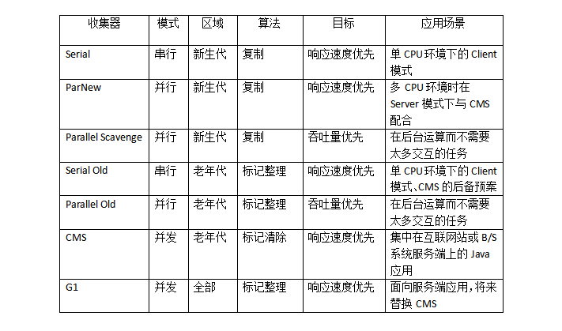

# JVM

## GC

GC 会对 方法区(HotSpot 中的永久代) 进行垃圾收集, 包括收集 无用的类 和 废弃常量

### Java 语言规范

任何一种 JVM-GC 都需要满足:
- 发现无用信息对象
- 回收被无用对象占用的内存空间, 使该空间可被再次使用

### 引用计算法

- 当一个对象被创建时, 给该对象实例分配给一个变量
- 引用 +1 , 解引用 -1
- 当引用为 0 时, 认为该对象可以被回收
- 同时某对象被回收时, 它引用的所有对象的引用计数 -1

优点:
- 执行快

缺点:
- 不解决循环引用问题

### 可达性分析

- 以一系列 "GC Roots" 的对象作为起点, 从这些节点开始向下搜索, 搜索所走过的路径称为引用链(Reference Chain)
- 如果存在某对象, GC Roots 到该对象不可达, 则认为该对象是不可用的
- GC Roots 的不可达只是标记 某对象的必要条件, 后续等待筛选
- 筛选的条件是此对象是否有必要执行 `finalize()` 方法: 当对象没有覆盖 `finalize()` 方法或者 `finalize()` 方法已经被虚拟机调用过, 则虚拟机将这两种情况视为 "没有必要执行"
- 如果该对象被判断为有必要执行 `finalize()` , 那么该对象会被放置到 `F-Queue` 队列中, 该队列由虚拟机创建的低优先级的 Finalizer 线程负责运行, 但是虚拟机不 "承诺" 会等待该线程执行结束

在 Java 中, 可作为 CG Roots 的对象包括:
- 虚拟机栈(栈帧中的本地变量表) 中引用的对象
- 方法区中 类静态属性 引用的变量
- 方法区中 常量 引用的变量
- 本地方法中 JNI(Native 方法) 引用的变量

### 垃圾收集算法 -- 理论

#### 三色标记法

- 白: 对象没有被标记到, 标记阶段结束后, 会被当做垃圾回收掉
- 灰: 对象被标记了, 但是它的 field 还没有被标记或标记完
- 黑: 对象被标记了, 且它的所有 field 也被标记完了

#### 标记-清除算法


#### 标记-整理算法


#### 复制算法

- 把堆分为一个对象面和多个空闲面
- 对象面用于为对象分配内存
- 对象面满后, GC 就从根集中扫描活动对象, 并将每个对象复制到空闲面, 该空闲面设为对象面, 原对象面清除并设置为空闲面, 之后在新对象面中分配内存
- 典型 copy 算法: stop-and-copy 算法(Golang)
  - 将堆分成对象面和空闲区域面, 在对象面与空闲区域面的切换过程中, 程序暂停执行

#### 分代回收算法

- 根据对象的生命周期的不同将内存划分为几块:
  - 新生代: 大批对象死去、少量对象存活的 -- 复制算法/复制成本低
  - 老年代: 对象存活率高、没有额外空间进行分配担保 -- 标记-清理算法 OR 标记-整理算法

#### 垃圾收集器

JDK7/8 后, HotSpot 虚拟机所有收集器及组合




新生代和老年代的组合

| 新生代(别名)                   | 老年代                   | JVM 参数                |
| :-                             | :-                       | :-                      |
| Serial (DefNew)                | Serial Old(PSOldGen)     | -XX:+UseSerialGC        |
| Parallel Scavenge (PSYoungGen) | Serial Old(PSOldGen)     | -XX:+UseParallelGC      |
| Parallel Scavenge (PSYoungGen) | Parallel Old (ParOldGen) | -XX:+UseParallelOldGC   |
| ParNew (ParNew)                | Serial Old(PSOldGen)     | -XX:-UseParNewGC        |
| ParNew (ParNew)                | CMS+Serial Old(PSOldGen) | -XX:+UseConcMarkSweepGC |
| G1                             | G1                       | -XX:+UseG1GC            |

> 注: ParNew -- Serial 收集器的多线程版本

#### 工具

- jinfo

### G1 -- Garbage-First Garbage Collector

正式发布: `JDK 7u4`

作为 default GC: `JEP 248`

开启: `-XX:+UseG1GC`

feature:
- Can operate concurrently with applications threads like the CMS collector.
- Compact free space without lengthy GC induced pause times.
- Need more predictable GC pause durations.
- Do not want to sacrifice a lot of throughput performance.
- Do not require a much larger Java heap.

特性:
- 像CMS收集器一样,  能与应用程序线程并发执行
- 整理空闲空间更快
- 需要更多的时间来预测gc停顿时间
- 不希望牺牲大量的吞吐性能
- 不需要更大的Java heap

#### 概念

##### Region

堆内存划分为 老年代(O-Older)/新生代(E-Eden)/幸存区(S-Service)/巨大对象(H-Humongous Object)

H-Obj 的特征:
- H-Obj 直接分配到了 old gen , 防止了反复拷贝移动
- H-Obj 在 `global concurrent marking` 阶段的 cleanup 和 full GC 阶段回收
- 在分配 H-Obj 之前先检查是否超过 initiating heap occupancy percent 和 the marking threshold , 如果超过的话, 就启动 global concurrent marking, 为的是提早回收, 防止 evacuation failures 和 full GC

设置: `-XX:G1HeapRegionSize`

Region 有 两个 top-at-mark-start(TAMS)指针, 分别为 `prevTAMS` 和 `nextTAMS`

```cpp
// share/vm/gc_implementation/g1/heapRegion.cpp

// Minimum region size; we won't go lower than that.
// We might want to decrease this in the future, to deal with small
// heaps a bit more efficiently.
#define MIN_REGION_SIZE  (      1024 * 1024 )
// Maximum region size; we don't go higher than that. There's a good
// reason for having an upper bound. We don't want regions to get too
// large, otherwise cleanup's effectiveness would decrease as there
// will be fewer opportunities to find totally empty regions after
// marking.
#define MAX_REGION_SIZE  ( 32 * 1024 * 1024 )
// The automatic region size calculation will try to have around this
// many regions in the heap (based on the min heap size).
#define TARGET_REGION_NUMBER          2048
void HeapRegion::setup_heap_region_size(size_t initial_heap_size, size_t max_heap_size);
```

##### SATB/Snapshot-At-The-Beginning

通过 Root Tracing 得到的 **GC 开始时活着的对象的快照** , 作用是 **维持并发 GC 的正确性**

在并发阶段, Mutator 和 Garbage Collector 线程同时对对象进行修改, 在以下前提下, 可能导致白对象漏标:
- Mutator 赋予一个黑对象该白对象的引用
- Mutator 删除了所有从灰对象到该白对象的直接或者间接引用

为了避免 Mutator 删除了灰对象到白对象的引用导致白对象被回收, 则需要通过 **SATB 在 Write Barrier 时期将旧引用记录**

SATB 会导致 **float garbage**

```cpp
//  share/vm/gc_implementation/g1/g1SATBCardTableModRefBS.hpp

// This notes that we don't need to access any BarrierSet data
// structures, so this can be called from a static context.
template <class T> static void write_ref_field_pre_static(T* field, oop newVal) {
  T heap_oop = oopDesc::load_heap_oop(field);
  if (!oopDesc::is_null(heap_oop)) {
    enqueue(oopDesc::decode_heap_oop(heap_oop));
  }
}

// share/vm/gc_implementation/g1/g1SATBCardTableModRefBS.cpp

void G1SATBCardTableModRefBS::enqueue(oop pre_val) {
  // Nulls should have been already filtered.
  assert(pre_val->is_oop(true), "Error");
  if (!JavaThread::satb_mark_queue_set().is_active()) return;
  Thread* thr = Thread::current();
  if (thr->is_Java_thread()) {
    JavaThread* jt = (JavaThread*)thr;
    jt->satb_mark_queue().enqueue(pre_val);
  } else {
    MutexLockerEx x(Shared_SATB_Q_lock, Mutex::_no_safepoint_check_flag);
    JavaThread::satb_mark_queue_set().shared_satb_queue()->enqueue(pre_val);
  }
}
```

##### RSet/Remembered Set

- points-into: 谁引用了我的对象
- points-out: 我引用了谁的对象
- Collection Set(CSet): 它记录了当次 GC 要收集的 Region 集合, 集合里的 Region 可以是任意年代的
- Card Table(Card): points-out, 每个 Region 有多个 Card, 每个 Card 覆盖一定范围的 Heap, Card 会记录本 Region, 本 Heap 引用的其他 Region 的 Card
- RSet: points-into
  - 每个 Region 都有一个 RSet, 每个 Region 会记录下别的 Region 引用本 Region 中的对象的关系, 并标记这些指针分别在哪些 Card 的范围内
  - Hash Table, Key 是别的 Region 的起始地址, Value 是一个集合, 里面的元素是 Card Table 的 Index


- 蓝色实线: points-out
- 红色虚线: points-into
- 双向绑定(??)

```cpp
void oop_field_store(oop* field, oop new_value) {
  pre_write_barrier(field);             // pre-write barrier: for maintaining SATB invariant
  *field = new_value;                   // the actual store
  post_write_barrier(field, new_value); // post-write barrier: for tracking cross-region reference
}
```

- post-write barrier 记录了跨 Region 的引用更新, 更新日志缓冲区则记录了那些包含更新引用的 Cards
- 一旦缓冲区满了, Post-write barrier 就停止服务了, 会由 Concurrent refinement threads 处理这些缓冲区日志

RSet 的引入使得:
- 在做 YGC 的时候, 只需要选定 young generation region 的 RSet 作为根集, 这些 RSet 记录了 old->young 的跨代引用, 避免了扫描整个 old generation
- 而 mixed GC 的时候, old generation 中记录了 old->old 的 RSet, young->old 的引用由扫描全部 young generation region 得到, 也不用扫描全部 old generation region

##### Pause Prediction Model

停顿预测模型

基于 `-XX:MaxGCPauseMillis` 的目标停顿时间

```cpp
//  share/vm/gc_implementation/g1/g1CollectorPolicy.hpp

double get_new_prediction(TruncatedSeq* seq) {
    return MAX2(seq->davg() + sigma() * seq->dsd(),
                seq->davg() * confidence_factor(seq->num()));
}
```

- TruncateSeq: 序列中的最新的 n 个元素的一个截断的序列
- davg: 截断序列的衰减均值
- sigma: 表示信赖度的系数
- dsd: 衰减标准偏差
- confidence_factor: 可信度相关系数

G1 GC 过程中, 每个可测量的步骤花费的时间都会记录到 TruncateSeq(和 AbsSeq 相似)中, 用来计算衰减均值、衰减变量、衰减标准偏差等:

```cpp
// src/share/vm/utilities/numberSeq.cpp

void AbsSeq::add(double val) {
  if (_num == 0) {
    // if the sequence is empty, the davg is the same as the value
    _davg = val;
    // and the variance is 0
    _dvariance = 0.0;
  } else {
    // otherwise, calculate both
    _davg = (1.0 - _alpha) * val + _alpha * _davg;
    double diff = val - _davg;
    _dvariance = (1.0 - _alpha) * diff * diff + _alpha * _dvariance;
  }
}
```

例如, 预测一次 GC 中, 更新 RSet (将 Dirty Card 加入到 RSet 中) 的时间:

```cpp
//  share/vm/gc_implementation/g1/g1CollectorPolicy.hpp

double predict_rs_update_time_ms(size_t pending_cards) {
   return (double) pending_cards * predict_cost_per_card_ms();
}
double predict_cost_per_card_ms() {
   return get_new_prediction(_cost_per_card_ms_seq);
}
```

#### GC 过程

GC 模式:
- Young GC: 选定所有年轻代的 Region ; 通过控制年轻代的 Region 个数, 控制年轻代内存大小, 以控制 Young GC 的开销
- Mixed GC: 选定所有年轻代的 Region , 且根据 `global concurrent marking` 统计出收集收益高(回收率高)的若干老年代 Region , 尽可能的选择 收益高的老年代 Region

如果 Mixed GC 也无法跟上内存分配的速度, 会选择 serial old GC(full GC)

`global concurrent marking` 作为 Mixed GC 的专属标记服务, 执行过程类似 CMS
1. 初始标记(Initial Mark/STW): 标记 GC Root 开始直接可达的对象
2. 根区域扫描(Root Zone Scan): G1 GC 在初始标记的存活区扫描对老年代的引用, 并标记被引用的对象; 只有完成该阶段, 才能开始下一次 STW 的 Young GC
2. 并发标记(Concurrent Marking): 从 GC Root 开始对 Heap 中的对象标记; 标记线程和应用程序线程并行执行, 并且收集各个 Region 的存活对象信息
3. 最终标记(Remark/STW): 标记在并发阶段, 引用关系发生变化的对象
4. 清除(Cleanup): 清除空 Region (没有存活的对象), 加入到 free list

以下参数控制 Mixed GC 的发生:
- `-XX:G1HeapWastePercent=10`: 在 `global concurrent marking` 结束之后, 我们可以知道 old gen regions 中有多少空间要被回收, 在每次 YGC 之后和再次发生 Mixed GC 之前, 会检查垃圾占比是否达到此参数, 只有达到了, 下次才会发生 Mixed GC
- `-XX:G1MixedGCLiveThresholdPercent=65`: old generation region 中的存活对象的占比, 只有在此参数之下, 才会被选入 CSet
- `-XX:G1MixedGCCountTarget=8`: 一次 `global concurrent marking` 之后, 最多执行 Mixed GC 的次数
- `-XX:G1OldCSetRegionThresholdPercent=10`: 一次 Mixed GC 中能被选入 CSet 的最多 old generation region 数量

其余 G1GC 参数:
- `-XX:G1HeapRegionSize=n`: 设置 Region 大小, 并非最终值, 目标是根据最小的 Java 堆的大小划分出 2048 区域
- `-XX:MaxGCPauseMillis=200`: 设置 G1 收集过程目标时间, 默认值 200ms, 不是硬性条件
- `-XX:G1NewSizePercent=5`: 新生代最小值, 默认值 5%
- `-XX:G1MaxNewSizePercent=60`: 新生代最大值, 默认值 60%
- `-XX:ParallelGCThreads=n`: STW 期间, 并行 GC 线程数
- `-XX:ConcGCThreads=n`: 并发标记阶段, 并行执行的线程数
- `-XX:InitiatingHeapOccupancyPercent=45`: 设置触发标记周期的 Java 堆占用率阈值; 默认值是 45%; 这里的 Java 堆占比指的是 `non_young_capacity_bytes`, 包括 old+humongous

- `-XX:+UnlockExperimentalVMOptions`: 解锁实验性标志

##### 建议

- 年轻代大小: 避免使用 `-Xmn` 选项或 `-XX:NewRatio` 等显式设置年轻代大小; 固定年轻代的大小会覆盖暂停时间目标
- 暂停时间目标: G1 GC 的吞吐量目标是 90% 的应用程序时间和 10% 的垃圾回收时间. 因此在评估 G1 GC 的吞吐量时, 暂停时间应该相对延缓; 在评估 G1 GC 的延迟时, 应该考虑设置合理的(软)实时目标
- 混合垃圾回收:
  - `-XX:InitiatingHeapOccupancyPercent`: 用于更改标记阈值
  - `-XX:G1MixedGCLiveThresholdPercent` 和 `-XX:G1HeapWastePercent`: 当您想要更改混合垃圾回收决定时
  - `-XX:G1MixedGCCountTarget` 和 `-XX:G1OldCSetRegionThresholdPercent`: 当您想要调整旧区域的 CSet 时

##### 溢出和耗尽

如果日志中出现以下的目标空间溢出/耗尽信息, 表示 G1 GC 没有足够的内存

```text
924.897: [GC pause (G1 Evacuation Pause) (mixed) (to-space exhausted), 0.1957310 secs]
924.897:[GC pause (G1 Evacuation Pause) (mixed) (to-space overflow), 0.1957310 secs]
```

此时建议:
- 增加 `-XX:G1ReservePercent` 选项的值
- 减少 `-XX:InitiatingHeapOccupancyPercent` 提前启动标记周期
- 增加 `-XX:ConcGCThreads` 选项的值来增加并行标记线程的数目

##### 巨型对象和巨型分配

- H-Obj 会被分配到连续的巨型区域, `StartsHumongous` 标记该连续集的开始, `ContinuesHumongous` 标记它的延续
- 在分配任何巨型区域之前, 会检查标记阈值, 如有必要, 还会启动一个并发周期
- 由于每个 `StartsHumongous` 和 `ContinuesHumongous` 区域集只包含一个巨型对象, 所以不会使用巨型对象的终点与上个区域的终点之间的空间(即巨型对象所跨的空间); 如果对象只是略大于堆区域大小的数倍, 则此类未使用的空间可能会导致堆碎片化
- 如果巨型分配导致连续的并发周期, 并且此类分配导致老年代碎片化, 请增加 `-XX:G1HeapRegionSize`, 这样一来, 之前的巨型对象就不再是巨型对象了, 而是采用常规的分配路径

#### GC 日志

TODO:

### JDK11 - ZGC

开启: `-XX:+UnlockExperimentalVMOptions -XX:+UseZGC`

特点:
- 低停顿高并发
- 除了初始标记的是 STW (stop-the-world) , 几乎在所有地方并发执行的

设计目标:
- TB 级别的堆内存管理
- 最大 GC Pause 不高于 10ms
- 最大的吞吐率 (Throughput) 损耗不高于 15%

关键技术:
- 着色指针(Colored Pointer):
  - 指针 64 位中的几位表示 `Finalizable` / `Remapped` / `Marked1` / `Marked0` (ZGC 仅支持 64 位平台), 以标记该指向内存的存储状态
- 读屏障(Load Barrier):
  - 由于着色指针的存在, 在程序运行时访问对象的时候, 可以轻易知道对象在内存的存储状态
  - 若请求读的内存在被着色了, 那么则会触发读屏障

与标记对象的传统算法相比, ZGC 在指针上做标记, 在访问指针时加入 Load Barrier (读屏障)

- 在标记阶段它会把指针标记上并把堆里的这个指针给 "修正" 到新的标记后的值
- 而在移动对象的阶段, 这个屏障会把读出的指针更新到对象的新地址上, 并且把堆里的这个指针"修正"到原本的字段里

##### 着色指针

```txt
 6                 4 4 4  4 4                                             0
 3                 7 6 5  2 1                                             0
+-------------------|-|----|-----------------------------------------------+
|00000000 00000000 0|0|1111|11 11111111 11111111 11111111 11111111 11111111|
+-------------------|-|----|-----------------------------------------------+
|                   | |    |
|                   | |    * 41-0 Object Offset (42-bits, 4TB address space)
|                   | |
|                   | * 45-42 Metadata Bits (4-bits)  0001 = Marked0
|                   |                                 0010 = Marked1
|                   |                                 0100 = Remapped
|                   |                                 1000 = Finalizable
|                   |
|                   * 46-46 Unused (1-bit, always zero)
|
* 63-47 Fixed (17-bits, always zero)
```

```txt
  +--------------------------------+ 0x0000140000000000 (20TB)
  |         Remapped View          |
  +--------------------------------+ 0x0000100000000000 (16TB)
  |     (Reserved, but unused)     |
  +--------------------------------+ 0x00000c0000000000 (12TB)
  |         Marked1 View           |
  +--------------------------------+ 0x0000080000000000 (8TB)
  |         Marked0 View           |
  +--------------------------------+ 0x0000040000000000 (4TB)
```
