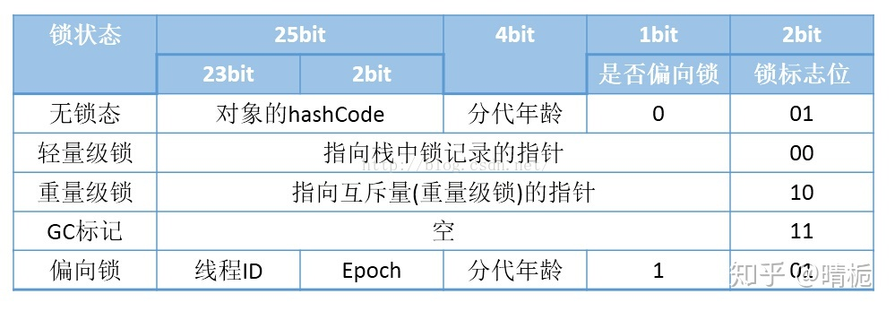
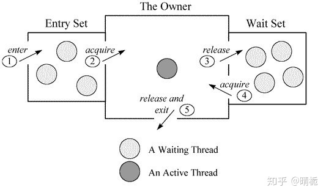

# Java 中锁(概念)的分类

## 线程安全

使用共享内存上的线程安全

- 可见性

- 有序性

- 原子性 -- 由锁来解决

## 公平锁/非公平锁

### 公平锁

- 入队排他抢占锁

- ReentrantLock 可以设置为 FreeLock

### 非公平锁

- 先尝试性获取锁, 成功则插队执行后续, 失败则入队, 以排他形式抢占锁

- ReentrantLock 和 synchronized 默认 NoFreeLock

## 可重入锁

使用计数器保存已拥有的锁, 实现**多次**进入同步代码

### Synchronized

**程序执行过程中, 如果出现异常, 默认情况下锁会被释放**, 该情况可能导致: 后续线程读到异常线程未处理的异常数据

锁对象(以 32 bit 系统为例):
- Synchronized 使用的锁对象存储在 Java 对象头
- JVM 中采用 2 个字(32 bits)来存储对象头(数组对象分配 3 个字, 多出的 1 个字记录数组长度), 其主要结构为 Mark Word 和 Class Metadata Address
- Class Metadata Address 存储的是该对象属于的类的地址

普通对象:

```
|--------------------------------------------------------------|
|                     Object Header (64 bits)                  |
|------------------------------------|-------------------------|
|        Mark Word (32 bits)         |    Klass Word (32 bits) |
|------------------------------------|-------------------------|
```

数组对象:

```
|---------------------------------------------------------------------------------|
|                                 Object Header (96 bits)                         |
|--------------------------------|-----------------------|------------------------|
|        Mark Word(32bits)       |    Klass Word(32bits) |  array length(32bits)  |
|--------------------------------|-----------------------|------------------------|
```

> 注: 64 位 JVM 开启 `+UseCompressedOops` 后, JVM 会使用 32 bits 对象头结构




```
|--------------------------------------------------------------|-----------------------------|
|                  Mark Word (32 bits)                         |       State                 |
|--------------------------------------------------------------|-----------------------------|
| identity_hashcode:25 | age:4 | biased_lock:1(0) | lock:2(01) |       Normal/无锁态         |
|--------------------------------------------------------------|-----------------------------|
|  thread:23 | epoch:2 | age:4 | biased_lock:1(1) | lock:2(01) |       Biased/偏向锁         |
|--------------------------------------------------------------|-----------------------------|
|               ptr_to_lock_record:30             | lock:2(00) | Lightweight Locked/轻量级锁 |
|-----------------------------------------------------------|-----------------------------|
|               ptr_to_heavyweight_monitor:30     | lock:2(10) | Heavyweight Locked/重量级锁 |
|--------------------------------------------------------------|-----------------------------|
|                                                 | lock:2(11) |    Marked for GC/GC 标记    |
|--------------------------------------------------------------|-----------------------------|
```


- `biased_lock`: 对象是否启用偏向锁标记; 1: 启用偏向锁, 0: 没有偏向锁
- `age`: Java 对象年龄; 在 GC 中, 如果对象在 Survivor 区复制一次, 年龄增加 1 ; 当对象达到设定的阈值时, 将会晋升到老年代
  - 默认下, 并行 GC 的年龄阈值为 15, 并发 GC 的年龄阈值为 6
  - 由于 age 只有 4 位, 所以最大值为 15 , 因此 `-XX:MaxTenuringThreshold` 选项最大值为 15
- `identity_hashcode`: 25 位的对象标识 Hash 码, 采用延迟加载技术
  - 调用方法 `System.identityHashCode()` 计算, 并将结果写到该对象头中
  - 当对象被锁定时, 该值会移动到管程(监视器锁) Monitor 中
- `thread`: 持有偏向锁的线程ID
- `epoch`: 偏向时间戳
- `ptr_to_lock_record`: 指向栈中锁记录的指针
- `ptr_to_heavyweight_monitor`: 指向管程 Monitor 的指针

### Monitor

每个对象都拥有自己的监视器锁 Monitor

`synchronized` 的修饰规则:
- 修饰方法名: 在方法名上添加 `ACC_SYNCHRONIZED` 标识
- 修饰代码块: 在代码块的前后生成 `monitorenter` 和 `monitorexit` 字节码

```java
ObjectMonitor() {
	_header       = NULL;
	_count        = 0;
	_waiters      = 0;
	_recursions   = 0;
	_object       = NULL;
	_owner        = NULL;
	_WaitSet      = NULL;
	_WaitSetLock  = 0;
	_Responsible  = NULL;
	_succ         = NULL;
	_cxq          = NULL;
	FreeNext      = NULL;
	_EntryList    = NULL;
	_SpinFreq     = 0;
	_SpinClock    = 0;
	OwnerIsThread = 0;
}
```

- `_owner`: 指向持有 ObjectMonitor 对象的线程
- `_WaitSet`: 存放处于 wait 状态的线程队列
- `_EntryList`: 存放处于等待锁 block 状态的线程队列
- `_recursions`: 锁的重入次数
- `_count`: 用来记录该线程获取锁的次数



monitor 逻辑:
- (1) 多个线程同时访问 `synchronized` 修饰的内容, 先进入到 `_EntryList` 等待
- (2) 某个线程获取到对象的 monitor , 进入 _Owner 区域并把 monitor 中的 `_owner` 设置为当前线程, 同时`monitor._count += 1`
- (3, 4) 持有 monitor 的线程调用 `wait()`, 将释放当前持有的 monitor , `_owner` 恢复为 null, `_count` 自减 1, 同时该线程进入 `_WaitSet` 集合中等待被唤醒
- (5) 当前线程执行完毕, 则释放 monitor

### sychronized 代码块实现

TODO:

### sychronized 方法实现

在 方法调用和返回操作 中:
- JVM 从方法常量池中的方法表结构(`method_info Structure`) 的 `ACC_SYNCHRONIZED` 标志确定是否为同步方法
- 如果为同步方法, 执行线程需要先获取相关的 monitor , 再执行方法, 方法结束(正常完成/异常退出)后释放 monitor

### 等待唤醒机制与 synchronized

`notify`/`notifyAll` 和 `wait`:
- 调用以上方法时, 需要处于 `synchronized` 代码块或者 `synchronized` 方法, 否则抛 `IllegalMonitorStateException`

### synchronized 的可重入性

由于 `synchronized` 依赖于 monitor 结构, 而 monitor 是对象结构的一部分, 因此:
- 可重入该 `synchronized` 修饰的同一方法
- 可重入该 `synchronized` 修饰的方法的对象的另一个 `synchronized` 方法/代码段

## 独享锁/共享锁

## 互斥锁/都写锁

## 乐观锁/悲观锁

- **悲观锁如果使用不当(锁的条数过多), 会引起服务大面积等待. 推荐优先使用乐观锁 + 重试**
- mysql 的 innodb 存储引擎事务锁虽然是行锁, 但内部是锁**索引**的
- 锁相同数据的不同**索引条件**, 可能会引起死锁(例如两个事务锁的顺序相反)

### 乐观锁

volatile 变量 -- 关闭编译器的**顺序**优化, 要求

每次该变量修改后把变量写入变量地址
每次读取都从变量地址重新读一遍

#### CAS - ABA 问题

CAS - Compare and Swap

假设 线程 One 从目标内存 V 中读出**A**, 这时另一个线程 Tow 也读出**A**, 并且 Tow 进行操作后由**A**变成**B**, 然后又把 V 的**B**改回**A**
然后线程 One 进行 **CAS**, 发现内存中仍然时**A**, 于是认为本次 CAS 成功

### 悲观锁

- select for update : **行锁(X 锁)**(不可读, 不可写)

## 分段锁

## 偏向锁/轻量级锁/重量级锁

## 自旋锁

## 写时复制 -- Copy-On-Write

并发访问下, 当修改某 Container 的元素时, 不直接修改容器, 而是先复制一份副本, 在副本中修改
修改结束后, 将指向原来容器的引用指向副本容器

- 读/写操作分离, 适合**多读少写**的情况
- 内存开销大
- 最终一致性

## 死锁

条件:
- 互斥
- 持有
- 不可剥夺
- 环形等待
