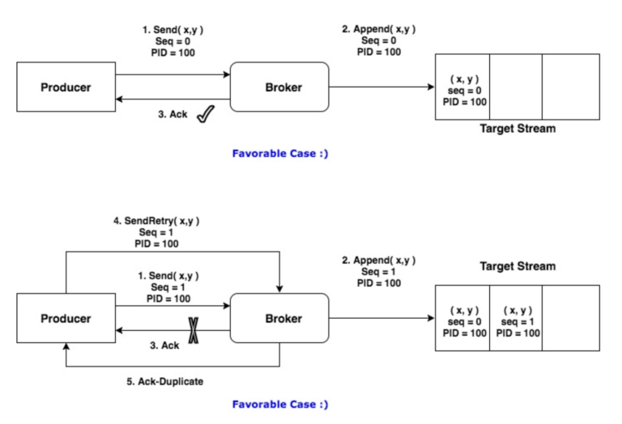

# Kafka


- Producer: 消息的生成者
- Consumer: 消息的消费者
- ConsumerGroup: 消费者组, 可以并行消费Topic中的partition的消息
- Broker: 缓存代理, Kafka集群中的一台或多台服务器统称broker
- Topic: Kafka 处理资源的消息源(feeds of messages)的不同分类
  - 不同的 Topic 之间不保证数据相关
- Partition	Topic: 物理上的分组, 一个 topic 可以分为多个 partion, 每个 partion是一个有序的队列; partion 中每条消息都会被分配一个 **有序的 Id(offset)**
  - 同一 Partition 内保证数据顺序, 不同 Partition 之间不保证数据相关
  - 物理记录集, 用于负载均衡以及复制
- Message: 消息, 是通信的基本单位, 每个producer可以向一个topic（主题）发布一些消息
- Producers: 消息和数据生成者, 向 Kafka 的一个 topic 发布消息的过程叫做 producers
- Consumers: 消息和数据的消费者, 订阅topic并处理其发布的消费过程叫做 consumers

## 数据一致性与可靠性

Kafka 通过 AR/Assigned Replicas 列表记录当前主分区的所有复制, AR 由 ISR 和 OSR 组成:
- ISR(in sync replica): 是 kafka 动态维护的一组同步副本, 在 ISR 中有成员存活时, 只有这个组的成员才可以成为 leader
  - 内部保存的为每次提交信息时必须同步的副本(acks = all)
  - 每当 leader 挂掉时, 在 ISR 集合中选举出一个 follower 作为 leader 提供服务, 当 ISR 中的副本被认为坏掉的时候, 会被踢出 ISR , 当重新跟上 leader 的消息数据时, 重新进入 ISR
- OSR(out sync replica): 保存的副本不必保证必须同步完成才进行确认; OSR 内的副本是否同步了 leader 的数据, 不影响数据的提交, OSR 内的 follower 尽力的去同步 leader, 但仍可能数据版本会落后

## 配置

```conf
# The maximum number of unacknowledged requests the client will send on a single connection before blocking. Note that if this setting is set to be greater than 1 and there are failed sends, there is a risk of message re-ordering due to retries (i.e., if retries are enabled).
# 客户端在 单个连接 上能够发送的 未响应请求的个数; 消息的并发度
max.in.flight.requests.per.connection = 1

# 幂等数据
enable.idempotence=true
```

幂等性依据: 在 Topic 级唯一 的`Seq`?



## [Kafka核心技术与实战](https://time.geekbang.org/column/article/100726)

### 各版本详情

```
0.8版本:
增加了副本机制, 新的producer API; 建议使用0.8.2.2版本; 不建议使用0.8.2.0之后的producer API

0.9版本:
增加权限和认证, 新的consumer API, Kafka Connect功能; 不建议使用consumer API

0.10版本:
引入Kafka Streams功能，bug修复; 建议版本0.10.2.2; 建议使用新版consumer API

0.11版本:
producer API幂等, 事物API, 消息格式重构; 建议版本0.11.0.3; 谨慎对待消息格式变化

1.0和2.0版本:
Kafka Streams改进, 建议版本2.0
```

### 分区

- 轮询(round)
- 随机(rand)
- 按数据键/列(key/column)
- 地域(geo)

### 生产者压缩

- V1 版本中保存压缩消息的方法是把多条消息进行压缩然后保存到外层消息的消息体字段中
- V2 版本的做法是对整个消息集合进行压缩

执行压缩的地方:
- Producer
- Broker

```java
// compression.type
Properties props = new Properties();
props.put("bootstrap.servers", "localhost:9092");
props.put("acks", "all");
props.put("key.serializer", "org.apache.kafka.common.serialization.StringSerializer");
props.put("value.serializer", "org.apache.kafka.common.serialization.StringSerializer");
// 开启GZIP压缩
props.put("compression.type", "gzip");

Producer<String, String> producer = new KafkaProducer<>(props);
```
