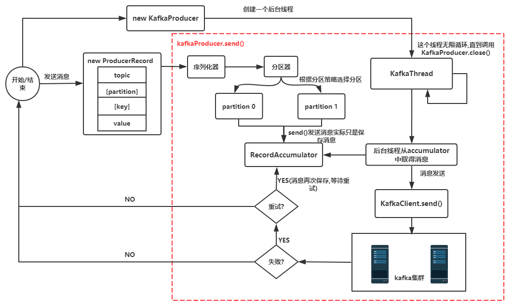
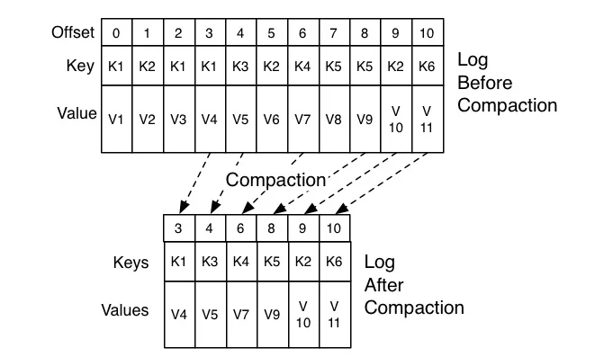
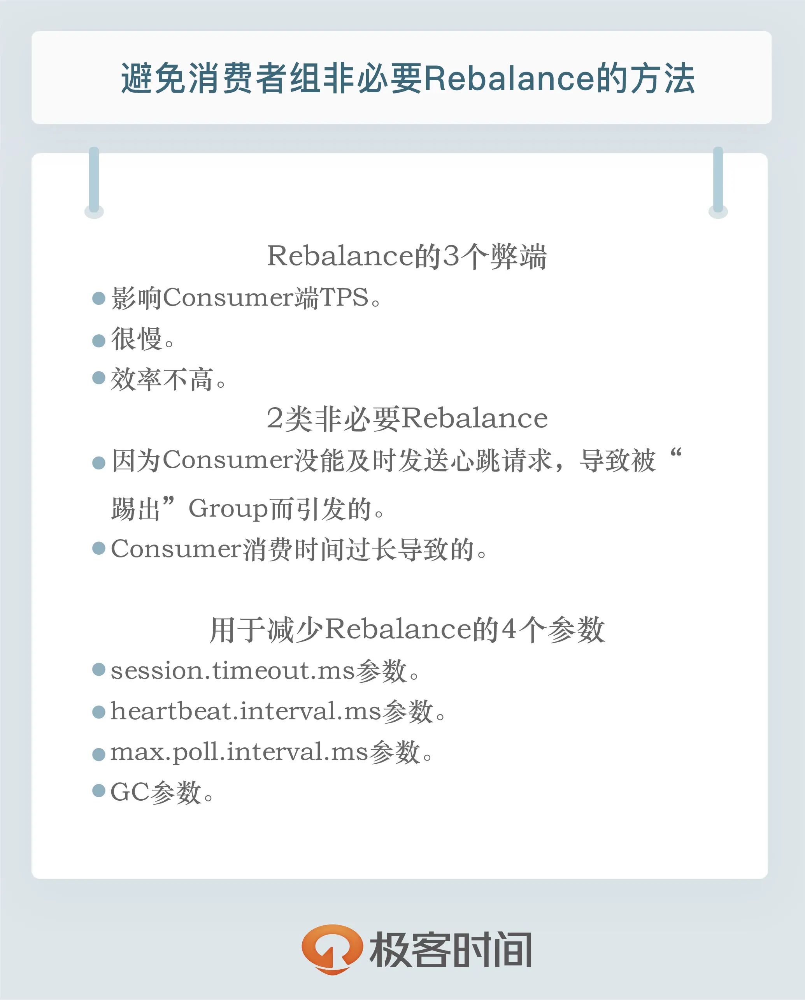

# Kafka


- Producer: 消息的生成者
- Consumer: 消息的消费者
- ConsumerGroup: 消费者组, 可以并行消费Topic中的partition的消息
- Broker: 缓存代理, Kafka集群中的一台或多台服务器统称broker
- Topic: Kafka 处理资源的消息源(feeds of messages)的不同分类
  - 不同的 Topic 之间不保证数据相关
- Partition	Topic: 物理上的分组, 一个 topic 可以分为多个 partion, 每个 partion是一个有序的队列; partion 中每条消息都会被分配一个 **有序的 Id(offset)**
  - 同一 Partition 内保证数据顺序, 不同 Partition 之间不保证数据相关
  - 物理记录集, 用于负载均衡以及复制
- Message: 消息, 是通信的基本单位, 每个producer可以向一个topic（主题）发布一些消息
- Producers: 消息和数据生成者, 向 Kafka 的一个 topic 发布消息的过程叫做 producers
- Consumers: 消息和数据的消费者, 订阅topic并处理其发布的消费过程叫做 consumers

## 数据一致性与可靠性

Kafka 通过 AR/Assigned Replicas 列表记录当前主分区的所有复制, AR 由 ISR 和 OSR 组成:
- ISR(in sync replica): 是 kafka 动态维护的一组同步副本, 在 ISR 中有成员存活时, 只有这个组的成员才可以成为 leader
  - 内部保存的为每次提交信息时必须同步的副本(acks = all)
  - 每当 leader 挂掉时, 在 ISR 集合中选举出一个 follower 作为 leader 提供服务, 当 ISR 中的副本被认为坏掉的时候, 会被踢出 ISR , 当重新跟上 leader 的消息数据时, 重新进入 ISR
- OSR(out sync replica): 保存的副本不必保证必须同步完成才进行确认; OSR 内的副本是否同步了 leader 的数据, 不影响数据的提交, OSR 内的 follower 尽力的去同步 leader, 但仍可能数据版本会落后

## 配置

```conf
# The maximum number of unacknowledged requests the client will send on a single connection before blocking. Note that if this setting is set to be greater than 1 and there are failed sends, there is a risk of message re-ordering due to retries (i.e., if retries are enabled).
# 客户端在 单个连接 上能够发送的 未响应请求的个数; 消息的并发度
max.in.flight.requests.per.connection = 1

# 幂等数据
enable.idempotence=true
```

幂等性依据: 在 Topic 级唯一 的`Seq`?


## [Kafka核心技术与实战](https://time.geekbang.org/column/article/100726)

### 各版本详情

```
0.8版本:
增加了副本机制, 新的producer API; 建议使用0.8.2.2版本; 不建议使用0.8.2.0之后的producer API

0.9版本:
增加权限和认证, 新的consumer API, Kafka Connect功能; 不建议使用consumer API

0.10版本:
引入Kafka Streams功能，bug修复; 建议版本0.10.2.2; 建议使用新版consumer API

0.11版本:
producer API幂等, 事物API, 消息格式重构; 建议版本0.11.0.3; 谨慎对待消息格式变化

1.0和2.0版本:
Kafka Streams改进, 建议版本2.0
```

### 分区

- 轮询(round)
- 随机(rand)
- 按数据键/列(key/column)
- 地域(geo)

### 生产者压缩

- V1 版本中保存压缩消息的方法是把多条消息进行压缩然后保存到外层消息的消息体字段中
- V2 版本的做法是对整个消息集合进行压缩

执行压缩的地方:
- Producer
- Broker

```java
// compression.type
Properties props = new Properties();
props.put("bootstrap.servers", "localhost:9092");
props.put("acks", "all");
props.put("key.serializer", "org.apache.kafka.common.serialization.StringSerializer");
props.put("value.serializer", "org.apache.kafka.common.serialization.StringSerializer");
// 开启GZIP压缩
props.put("compression.type", "gzip");

Producer<String, String> producer = new KafkaProducer<>(props);
```

### 管理 TCP 连接



简短内容:
- `KafkaProducer.send()` 随 `KafkaProducer` 被构建且执行创建线程
- 待发送的消息首先进入 `RecordAccumulator` , 等待被 `KafkaThread` 扫描并实际发送
- 数据包结构 -- `ProducerRecord`; 发送失败数据包将再次进入 , `RecordAccumulator`, 而不会马上再发送
- 发送成功 (消息成功写入 kafka), 就返回一个 RecordMetaData 对象; 该对象包换了主题和分区信息, 以及记录在分区里的偏移量

- TCP 连接的创建时机:
  - 必定会创建: KafkaProducer 实例被创建
  - 可能会创建: 更新元数据/消息发送 时, 如果发现与 Broker 未连接则会尝试连接

### 幂等性

#### 幂等性 Producer

```java
props.put("enable.idempotence", ture)
// 或
props.put(ProducerConfig.ENABLE_IDEMPOTENCE_CONFIG, true)
```

```java
if ps.parent.conf.Producer.Idempotent && msg.sequenceNumber < set.recordsToSend.RecordBatch.FirstSequence {
  return errors.New("assertion failed: message out of sequence added to a batch")
}
```

- `batch.FirstSequence = msg.sequenceNumber`: 当前操作批次的初始序列以当前消息为准(效果参考第二部分代码)
- `config.Net.MaxOpenRequests = 1`: 并发数为1
- 该幂等性由当前 Producer 会话保证; 即 **单分区单会话** 的幂等性

#### 事务型 Producer

开启要求:
- 和幂等性 Producer 一样, 开启 `enable.idempotence = true`
- 设置 Producer 端参数 `transactional.id`

特点:
- Consumer 能通过配置 isolation.level 获取事务消息
- `read_uncommitted`: 不论事务型 Producer 提交事务(commit)还是终止事务(abort), 其写入的消息都可以读取
- `read_committed`: Consumer 读取事务型 Producer 成功提交事务写入的消息 以及 **非事务型 Producer 写入的所有消息**

#### 消费者组

- 新版本(>=2.0)的 Consumer Group 将位移保存在 Broker 端的内部主题中 -- `__consumer_offsets`

重平衡 `rebalance` 触发条件
- 组成员数(group-member)变化
- 主题数(topic)变更
- 订阅主题的分区数(partition)发生变更

#### 位移主题/Offsets Topic

`offset topic` 的三种消息格式:
- 通信中: `<GroupID, TopicID, PartitionNo>`
- 注册 Consumer Group : 用于保存 Consumer Group 信息的消息
- `tombstone` / `Delete Mark`
  - 作用: 用于删除 Group 过期位移甚至是删除 Group 的消息
  - 写入时机: 一旦某个 Consumer Group 下的所有 Consumer 实例都停止了, 而且它们的位移数据都已被删除时, Kafka 会向位移主题的对应分区写入 tombstone 消息

- 当 Kafka 集群中的第一个 Consumer 程序启动时, Kafka 会自动创建位移主题
- 自动创建的 `offset topic` 会创建 `offsets.topic.num.partitions` 的分区数, `offsets.topic.replication.factor` 的副本数
- `enable.auto.commit`(default: `true`): Consumer 端的参数
  - 为 true 则 *定期* 提交位移; 提交间隔由 `auto.commit.interval.ms` 控制
  - 为 false 需要 Consumer 通过 `consumer.CommitSync` 手动操作提交位移

Kafka 通过 Compaction 策略以删除位移主题中的 *过期* 消息; Kafka 通过 `Log Cleaner` 的后台进程定期地巡检待 Compact 的主题, 检查是否存在满足条件的可删除数据:



#### Rebalance



有助于减少 Rebalance 的参数
- `session.timeout.ms`: 会话超时间隔
- `heartbeat.interval.ms`: 心跳发送间隔
  - 保证 Consumer 实例在被判定为 dead 之前, 能够发送至少 3 轮的心跳请求
  - `session.timeout.ms` >= 3 * `heartbeat.interval.ms`
- `max.poll.interval.ms`: Consumer 重新拉取数据的消费间隔

#### 消费位移
