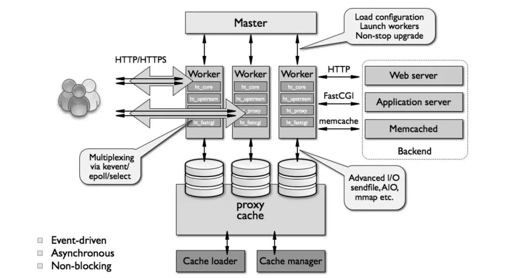

# 网关 -- 负载均衡 / 网络安全

## 负载均衡

按工作的协议划分: TODO:
- 四层负载均衡: 根据请求报文中的目标地址和端口进行调度(主要操作对象是 报文的地址/端口/MAC)
- 七层负载均衡: 根据请求报文的内容进行调度, 这种调度属于「代理」的方式(通过报文(的应用层)内容 动态/可配置 的操作)

按软硬件划分:
- 硬件:
  - F5: BIG-IP
  - Citrix: NetScaler
- 软件:
  - TCP: LVS(keepalived) / HaProxy / Nginx
  - HTTP: HaProxy / Nginx / ATS(Apache Traffic Server) / Squid / varnish
  - MySQL: Sharding-Sphere / MyCAT
  - MongoDB
    - Replica Set: TODO:
	- Sharding: ConfigServer(config) + Mongos(Router) + Replica Set(shard)
  - Redis -- Redis-Cluster / Codis

### F5

TODO:

### LVS

工作模型:
- VS/NAT(Virtual Server via Network Address Translation)
- VS/TUN(Virtual Server via Tunneling)
- VS/DR(Virtual Server via Direct Routing)
- VS/DNAT(Virtual Server via Destination Network Address Translation)

LVS 链的设备角色:
- VIP: Virtual IP , **LVS** 面向用户请求的 IP 地址 / Client IP
- RIP: Real server IP , **后端 Server** 用于与 LVS 通信的 IP 地址
- DIP: Director IP , **LVS** 用户和后端 Server 通信的 IP 地址
- CIP: Client IP , 客户端 IP 地址

#### Workmode: LVS-NAT

特点:
- Director 修改的报文内容是 **target IP**
- RealServer 集群节点和 Director 必须在同一个 IP 网段中
- Director 可负责端口映射
- Director 处于 client 和 RealServer 之间, 负责处理进出的所有报文, 并且是一个单节点, 因此在大规模场景会成为系统瓶颈(bottleneck)

#### Workmode: LVS-DR

特点:
- Director 修改的报文内容是 **target MAC** 地址
- **各 RIP 必须与 DIP 在同一个物理网络**
- RealServer 集群的 VIP 随 Director 变动而变动
- RealServer 的 VIP 不会对 ARP 的请求返回响应
- 客户端的响应报文不经过 Director, 大大提升 Director 的并发能力
- 必须保证前端路由器将目标地址为 VIP 的报文通过 ARP 解析后送往 **Director**
  - 静态绑定: 在前端路由将 VIP 对应的目标 MAC 地址静态配置为 Director VIP 接口的 MAC 地址
  - arptables: 在 Realserver 上, 通过 arptables 规则拒绝其响应对 VIP 的 ARP 广播请求
  - 修改内核参数: 在 Realserver 上, 修改内核参数, 并结合地址的配置方式实现拒绝响应对 VIP 的 ARP 广播请求
- 不支持端口映射(如果 Director 和 RealServer 也获得 端口配置, 能否支持 ??)

#### Workmode: LVS-TUN

特点:
- Director 通过 **IP 隧道技术**
- 集群节点可以跨越 Internet; RIP, DIP, VIP 都可以是公网地址
- RealServer 有自己的网关(可以独立于 Director)
- RealServer **必须** 使用支持 IP 隧道的操作系统
- 不支持端口映射

#### Workmode: LVS-DNAT

TODO:

均衡方式:
- 修改请求报文的源地址为 DIP, 目标地址为 RIP 来实现转发
- 对于响应报文, 源地址修改为 VIP, 目标地址修改为 CIP 来实现转发

特点:
- 支持端口映射

#### Workmode: LVS-FULLNAT

特点:
- 类似于 DNAT 的转发方式(不需要修改 MAC , 而是直接操作 IP 包和 TCP 包)
- 支持端口映射
- RIP , DIP 可以不在同一个网络中, RIP 网关不需要指向 DIP
- TODO:

#### 调度算法

静态调度:
- RR/round robin: 轮询, 在各主机间轮流调度
- WRR/weighted round robin: 加权轮询, 按照(已设定的)权重进行轮询
- SH/source hash: 源地址哈希
  - session affinity/会话绑定: 在一段时间内, 同一 client IP 地址的请求会被调度到相同的 RealServer(与 负载均衡 冲突)
- DH/destination hash: 目标地址哈希, 当 RealServer 为透明代理缓存服务器时, 提高缓存的命中率

动态调度: 由 活动链接(active) / 非活动链接(inactive) / 权重(weighted) 来决定调度选择
- LC/least connected: 最少连接, `overhead = active<<8+inactive` , 根据 overhead 选择最小的 RealServer
- WLC/weighted lc: 加权最少连接, `overhead = (active<<8+inactive)/weight` ; 默认调度算法
- SED/shortest expected delay: 最短期望延迟, `overhead = (active+1)*256/weight`
- NQ/never queue: 当由空闲 RealServer , 直接调度到该 RealServer ; 否则 , 按照 SED 算法调度
- LBLC/locality based least connection: 基于本地的最少连接, 即 `DH + WLC`
  - 正常请求下使用 DH , 目标服务器超载下通过 WLC 算法调度至其他 RealServer
- LBLCR/locality based least connection with replication: 基于本地的带复制功能的最少连接
  - LVS 管理 服务池, 通过 DH 算法将请求 IP 映射到对应服务池, 通过 LC 算法选择服务池中的节点, 当池中所有节点都超载, 则通过 LC 算法从所有 Realserver 中选择一个添加到服务池

#### keepalived

#### OSPF + FullNAT LVS

#### 总结

优点:
- 操作传输层及以下, 适用面极广
- 抗负载能力/性能强, CPU/内存 消耗低
- 稳定, 完整双机热备方案: LVS + Keepalived
- 无流量

不足:
- 无应用层功能: 无动静态分离能力, 无正则表达式功能

### Nginx

模块化/基于事件驱动/异步/单线程非阻塞

## 防火墙

### nftables

### iptables

- iptables 是内核驱动模块, 随内核迁移升级
- iptables 是监控 linux inode 的状态, 更安全

### firewall

- firewall 是 systemd 服务

## 附录

### 交换机虚拟化

|       | 优点                                                                             | 缺点                                                     | 应用场景                       |
| :-    | :-                                                                               | :-                                                       | :-                             |
| 堆叠  | 简化本地网络管理节点、易维护，同时增加系统端口密度和带宽，充分发挥设备性能       | 可靠性不高，堆叠系统分裂、系统升级都会影响业务中断       | 广泛应用于企业、教育           |
| VRRP  | 网络设备冗余、可靠性高                                                           | 配置复杂、网络建设投入成本高，不能充分发挥设备的网络性能 | 银行、证券、政府内网           |
| M-LAG | 网络可靠性非常高，设备控制层面独立，能单独设备升级且不影响业务，充分发挥设备性能 | 管理节点多(控制层面无法虚拟化)                           | 银行、证券、数据中心(双规场景) |

### RIP / OSPF 路由协议

#### RIP

- 基于距离矢量算法, 以到达目标站点的链路数表示距离, 分别为 0-15 , 16(无限长)
- UDP:520 ; 每隔 30s 以广播形式发送一次, 对后续的分组做 *随机延时后发送* 以防止 **广播风暴**

缺点:
- 过低的链路数设置, 在大型网络中容易出现 计数到无限 的情况, 路由收敛缓慢
- RIP 只考虑 链路数 衡量两站点的远近关系, 缺乏对网络中重要的 网络延迟/线路负载/可靠性 等的考虑

#### OSPF/Open Shortest Path First

基于链路状态路由算法, 获得链路状态信息(Link-State), 生成链路状态数据库(Link-State-Database); 以 最短路径优先(Shortest Path First) 算法独立, 计算出到达任意目的地的路由

OSPF 以各个独立的区域组成分层路由; 每个区域作为一个独立网络, 共 5 种 **区域**:
- 标准区域: 一个标准区域可以接收链路更新信息和路由总结
- 主干区域(传递区域): 主干区域是连接各个区域的中心实体; 主干区域始终是"区域0", 所有其他的区域都要连接到这个区域上交换路由信息; 主干区域拥有标准区域的所有性质
- 存根区域(Stub Area): 存根区域是不接受自治系统以外的路由信息的区域; 如果需要自治系统以外的路由, 它使用默认路由 0.0.0.0
- 完全存根区域: 它不接受外部自治系统的路由以及自治系统内其他区域的路由总结; 需要发送到区域外的报文则使用默认路由: 0.0.0.0 ; 完全存根区域是 Cisco 自己定义的
- 不完全存根区域(NSAA): 它类似于存根区域, 但是允许接收以 LSA Type 7 发送的外部路由信息, 并且要把 LSA Type 7 转换成 LSA Type 5

在 OSPF 多区域网络中, **路由器** 可以按不同的需要同时成为以下 4 种路由器中的几种:
- 内部路由器: 所有端口在同一区域的路由器, 维护一个链路状态数据库
- 主干路由器: 具有连接主干区域端口的路由器
- 区域边界路由器(ABR): 具有连接多区域端口的路由器, 一般作为一个区域的出口
  - ABR 为每一个所连接的区域建立链路状态数据库, 负责将所连接区域的路由摘要信息发送到主干区域, 而主干区域上的 ABR 则负责将这些信息发送到各个区域
- 自治域系统边界路由器(ASBR): 至少拥有一个连接外部自治域网络(如非 OSPF 的网络)端口的路由器, 负责将非 OSPF 网络信息传入 OSPF 网络

OSPF 中不同功能的 **报文**:
- LSA TYPE 1: **router LSA** 由每台路由器为所属的区域产生的 LSA, 描述本区域路由器链路到该区域的状态和代价; 一个边界路由器可能产生多个 LSA TYPE1
- LSA TYPE 2: **network LSA** 由 DR 产生, 含有连接某个区域路由器的所有链路状态和代价信息; 只有 DR 可以监测该信息
- LSA TYPE 3: **summary LSA** 由 ABR 产生, 含有 ABR 与本地内部路由器连接信息, 可以描述本区域到主干区域的链路信息(它通常汇总缺省路由而不是传送汇总的 OSPF 信息给其他网络)
- LSA TYPE 4: **summary LSA** 由 ABR 产生, 由主干区域发送到其他 ABR, 含有 ASBR 的链路信息, 与 LSA TYPE 3 的区别在于 TYPE 4 描述到 OSPF 网络的外部路由, 而TYPE 3则描述区域内路由
- LSA TYPE 5: **AS External LSA** 由 ASBR 产生, 含有关于自治域外的链路信息; 除了存根区域和完全存根区域, LSA TYPE 5 在整个网络中发送
- LSA TYPE 6：**multicast OSPF LSA** MOSF 可以让路由器利用链路状态数据库的信息构造用于多播报文的多播发布树
- LSA TYPE 7: **Not-So-Stubby LSA** 由 ASBR 产生的关于NSSA的信息。LSA TYPE 7可以转换为LSA TYPE 5。

**协议类型**:
- Hello 报文, 通过周期性地发送来发现和维护邻接关系
  - 当路由器开启一个端口的 OSPF 路由时, 将会从这个端口发出一个 Hello 报文, 以后它也将以一定的间隔 周期性 地发送 Hello 报文
- DD(链路状态数据库描述)报文, 描述本地路由器保存的LSDB(链路状态数据库)
- LSR(LS Request)报文, 向邻居请求本地没有的 LSA
- LSU(LS Update)报文, 向邻居发送其请求或更新的 LSA
- LSAck(LS ACK)报文, 收到邻居发送的 LSA 后发送的确认报文

OSPF 划分的网络类型:
- 广播多路访问型(Broadcast multiAccess/BMA)
- 非广播多路访问型(None Broadcast MultiAccess/NBMA)
- 点到点型(Point-to-Point)
- 点到多点型(Point-to-MultiPoint)

> 广播多路访问型网络/BMA 如: Ethernet、Token Ring、FDDI;
> 非广播多路访问型/NBMA 型网络如: Frame Relay、X.25、SMDS;
> Point-to-Point 型网络如: PPP、HDLC

指派路由器(DR)和备份指派路由器(BDR):
- 多路访问网络: 该网络环境可能存在多个路由器, 为了避免路由器之间建立完全相邻关系而引起的大量开销, OSPF 要求在区域中选举一个 DR; 每个路由器都与之建立完全相邻关系; DR 负责收集所有的链路状态信息, 并发布给其他路由器; 选举 DR 的同时也选举出一个 BDR, 在 DR 失效的时候, BDR 担负起 DR 的职责
- 点对点型网络: 该网络不需要 DR, 因为只存在两个节点, 彼此间完全相邻; 协议组成 OSPF 协议由 Hello 协议、交换协议、扩散协议组成
- 广播型网络和非广播型多路访问网络: 路由器使用 Hello 协议选举出一个 DR; 在广播型网络(BMA)里, Hello 报文使用多播地址 *224.0.0.5* 周期性广播, 并通过这个过程自动发现路由器邻居; 在 NBMA 网络中, DR 负责向其他路由器逐一发送 Hello 报文
