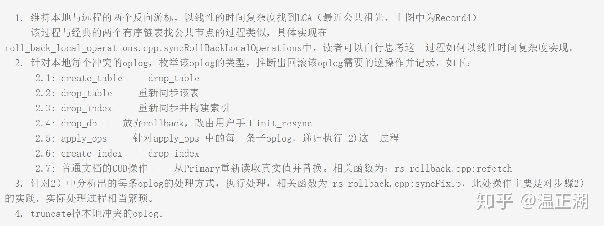
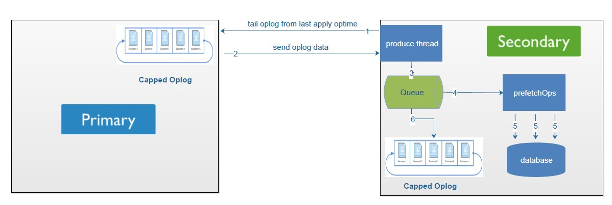

# MongoDB

## 一.CRUD

### 写关注 --- local.system.replset.settings.getLastErrorDefaults

#### `w`

- -1: 不使用写关注, 忽略所有网络/socket 错误
- 0: 不使用写关注, 返回网络/socket 错误
- 1: 启用写关注, 但只针对 primary 节点 --- 默认配置
- >1: 写关注将针对复制集中 n 个节点

#### wtimeout --- 写关注的超时时间

### 原子性与事务处理

在 mongoDB , 所有操作在 document 级别具有原子性(一个**不可再分**的写操作最多只可以修改一个文档)

#### 1)`$isolated`

- `$isolated`操作在:term: `sharded clusters` 中**不**起作用;
- :update:`$isolated`操作在分片集群中**不**起作用

#### 2)类事务处理语句 -- 两阶段提交(:doc: two-phase commit</tutorial/perform-two-phase-commits>)

- **两阶段提交**只能提供*类*事务处理的语句
- 两阶段提交步骤:
	1. 设置**事务**初始状态 **initial**
	2. 切换事务到 **Pending** 状态
	3. 将事务应用到对应的多个**待处理文档**
	4. 设置事务状态为 **committed**
	5. 从**待处理文档**移除 pending 事务
	6. 设置事务为 **done**
- 错误恢复步骤
	1. err ∈ (1, 3) -- 从 2 恢复
	2. err ∈ (3, 5) -- 从 4 恢复
- 回滚
	- task > 3 -- 创建**新事务**, 切换源(Source)和目标(destination)的值
	- 1 < task < 3
		1. 设置事务状态为 **canceling**
		2. 撤销事务 -- 取消在源和目标的更改
		3. 设置事务状态为 **canceled**


3.x 版本 rollback 的场景与方式:



#### 3)并行处理的控制

- 唯一性 索引
- 查询断言

#### 4)事务实现

TODO:

孔德雨博客:
- [MongoDB 4.0 事务实现浅析](http://www.mongoing.com/archives/6102)
- [事务, 时间戳与混合逻辑时钟](http://www.mongoing.com/archives/25302)
- [Mongo4.2 分布式事务实现Overview](http://www.mongoing.com/archives/26731)

- [逻辑时钟](/IT/DBA/distribute/logical-lock.md)

- 跨文档事务(`>=4.0`)

MongoDB 在 [WT-3181](https://source.wiredtiger.com/3.0.0/md_changelog.html) 中消除从库回滚 oplog 的全局锁

首先, mongo 在 apply 完一批 oplogs 后, 调用 `setMyLastAppliedOpTimeForward` 方法作为这批 oplogs 中最后一条的 ts:

```cpp
class ApplyBatchFinalizer {
    void _recordApplied(const OpTime& newOpTime,
                        ReplicationCoordinator::DataConsistency consistency) {
        _replCoord.setMyLastAppliedOpTimeForward(newOpTime, consistency);
    }
};
```

MongoDB 4.0 通过 **读最近一致的 snapshot, 保证从节点的读是不会和并行回放 oplog 相互阻塞, 也不用担心会读到不一致的状态**

`rollback_to_stable`

随着复制的推进, 每个节点虽有延时, 但是(raft 的)commit-timestamp 时间点必然是单调的; 由 raft 协议的保证, commit-timestamp 之前的日志必然不会被回滚; 因此 mongo 的每个节点(通过 setMyLastAppliedOpTimeForward 方法)确定一个 oplog 的 ts 成为 commit-timestamp 之后, 会通过 wt 的 api set_timestamp 设置该 ts 为最新的 **stable-timestamp** , mongodb 主从切换后, 首先通过 wt 的 api  rollback_to_stable 恢复到最近的被(raft)提交的 snapshot, rollback 的动作就完成了

`oldest-timestamp`

`commit as-of timestamp`

- 分布式事务(`>=4.2`)

### 读隔离, 一致性和时近性

- 一个连接拥有一个一致的数据库视图(注: Ruby、Python、Java 为提高效率, 驱动库一般采用连接池)

## 二.聚合

## 三.文本索引

## 四.数据模型

### (一)MongoDB特性和数据模型的关系

#### 1)文档增长型

#### 2)原子性

#### 3)分片

#### 4)索引

#### 5)集合的数量

### (二)树结构建模

#### 1)父文档引用

	db.categories.insert( { _id: "MongoDB", parent: "Databases" } )

- 快速查询父节点

#### 2)子文档引用

	db.categories.insert( { _id: "Databases", children: [ "MongoDB", "dbm" ] } )

- 快速查询子节点

#### 3)祖先数组

	db.categories.insert( { _id: "Databases", ancestors: [ "Books", "Programming" ], parent: "Programming" } )

- 快速查询 **一节点的所有祖先节点** OR **从根节点到某个节点** 的路径

#### 4)物化路径

	db.categories.insert( { _id: "MongoDB", path: ",Books,Programming,Databases," } )

- 便于排序(sort)
- 使用正则查询

#### 5)嵌套集合

	db.categories.insert( { _id: "Languages", parent: "Programming", left: 3, right: 4 } )

- 数学的查询方式:

```javascript
	var databaseCategory = db.categories.findOne( { _id: "Databases" } );
	db.categories.find( { left: { $gt: databaseCategory.left }, right: { $lt: databaseCategory.right } } );
```

### ?)原子性事务建模

	mongoDB 在文档级别是原子性的

## 末.存储引擎

	mongod 参数: --storageEngine  wiredTiger | inMemory
	WiredTiger和MMAPv1都用于持久化存储数据, 相对而言, WiredTiger比MMAPv1更新, 功能更强大

### (一)WiredTiger(缺省) -- 硬盘

#### 1)文档级别的并发控制(Decument-Level Concurrency Contorl)

- 写权限:
	- 同一时间,  多个写操作能同时修改同一集合(Collection)中的不同文档(Document)
	- 同一时间,  对同一文档(Document)的写操作需要序列化进行: 当前写操作进行时, 其他写操作等待；写操作完成后, 其他写操作相互竞争修改权
- 乐观并发控制: 只在 Global,  database 和 Collection 级别上使用意向锁(Intent Lock)
	- 当两次操作冲突时, MongoDB 会再次执行其中一个操作

#### 2)检查点(Checkpoint)

- 在 Checkpoint 操作开始时, WiredTiger 提供指定时间点(point-in-time)的数据库快照(Snapshot), 该 Snapshot 呈现的是[内存]中数据的一致性视图
- Checkpoint 作为数据中的还原点, 创建间隔为 60s/2GB 的 Journal 文件

#### 3)预先记录日志(Write-ahead Transaction Log)

- 数据先被写在日志(Journal)中 -- 在创建检查点(Checkpoint)开始时, 数据被刷新到数据文件

#### 4)内存使用

- WiredTiger 的系统内存资源缓存分两部分
  - 内部缓存 -- 1GB **or** 60% of RAM - 1GB, 取两者的较大值
  - 文件系统缓存 -- 大小不固定, 压缩存储
- mongod 参数: --wiredTigerCacheSizeGB 内部缓存大小

##### 5)数据压缩(Data Compression)

	WiredTiger 默认压缩存储集合(Collection)和索引(Index)

- 集合(Collection): 块压缩(Black Compression)
- 索引(Index): 前缀压缩(Prefix Compression)
- 默认的压缩设置要求均衡(Balance)数据存储的效率和处理数据的需求(意味着对于多数工作负载(Workload), 压缩和解压的处理速度非常高)

#### 6)Disk 空间回收

删除集合(Collection)或文档(Document)后, Mongo 不将 Disk 空间释放, 而是在数据文件(Data file)中维护 Empty Records 的列表, 以备内部重新使用

	移除集合(Collection)中的数据和索引碎片, 释放 unused 的空间
	-- db.runCommand({compact:'<collection>'})
执行时, Mongo 阻塞当前的 database, 直至结束

###(二)In-Memory -- 内存

除了少量的元数据和诊断(Diagnostic)日志, In-Memory 存储引擎不维护任何存储在硬盘上的数据(On-Disk Data)

#### 1)指定 In-Memory 存储引擎

	mongod --storageEngine inMemory --dbpath <path>

- --dbpath: 用于维护少量的元数据和诊断(Diagnostic)日志；创建 Large Index 时, 使用 Disk 存储临时数据

#### 2)文档级别的并发(document-level concurrency)

#### 3)内存使用

通过 Mongod 参数修改:

	mongod --storageEngine inMemory --dbpath <path> --inMemorySizeGB <newSize>

- --inMemorySizeGB: 占用的内存数量, (缺省: 50% of RAM-1G)

#### 4)持久化(Durable)

In-Memory 不持久化存储数据

#### 5)记录 Oplog --- (Redis?)

	Oplog: In-Memory 记录在硬盘中的<内存中的集合>

- In-Memory 通过 Replication 将 Primary 成员的 Oplog 推送给同一**副本集(Replica Set)**的其他成员
- 通过多个 Primary 成员共同备份 Oplog 中记录的操作, 对各个 Primary 成员的数据持久性存储

### (三)记录日志

MongoDB 通过预写日志机制实现数据的持久化存储:
- WiredTiger 在执行写操作时, 先将数据更新写入日志文件(Journal File)
- 在执行 Checkpoint 时, 将数据的更新同步到数据文件

	开启日志记录(默认开启):mongod --journal

#### 1)从 Journal File 还原

1.从数据文件(Data File), 获取上一个 Checkpoint 创建的标识(Identifier)值
2.从日志文件(Journal File), 根据标识值匹配日志记录(Record)
3.重做日志记录

#### 2)缓存日志

WiredTiger 以128KB为界限在内存缓冲区里存储日志记录(Journal Records)

#### 3)日志文件(Journal File)

	放置在 --dbpath 下的 journal 子目录
	大小约为100MB
	命名格式:WiredTigerLog.<sequence>
Journal File 特定:
- 标志日志记录:  Journal File 中每个日志记录(Record)代表一个写操作；每一个记录有一个唯一ID
- 压缩 Journal 文件
- 100M的日志文件上限
- 自动移除 Journal 文件(?): WiredTiger 自动移除老的 Journal 文件, 只维护从上一个 Checkpoint 还原时必需的 Journal 文件
- 预分配 Journal 文件

#### 4)在异常宕机后恢复数据

在MongoDB实例异常宕机后, 重启mongod实例, MongoDB自动重做(redo)所有的Journal Files, 在还原Journal Files期间, MongoDB数据库是无法访问的

### (四)mongod 存储引擎

#### 1)WiredTiger

```sh
mongod \
--storageEngine wiredTiger \
--dbpath <path> \
--journal --wiredTigerCacheSizeGB <value> \
--wiredTigerJournalCompressor <compressor> \
--wiredTigerCollectionBlockCompressor <compressor> \
--wiredTigerIndexPrefixCompression <boolean>
```

#### 2)In-Memory

```sh
mongod \
--storageEngine inMemory \
--dbpath <path> \
--inMemorySizeGB <newSize> \
--replSet <setname> \
--oplogSize <value>
```

## 集群

### 集群成员

| 成员       | 说明                                                                                                                                                                                                                                                                                                                              |
| :-:        | :-:                                                                                                                                                                                                                                                                                                                               |
| Secondary  | 正常情况下, 复制集的 Seconary 会参与 Primary 选举(自身也可能会被选为 Primary), 并从 Primary 同步最新写入的数据, 以保证与 Primary 存储相同的数据; Secondary 可以提供读服务, 增加 Secondary 节点可以提供复制集的读服务能力, 同时提升复制集的可用性; 另外, MongoDB 支持对复制集的 Secondary 节点进行灵活的配置, 以适应多种场景的需求 |
| Arbiter    | 只参与投票, 不能被选为 Primary, 并且不从 Primary 同步数据; Arbiter 本身不存储数据, 是非常轻量级的服务, 当复制集成员为偶数时, 最好加入一个 Arbiter 节点, 以提升复制集可用性                                                                                                                                                        |
| Priority:0 | Priority:0 节点的选举优先级为 0, 不会被选举为 Primary                                                                                                                                                                                                                                                                             |
| Vote:0     | Mongodb 3.0 里, 复制集成员最多 50 个, 参与 Primary 选举投票的成员最多 7 个, 其他成员(Vote:0)的 vote 属性必须设置为 0, 即不参与投票                                                                                                                                                                                                |
| Hidden     | Hidden 节点不能被选为主(Priority 为 0), 并且对 Driver 不可见; 因 Hidden 节点不会接受 Driver 的请求, 可使用 Hidden 节点做一些数据备份、离线计算的任务, 不会影响复制集的服务                                                                                                                                                        |
| Delayed    | Delayed 节点必须是 Hidden 节点, 并且其数据落后与 Primary 一段时间(可配置，比如 1 hour); 因 Delayed 节点的数据比 Primary 落后一段时间, 当错误或者无效的数据写入 Primary 时, 可通过 Delayed 节点的数据来恢复到之前的时间点                                                                                                          |

```js
{
  _id: <string>,
  version: <int>,
  protocolVersion: <number>,
  writeConcernMajorityJournalDefault: <boolean>,
  configsvr: <boolean>,
  members: [
    {
      _id: <int>,
      host: <string>,
      arbiterOnly: <boolean>,
      buildIndexes: <boolean>,
      hidden: <boolean>,
      priority: <number>,
      tags: <document>,
      slaveDelay: <int>,
      votes: <number>
    },
    ...
  ],
  settings: {
    chainingAllowed : <boolean>,
    heartbeatIntervalMillis : <int>,
    heartbeatTimeoutSecs: <int>,
    electionTimeoutMillis : <int>,
    catchUpTimeoutMillis : <int>,
    getLastErrorModes : <document>,
    getLastErrorDefaults : <document>,
    replicaSetId: <ObjectId>
  }
}
```

MongoDB Replica Set 与 Raft 的相同点:
- Leader
- Log
- Initial sync
- Heartbeats & Elections

MongoDB Replica Set 与 Raft 的差异点:
- Apply first, then replicate
- Pull(mongodb) vs push(raft)
- writeConcern (durability/持久化)
- readConcern (isolation/隔离)
- writeConcernMajorityJournalDefault
- disk based durability/持久化到磁盘
- Dry-run elections/pre-vote 预选举 (prevents term inflation/防止 term 号无意义增大)
- Chained replication/链式复制 (prevents flip flops) (对延迟的妥协)
- Oplog hash field (adds robustness)

### log replication/日志副本

`w` 选项控制同步/异步复制

#### data flow

`settings.chainingAllowed`:
- `true`: 链式模式, 允许 MongoDB 根据 距离本身最近/心跳延时最小 选择从 primary/secondary 作为 SyncSource(同步源) 同步数据
- `false`: 主从复制

#### pull 同步

primary 写数据到 `local.oplog.rs` , secondary 定期从其 SyncSource 同步数据



pull 方式加剧了 `writeConcern: majority` 的延迟, 该延迟效应由 网络效果更好的 SyncSource 抵消

#### 日志持久化时机

raft 与 MongoDB 的异同
- Raft: leader 先将 log append 到本地的 `log entries` , 然后等待 majority 节点读取后的回复, 再 apply log 到本地状态机
- MongoDB: 即使是 `writeconcern: majority` 设置, primary 依然会 apply 到本地状态机, 再写 oplog ; 随后 secondary 主动同步 SyncSource 的 `local.oplog.rs` , 也是优先 apply 到本地, 再写 oplog

即 MongoDB(由于 **先 apply 再写 oplog** 和 **异步复制** 规则, )不会因为无法将数据同步到其他的集群成员而回滚日志

#### catchup

`settings.catchUpTimeoutMillis`:
- 新选取的 primary 会尝试同步集群中其他成员的更新的 oplog
- 尝试过程会持续到 **primary 获取到更新的 oplog 或者 超时**
- 如果同步后依然没有将最新的 oplog 写入到 primary , 那么这部分 oplog 会写入到 rollback 文件(?)中(等待回滚 ??)

### 心跳/选举机制

#### 心跳包

以任意一个节点的 POV(point of view), 在每一次心跳后会尝试将 primary 节点降级, 降级原因:
- 心跳检测到有其他 primary 节点的优先级高于当前 primary 节点, 则尝试将 primary 节点降级(stepDown) 为 secondary (可用于 热变更 primary 节点)
- 本节点若是主节点, 但是无法 ping 通集群中超过半数的节点(majority 原则), 则将自身降级为 secondary

#### 选举机制

2PC + 多数派协议

**阶段一**

对于节点本身:
- 能 ping 通集群的过半数节点
- priority>0
- 不能是 arbitor 节点

成功, 则向集群中所有存活节点发送 FreshnessCheck, 其余节点进行同僚仲裁:
- 集群中有其他节点的 primary 比发起者高
- primary>0
- 不能是 arbitor 节点
- 以冲裁者的 POV, 发起者的 oplog 必须是集群存活节点中 oplog 最新的

**阶段二**

- 发起者向集群中存活节点发送 Elect 请求
- 仲裁者收到请求的节点会执行一系列合法性检查; 如果检查通过, 则仲裁者给发起者投一票, 并获得 30 秒钟 **选举锁** (保证在持有锁的时间内不给其他发起者投票)
- 发起者如果或者超过半数的投票, 则选举通过, 自身成为 Primary 节点
- 选票不足, 随机休眠([0, 1]s)后, 发现集群中自身仍然满足选举条件, 再次尝试选举

## 附

### (一)Mgo 使用记录

### session.Setmode(consistency Mode, refresh bool)

#### consistency

- Eventual -- 不缓存连接

### mgo.query.betch

默认最小分配空间 -- 4M ?

### db.system.profile

```js
drug:PRIMARY> db.system.profile.find().pretty()
{
    "op" : "query",    //操作类型, 有insert、query、update、remove、getmore、command
    "ns" : "mc.user",  //操作的集合
	"query" : {        //查询语句
        "mp_id" : 5,
        "is_fans" : 1,
        "latestTime" : {
            "$ne" : 0
        },
        "latestMsgId" : {
            "$gt" : 0
        },
        "$where" : "new Date(this.latestNormalTime)>new Date(this.replyTime)"
    },
    "cursorid" : NumberLong("1475423943124458998"),
    "ntoreturn" : 0,   //返回的记录数; 例如, profile命令将返回一个文档(一个结果文件), 因此ntoreturn值将为1; limit(5)命令将返回五个文件, 因此ntoreturn值是5; 如果ntoreturn值为0, 则该命令没有指定一些文件返回, 因为会是这样一个简单的find()命令没有指定的限制;
    "ntoskip" : 0,     //skip()方法指定的跳跃数
    "nscanned" : 304,  //扫描数量
    "keyUpdates" : 0,  //索引更新的数量, 改变一个索引键带有一个小的性能开销, 因为数据库必须删除旧的key, 并插入一个新的key到B-树索引
    "numYield" : 0,    //该查询为其他查询让出锁的次数
    "lockStats" : {    //锁信息, R: 全局读锁；W: 全局写锁；r: 特定数据库的读锁；w: 特定数据库的写锁
        "timeLockedMicros" : {     //锁
            "r" : NumberLong(19467),
            "w" : NumberLong(0)
        },
        "timeAcquiringMicros" : {  //锁等待
            "r" : NumberLong(7),
            "w" : NumberLong(9)
        }
    },
    "nreturned" : 101,        //返回的数量
    "responseLength" : 74659, //响应字节长度
    "millis" : 19,            //消耗的时间(毫秒)
    "ts" : ISODate("2014-02-25T02:13:54.899Z"), //语句执行的时间
    "client" : "127.0.0.1",   //链接ip或则主机
    "allUsers" : [ ],
    "user" : ""               //用户
}
```

### (二)MapReduce 使用记录

```js
db.runCommand({
   mapReduce: <collection>,
   map: <function>,
   reduce: <function>,
   finalize: <function>,
   out: <output>,
   query: <document>,
   sort: <document>,
   limit: <number>,
   scope: <document>,
   jsMode: <boolean>,
   verbose: <boolean>,
   bypassDocumentValidation: <boolean>,
   collation: <document>
})
```
其中:

- **mapReduce**: 即将进行 mapReduce 的源集合
- **map**: mapReduce 的**分组函数**, 形如( `function(){ emit( rule(), this._id ) }` ),  按照 rule 函数返回的值分组, 即将统计 `_id` 字段的数据
- **reduce**: mapReduce 的**统计函数**, 用于将 map 函数所分组重新组合,  形如
- **out**: 结果输出的目标集合
