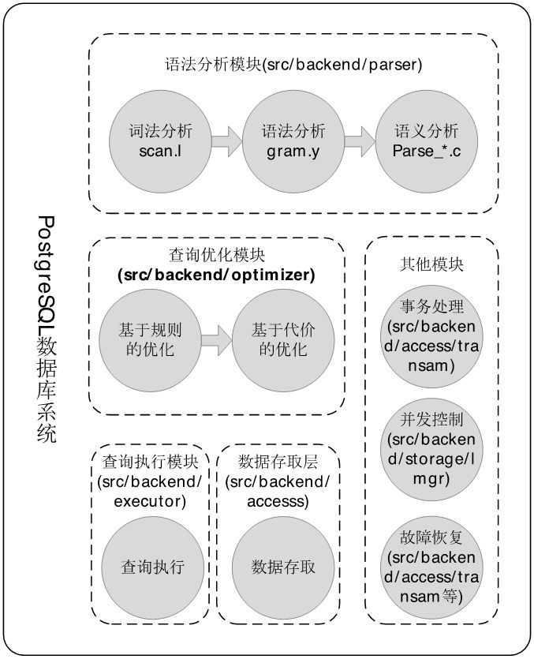
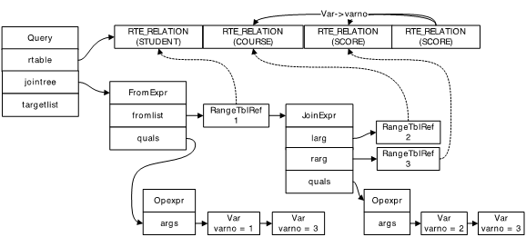

# PostgreSQL 入门

## 常用命令

- \l -- 列出所有的数据库
- \c <dbname> -- 切换数据库
- \d -- 列出当前库的所有表
- \d <tablename> -- 列出该表的使用字段
- \d+ <tablename> -- 查看表的基本情况(比 \d 多一个存储列)
- \x -- 开启/关闭扩展显示(行式 <-> 列式)

## 查询优化



```sql
SELECT st.sname, c.cname, sc.degree FROM STUDENT st , COURSE c INNER JOIN SCORE sc ON c.cno = sc.cno WHERE st.sno = sc.sno
```


