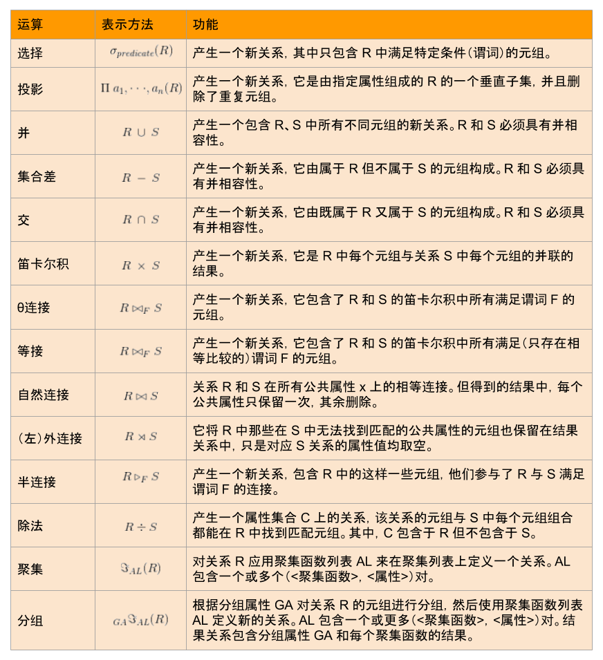
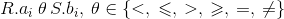
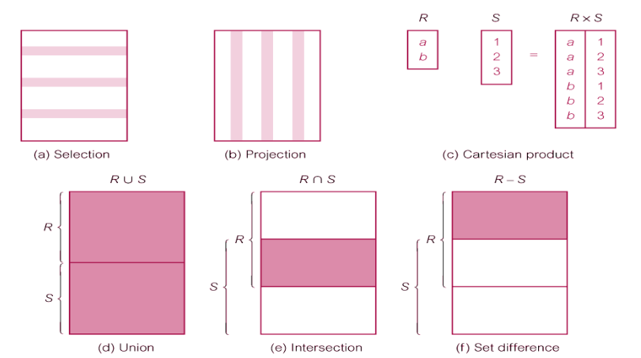
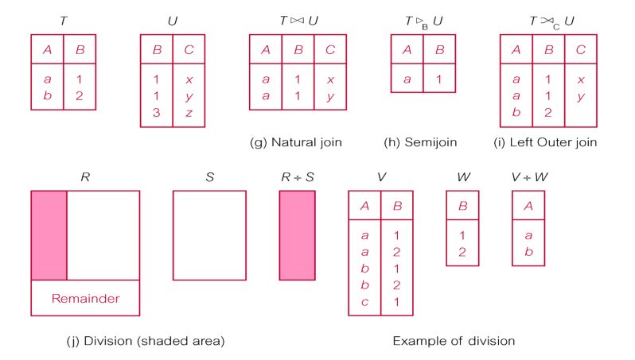
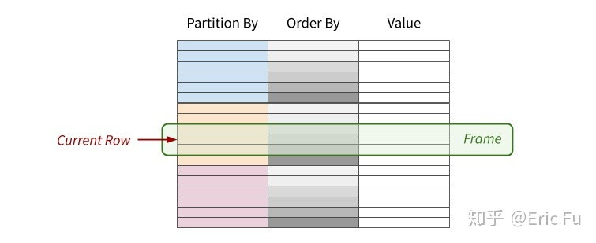
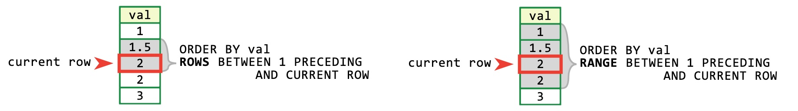
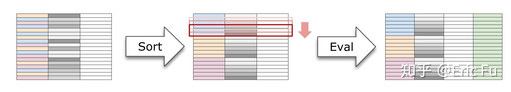
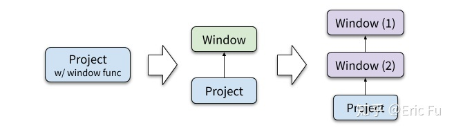
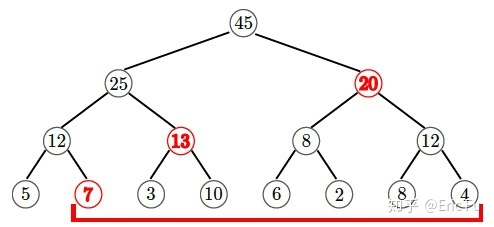

# SQL Language

## 关系代数 和 SQL 语言



基础运算符:
- 选择(σ , selection) -- where
- 投影(π , projection) -- select distinct ...
- 叉乘/笛卡尔积(x , cross-product) -- `from`, R 中每个元组和 S 中每个元组 **并联** 的结果
- 差(- , set-difference) -- R-S === 在 R 中不在 S 中的元组
- 并(υ , union) -- RuS === 在 R 和 S 中的所有元组
- 重命名(rename)

合成运算符:
- 交(∩ , intersection) -- R∩S === 在 R 中也在 S 中的元组
- 除(÷ , division) -- R÷S === R 中包含与 S 共有列相同, 其他列不同的关系实例 (??)
- δ(R) 能对关系 R 消除重复元组
- θ 链接 -- R 和 S 的笛卡尔乘积中所有满足谓词 F 的元组
- 等值链接(=, equival join) -- θ 链接的特例, (??)
- 自然链接(⋈, natural join) -- 先做叉乘, 再选择 *公共属性一样* 的关系实例

谓词 F 的格式:






## 合取范式(CNF)与析取范式(DNF)

- CNF: 逻辑交/与
- DNF: 逻辑并/或

## exists/in/all/any/some

- exists/in
- all/any/some

### exists

- 相关子查询
- 不返回查询的结果, 只返回 `true`/`false`
- 先运行 **主查询** 一次, 再去子查询里查询与其对应的结果, 如果是 true 则输出, 反之则不输出. 再根据主查询中的每一行去子查询里去查询

### in

- 返回结果集
- **子查询** 先产生结果集, 然后主查询再去结果集里去找符合要求的字段列表去. 符合要求的输出, 反之则不输出

### all

对所有数据都满足条件, 整个条件才成立

### any

只要有任一条数据满足条件, 整个条件成立

### some

等价于 any

## 外键约束

- CASCADE: Delete row from parent and automatically delete matching rows in child, and so on in cascading manner
- SET NULL: Delete row from parent and set FK column(s) in child to NULL. Only valid if FK columns are NOT NULL
- SET DEFAULT: Delete row from parent and set each component of FK in child to specified default. Only valid if DEFAULT specified for FK columns
- NO ACTION: Reject delete from parent. This is the default setting if ON DELETE rule is omitted

## 连接

### join

### outer-join

### semi-join

`exists/in`

在两表关联时, 当第二个表中存在一个或多个匹配记录时, 返回第一个表的记录且只返回一次

### anti-join

`not exists/in`

即当在第二张表没有发现匹配记录时, 才会返回第一张表里的记录

```sql
SELECT * FROM STUDENT LEFT JOIN SCORE ON STUDENT.sno = SCORE.sno WHERE SCORE.sno IS NULL;

转换为

SELECT * FROM STUDENT ANTI JOIN SCORE ON STUDENT.sno = SCORE.sno;
```

## 窗口函数

通过 `OVER` 关键字表示

```sql
window_function (expression) OVER (
  [ PARTITION BY part_list ]
  [ ORDER BY over_list ]
  [ { ROWS | RANGE } BETWEEN frame_start AND frame_end ])
```

- `PARTITION BY`: 数据先按 `part_list` 分区
- `ORDER BY`: 各个 **分区** 内的数据按 `order_list` 进行排序



`Frame` 表示 当前窗口包含的数据可能有:
- `ROWS`: 选择前后几行(`ROW BETWEEN 3 PRECEDING AND 3 FOLLOWING` 表示当前行的往前 3 行到往后 3 行的数据, 共 7 行)
- `RANGE`: 选择数据范围(`RANGE BETWEEN 3 PRECEDING AND 3 FOLLOWING` 表示值在 $[c-3, c+3]$ 这个范围内的行, $c$ 为当前行的值)



一个窗口函数的计算 "流程":
1. 按窗口定义, 将所有输入数据分区, 再排序
2. 对每一行数据, 计算它的 Frame 范围
3. 将 Frame 内的行集合输入窗口函数, 计算结果填入当前行

例如:

```sql
SELECT dealer_id, emp_name, sales,
       ROW_NUMBER() OVER (PARTITION BY dealer_id ORDER BY sales) AS rank,
       AVG(sales) OVER (PARTITION BY dealer_id) AS avgsales
FROM sales
```

| `dealer_id` | `emp_name`     | `sales` | `rank` | `avgsales` |
|          :- | :-             |      :- |     :- |         :- |
|           1 | Raphael Hull   |    8227 |      1 |      14356 |
|           1 | Jack Salazar   |    9710 |      2 |      14356 |
|           1 | Ferris Brown   |   19745 |      3 |      14356 |
|           1 | Noel Meyer     |   19745 |      4 |      14356 |
|           2 | Haviva Montoya |    9308 |      1 |      13924 |
|           2 | Beverly Lang   |   16233 |      2 |      13924 |
|           2 | Kameko French  |   16233 |      3 |      13924 |
|           3 | May Stout      |    9308 |      1 |      12368 |
|           3 | Abel Kim       |   12369 |      2 |      12368 |
|           3 | Ursa George    |   15427 |      3 |      12368 |


解析:
- 将 `(PARTITION BY dealer_id ORDER BY sales)` 执行得到多个行组, 经过 `ROW_NUMBER()` 得到相关的(`ORDER BY`)行号
- `AVG(sales)` 得到该行组的平均值(依然通过 `dealer_id` 分组)

- 如果不指定 `PARTITION BY` , 则不对数据进行分区, (所有数据都看作同一个分区)
- 如果不指定 `ORDER BY`, 则不对各分区做排序, 则不对各分区排序, 通常用于那些顺序无关的窗口函数, 例如 `SUM()`
- 如果不指定 Frame 子句, 则默认采用以下 Frame 行为:
  - 若不指定 `ORDER BY` , 默认使用分区内所有行
  - `RANGE BETWEEN UNBOUNDED PRECEDING AND UNBOUNDED FOLLOWING`
  - 若指定 `ORDER BY` , 默认使用分区第一行到当前值
  - `RANGE BETWEEN UNBOUNDED PRECEDING AND CURRENT ROW`

窗口函数的分类:
- 聚合(Aggregate): `AVG()`, `COUNT()`, `MIN()`, `MAX()`, `SUM()` ...
- 取值(Value): `FIRST_VALUE()`, `LAST_VALUE()`, `LEAD()`, `LAG()` ...
- 排序(Ranking): `RANK()`, `DENSE_RANK()`, `ROW_NUMBER()`, `NTILE()` ...

> 注: Frame 定义并非所有窗口函数都适用; 比如 `ROW_NUMBER()`、`RANK()`、`LEAD()` 等; 这些函数总是应用于整个分区, 而非当前 Frame

### 窗口函数 与 聚合函数


关系代数式:

```
x(cross-product 笛卡尔积) -> σ(selection 选择) -> Group by -> Having -> π(projection 投影) -> Window -> Order by -> asc/desc
```

### 窗口函数的执行



Frame 的处理逻辑:
- 对于整个分区的 Frame (例如 `RANGE BETWEEN UNBOUNDED PRECEDING AND UNBOUNDED FOLLOWING`), 只要对整个分区计算一次即可
- 对于逐渐增长的 Frame (例如 `RANGE BETWEEN UNBOUNDED PRECEDING AND CURRENT ROW`), 可以用 Aggregator 维护累加的状态, 这也很容易实现
- 对于滑动的 Frame (例如 `ROWS BETWEEN 3 PRECEDING AND 3 FOLLOWING`) 相对困难一些; 一种经典的做法是要求 Aggregator 不仅支持增加还支持删除(Removable), 这可能比你想的要更复杂, 例如考虑下 `MAX()` 的实现

### 窗口函数的优化



- 将 窗口函数从 project 中抽离, 暂时称之为 window 算子
- 窗口定义(over 子句)相同的窗口函数合并为一个 window 算子
- 不同的窗口函数, 可以作为不同的 window 算子, 在上图中, 每个 window 算子都需要先做一次排序

### 窗口函数的并行执行

通过 线段树 实现单一全局分区的 **分区内并行**



- $O(n\log{n})$ 时间内构造
- $O(\log{n})$ 时间内查询任意区间的聚合结果

### SPJ/Select-project-join

> `A select-project-join query block is made up of three basic operations: a selection that extracts rows fulfilling specific predicates,a projection that extracts specific columns from the referenced tables, and a join that puts together data extracted from several tables. Filter and join predicates are based on simple operators like equalities.Example: SELECT t1.id, t2.n FROM t1 JOIN t2 ON t1.id=t2.id WHERE t1.n=42.`

### 范式

- 第一范式/1NF: 每列都是不可分割的原子值
- 第二范式/2NF: 每个属性都是和主键完全相关的, 而不是和其他列相关的
- 第三范式/3NF: 每个属性都是和主键直接相关, 而不是间接相关

### SQL 注意:

#### Distinct 和 Group by

`(3065, "Expression #1 of ORDER BY clause is not in SELECT list, references column 'school.sc.score' which is not in SELECT list; this is incompatible with DISTINCT")`

> Distinct 本身有 `Group by` 的操作, 因此后续的 `Order by` 也需要有遵守 `Group by` 的规则

同时 Group by 会消除之前操作的 Order by(被优化消除), 因此 Order by 尽量在 Group by 之后

### NULL

可能出现 NULL 的场景:
- SUM 等"集函数"在参数为空(empty)时, 返回 NULL(; COUNT/COUNT 函数会返回 0)
- 外连接和并连接(union join)
- CASE 表达式中的 ELSE 字句默认为 ELSE NULL
- `NULLIF(x, y)` 在 x=y 为 TRUE 时返回 NULL
- 标量子查询(单行+单列), 值为空表, 则空表转为 NULL
- (多)行子查询, 结果为空表, 则空表转为 NULL 的行集
