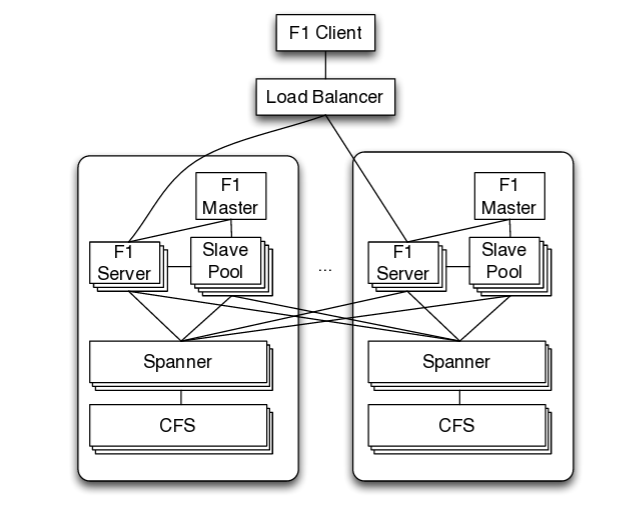
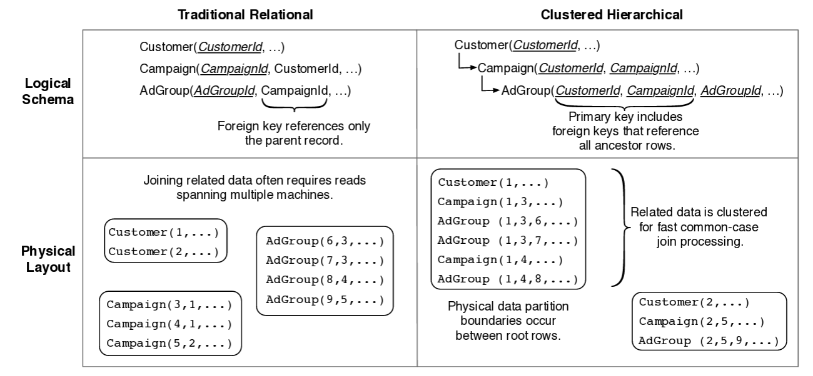
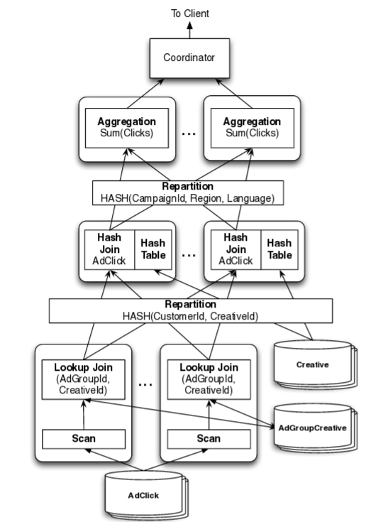

# Google F1

## F1 简介

F1 设计目标:
- 可扩展性: F1 的用户经常有复杂查询和 join, F1 提供了增加机器就能自动 resharding 和负载均衡
- 高可用性
- 事务: 提供包含 Spanner 的外部一致性的 ACID 事务
- 易用性:友好的 SQL 接口、索引支持、即查询



## F1 数据模型



层级存储:
- 可以并行化处理
- 可以加速 update 操作

## 索引

索引在 F1 中通过单个表存储起来; 同时支持对 常见类型的字段 和 Protocol Buffer 里的字段 索引

索引有两种:
- Local: 包含 root row 主键的索引为 local 索引
  - 索引和 root row 在同一个 directory
  - 索引文件和被索引的 row 放在同一个 spanserver
- Global: 不包含 root row 主键的索引为 local 索引
  - 索引被 shared 在多个 spanserver

## 无阻塞 schema 变更

## ACID 事务

F1 数据库层面的事务一致性:
- 快照事务: 只读事务
- 悲观事务: Spanner 标准事务
- 乐观事务: 两阶段: 无锁读, 而后短暂写
  - 写阶段: 尝试 CAS 修改该行的 lock 列(包含最后修改的 timestamp); 如果成功则表示事务成功 commit, 否则表示写重读

## 灵活的锁颗粒度

- 默认使用行级锁, 且只会锁这行的一个默认列
- 可以通过客户端锁定其他栏
- 层级锁: 锁定父表的列, 字表对应的列也会相应锁上

## 变更历史记录

- 每个事务变更都会通过 Protobuf 记录(包括变更前后的列值, 对应主键和事务提交的时间戳), 而且 root 表下会产生单独的 ChangeBatch 子表存放这些子表
- 一个事务同时变更多个 root 表, 每个 root 表的变更依然写入它的子表的对应变更值, 但是同时多了 **连接到其他 root 表的指针**

## F1 client

## 分布式 SQL

F1 支持集中式 SQL (在一个 F1 server 运行) 和 分布式 SQL

```sql
SELECT agcr.CampaignId, click.Region,cr.Language, SUM(click.Clicks) FROM
 AdClick clickJOIN AdGroupCreative agcrUSING (AdGroupId, CreativeId)
 JOIN Creative crUSING (CustomerId, CreativeId) WHERE click.Date ='2013-03-23'
 GROUP BY agcr.CampaignId, click.Region,cr.Language
```

可能的执行计划



- 一个 SQL 生成数十个更小的执行计划, 每个计划通过 有向无环图(DAG) 合并到最顶层
- hash partition 可以通过时刻调整, 而让 F1 的 partition 更高效; 而 range patition 需要相关统计
- F1 的运算都在内存中执行, 再加上管道的运用, 没有中间数据会存放在磁盘上
- 为了减少网络延迟, F1 使用 批处理和管道技术

## 层级表间 Join

## 客户端的并行

## Protobuf 提供嵌套表支持

## 异步 schema 变更

- 租约
  - F1 以特殊 KV 记录 schema 到 Spanner, 同时每个 F1 服务器在运行过程中自身维护一份拷贝
  - F1 约定 (shema 一次租约只持续数分钟, 所有 F1 服务器在租约过后都需要重新加载 schema) 以保证同一时刻最多只有 2 份 schema ; 如果节点无法重新完成续租, 它将自动终止服务, 并等待被集群管理设施重启
- 中间状态
  - delete-only: **保证** 该 schema 元素对应的 kv 总能被正确删除, 且不会为该 schema 生成新的 kv
  - write-only: **保证** schema 对写操作可见, 对读操作不可见

### 示例推演

schema 演化过程:

```shell
absent -> delete only -> write only -> (reorg) -> public
```

reorg: "database reorganization", 保证在索引变为 public 之前所有的旧数据的索引都被正确的生成

TODO:

### 证明过程简介

认为 数据库 是存储引擎中所有 kv 对的集合; 要求 **数据库(d) 对于 schema(S) 是一致的**, 当且仅当:
1. d 中不存在多余数据
2. d 中的数据是完整的

其中不存在多余数据要求:
1. d 中的列数据或索引必须是 S 中定义过的列或索引
2. d 中所有索引都指向合法的行
3. d 中不存在未知数据

数据的完整性要求:
1. public 状态的行或索引是完整
2. public 状态的(行和索引, 索引间的)约束是满足的

要求 **schema S1 至 S2 的变更过程是保持一致的**, 当且仅当:
1. 任何 S1 所定义的操作 OPs1 都保持数据库表示 d 对于 S2 的一致性
2. 任何 S2 所对应的操作 OPs2 都保持数据库表示 d 对于 S1 的一致性

推论: **schema S1 至 S2 的变更过程是保持一致的, 当且仅当 S2 至 S1 的变更过程也是保持一致的**

结论: **任何从 schema S1 至 S2 的变更, 如果其添加或删除了一项 _public_ schema 元素 E , 那么此变更不能保持一致性**

证明:
- **任何从 schema S1 到 S2 的变更, 如果其添加一项 _delete-only_ schema 元素 E, 那么此变更过程保持一致**
- **任何从 schema S1 到 S2 的变更, 如果其将一项 _delete-only_ 状态的 schema optional 元素 E 置为 public , 那么此变更过程保持一致**

至此, 针对 optional schema 元素的完整变更方案:

```shell
absent -> delete-only -> public
```
