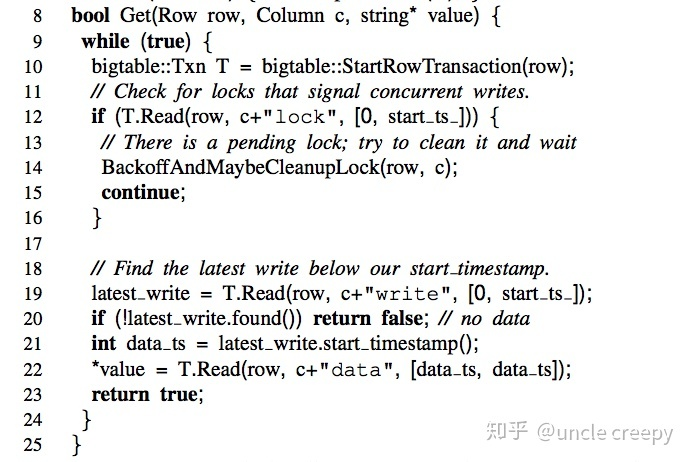
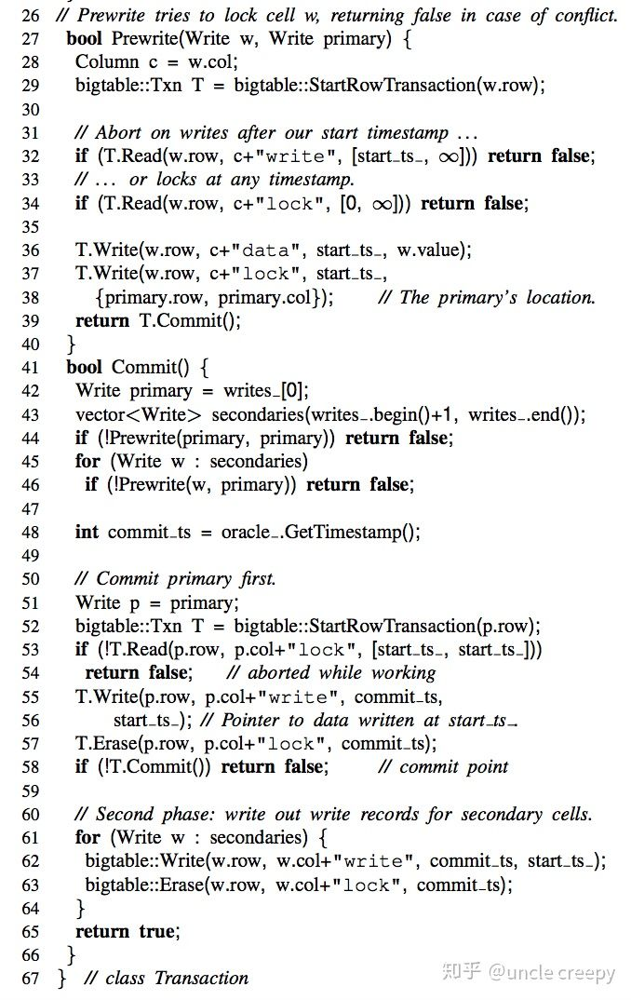
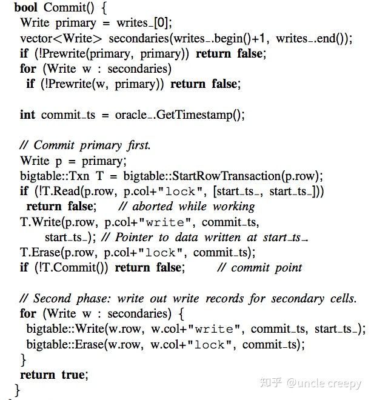

# Percolator

事务模型

Percolator 的特点如下

- 为增量处理定制
- 处理结果强一致
- 针对大数据量(小数据量用传统的数据库即可)

Percolator 为可扩展的增量处理提供了两个主要抽象：

- 基于随机存取库的 ACID 事务
- 观察者(observers) -- 一种用于处理增量计算的方式

## 事务

概述:
- percolator 主要业务场景为 batch insert
- percolator 的使用方式为客户端中间件, 嵌入用户进程
- percolator 的主要思想是 TSO(timestamp oracle) + MVCC
- percolator 不适合作为并发 update 单行的解决方案

### 前置条件

- percolator 的实现主要是依赖数据存储系统(bigtable)的单行原子性 , 提供多行, 跨表的ACID事务
- percolator 在用户数据外, 在单行上扩展了多个持久化的列, 这样用户不同时间点的单行数据, 在实际存储的时候会存储为多行数据(bigtable用列族，省下了原始data重复存储的空间)
- c:lock 持久化的锁状态
- c:write 记录一个 version, 表示该行最近的一次被递交的 version
- c:data 持久化数据

### 过程概述

假设 有事务 T1, T2 , 且 T1 的 begin_ts 在 T2 的 begin_ts , commit_ts 之间, 且 T1 比 T2 晚递交, 则在 snapshot 隔离级别下满足:
- T1 无法读取到 T2 的任意变更
- 如果 T2 和 T1 更改了同一行数据, T1会递交失败

### 事务读

### 事务递交的两阶段

- prewrite 阶段: 由 coordinate 节点(client 节点) 发起, 为需要写入的所有记录上锁, 防止出现脏写; 如果任一节点 prewrite 失败(已有锁, 节点下线等), 则停止 prewrite 并释放锁后 abort 事务, prewrite 节点中止

- commit 阶段: 把 client 的数据落入持久化的存储上, 并带上 commit ts 时间戳(commit ts 时间戳是在 client 执行 commit 命令的时候, 向 tso 节点申请的)

### Primary Lock 优化

percolator 在实现时, prewrite 阶段会为一个事务中的第一行(row)加入 primary lock, 其余则加入 secondary lock , 并指向 primary lock row 的 rowkey , 这样在二阶段时, secondary key 对应的 row 可以在整个二阶段未完成的情况下即可提前释放锁, 从而减少整个二阶段中锁的持有时间

### 缺陷分析

**Percolator非常不适合多线程update同一行记录的场景**

- 一般的 rdbms , 在 update 同一条记录的情况下, 多个 session 会在 DML 阶段获取读锁, 在递交阶段获取写锁(aka:2PL), 如果有出现多个 session 同时 update 一个记录(比如秒杀, 余额更改等), session 直接会在事务进行阶段自动排队等锁, 所以多个 session 最终仍会按次序获取到记录并递交成功
- 作为对比, percolator, 没有在 DML 中设置 2PL, 而是使用了乐观的 MVCC, 在递交阶段, 多个 session 几乎同时对一条记录的更改, 最终结果是最先递交的 session 成功, 其他的 session 全部失败
- 这是一种正确且低效的实现, 在这种实现下, 业务几乎无法运作, 因为大部分客户端要么陷入雪崩式的自动重试, 要么频繁报错

**global index 会导致单行插入也变成分布式事务**

- global index 和 row data 保存在不同的 storage node 中, 这会让单行插入的性质变化为一个分布式事务, 增加tso服务的容量
- 对于 newsql, 如果没有 global index, 那么很难称为一个符合 relational model 的 newsql 产品, 但如果加入了 global index, 那么按照一般的 rdbms schema 设置, 业务一般会设置 2-3 个 index, 最终导致用户未意识到的分布式事务增多, 造成容量瓶颈

**Percolator 单机事务, 也需要取 global timestamp**

- 因为在 begin 阶段 percolator 并不能知晓是否单机事务, 所以需要取 global timestamp , 单机事务的 Throughput 其实也会被 oracle timestamp server 所限制, 这个点 ClockSI, spanner 方案都有改进

### 对比

Percolator vs RDBMS/Relational Database Management System (如 innodb)
- Percolator 在事务过程是乐观的, 而 innodb 的实现, 在事务中是悲观的, 存在读锁和写锁
- Percolator 在递交的过程中的一阶段, 把锁和数据一起持久化; 该行为和 InnoDB 的 redo/undo log 是等价的, Percolator 依赖了 **bigtable 的单行原子和隔离** 来做到持久化行为

Percolator vs GTM/Global Transaction Management (如 Omid)
- GTM 在事务过程中的写入是直接持久化到 storage node 的, 这增加了写入的 latency
- GTM 的读取是分为两阶段且都要请求 TMS (transaction manager), 存在读单点
- GTM 的读是完全无阻塞的, 而 Percolator 如果事务正在提交中, 会阻塞进行中的事务读(此读锁和 2PL 的读锁不同, 请注意甄别)

Percolator vs Spanner 的 RW transaction
- Spanner 的读写事务是 **悲观锁**, 事务过程中就会加入读锁(读锁 buffer 在 storage 的内存), 还引入了参数发现, 超时锁自动释放, 因此在并发 update 冲突时有更好的性能(事务回滚代价更小)
- Spanner 还引入了 **blind-write 优化**, 在 batch insert 的情况下, 和 percolator 给本性能一致
- percolator 在事务过程中的读是 **根据时间戳做快照读**, spanner 是直接使用读锁 + 读最新数据, 不需要时间戳, 当并发事务重入同一条记录:
  - spanner 会等在事务过程中
  - percolator 会直接读取到 begin ts 之前的值, 并不会阻塞
- percolator 的提交是让 client 做 coordinator ; spanner 的提交是让 storage node 中的一个节点作为 coordinator
- percolator 的数据 ts 使用在事务过程 + 事务提交 ; 而 spanner 的 ts 仅用在 RW 事务的提交过程
- spanner 的 RW 事务的读是 **阻塞** 的, 因此 spanner 额外提供两个只读事务类型(spanner 只读事务指 **事务开始的时候就需要声明自己是只读事务**)
