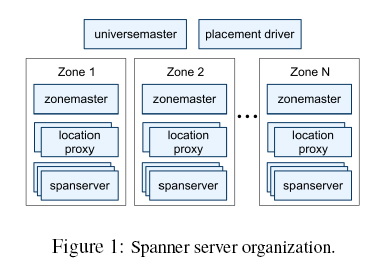
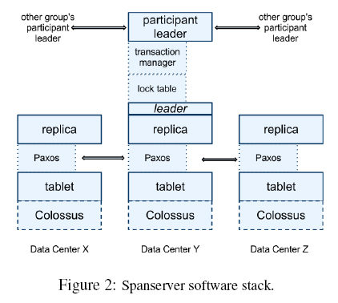
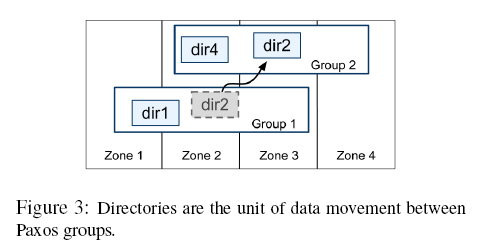
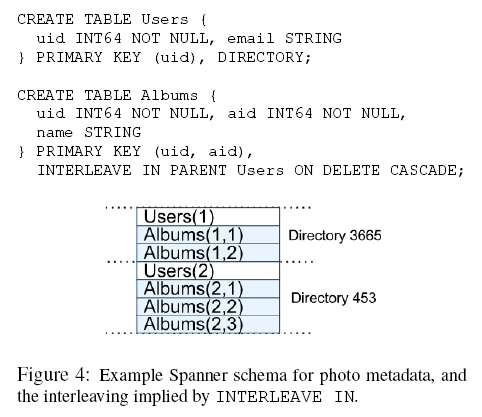
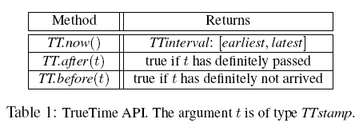
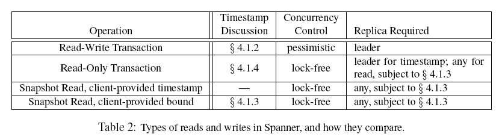

# Google Spanner

服务可用性: 所有读写请求在一定时间内得到响应, 可终止、不会一直等待

- 数据分布在各个 Posix 状态机上
- 采用相对独立的失败模式, 只要系统能够从 1-2 个数据中心失败中恢复过来(, 不考虑脑裂), 那么在延迟和可用性上, 优先考虑低延迟
- 应用应该能够定义:
  - 控制写操作的延迟: 不同数据副本之间距离有多远
  - 控制用户读取数据的延迟: 数据距离用户有多远
  - 控制可用性和读操作性能: 需要维护多少个副本
- 为了有效利用以上特性, 需要一个 **为事务分配全球范围内有意义的提交时间戳(TrueTime API)**; 该时间戳 API 用于暴露时钟的不确定性, 如果这个不确定性很大, Spanner就降低速度来等待这个大的不确定性结束

## Spanner 结构和实现机理

- universemaster: 一个 Spanner 部署称为一个 universe, 其中的控制部分即 universemaster, universemaster 作为控制台, 提供 zone 的状态信息, 用于相互调试
- placedriver: 周期性的与 spanserver 交互, 用于负载均衡
- zone: 由组织分割的 Spanner 单元, 是 管理部署的基本单元
  - zone 的集合也是数据可以被复制操作到的位置的集合
  - 当新的数据中心加入服务, 或者老的数据中心被关闭时, zone 可以被加入到一个运行的系统中, 或者从中移除
  - 物理隔离的单元, 在一个数据中心中, 可能有一个或者多个 zone
- 一个 zone 包括 一个 zonemaster, 成百上千个 spanserver
  - 数据分配 zonemaster -> spanserver -> client
  - client 通过 location-proxy 定位为自己提供数据的 spanserver

### MegaStore

- MegaStore 目标应用是读远远多于写的

### Dremel

交互式数据分析系统

## Spanserver 软件栈

- spanserver 用于管理多个数据结构实例 tablet
- 数据实例的映射: (key:string, timestamp:int64)->string
- 数据同时被 spanserver 附带上时间戳(MVCC 特性)
- 一个 tablet 的状态存储在 B-tree 结构的文件集合和写前日志(write-ahead-log), 通过 Colossus (继承自 Google File System(GFS)) 分布式文件系统存储这些状态
- 为了支持复制, 每个 spanserver 会在每个 tablet 上面实现一个单个的 Paxos 状态的机器; 每个状态机在相应的 tablet 中保存自己的元数据和日志
- Paxos 状态机实现 基于时间的领导者租约的长寿命的领导者(0s ~ 10s)
- (可能已经过时, )Spanner 会对写操作进行两次记录: tablet 日志和 Paxos 日志中
- 在领导者副本中, 为了保证 **长事务** 的效率, 每个 spanserver 通过实现一个锁表来实现并发控制(不同于乐观并发控制)
  - 对于需要同步的操作(事务型读操作等), 需要获取锁表中的锁
  - 该锁表包含了两阶段锁机制的状态: 它把键的值域映射到锁状态上面
- 在领导者副本中, 为了支持 **分布式事务**, 每个 spanserver 会实施一个事务管理器
  - 事务管理器实现了 participant leader 的功能, 该组内的其他副本作为 participant slaves
  - 如果一个事务包含一个 Paxos Group, 则该事务可绕过事务管理器
  - 如果一个事务包含多于一个 Paxos Group, 那些组的领导者之间会彼此协调合作完成两阶段提交
  - 每个事务管理器的状态, 会被保存到底层的 Paxos Group

## 目录和放置

- 在一系列键值映射的上层, Spanner 实现支持一个被称为 **目录** 的桶抽象
- 属于一个目录的的所有数据, 都具有相同的副本配置
- Paxos Group 可以包含多个目录; 当数据在不同的 Paxos Group 之间进行移动时, 会一个目录一个目录地转移
- 目录迁移的规则可能有:
  - 为了减轻一个 Paxos Group 的负担
  - 频繁地一起访问的目录都放置到同一个组中
  - 一个目录转移到距离访问者更近的地方
- MoveDir : 一个用于 Paxos Group 之间转移目录 或者 用来为 Paxos Group 增加和删除副本 的后台任务
- Movedir 会注册一个 **事实(fact)**, 表明它要转移数据, 然后在后台运行转移数据; 当它几乎快要转移完指定数量的数据时, 就会启动一个事务来自动转移那部分数据(删除原来的数据 ?), 并且为两个 Paxos Group 更新元数据
- 事实上, 当一个目录变得太大时, Spanner 会把它分片存储; 每个分片有可能不在同一个 Paxos Group 中; 同时 Movedir 在不同组之间转移的不是目录, 而是 **分片**

## 数据模型

以下数据, Spanner 会暴露给应用
- 基于模式化的半关系表的数据模型
- 查询语言
- 通用事务

应用的数据模型架构在 **目录桶的键值映射层** 之上

- 客户端 通过 `INTERLEAVE IN` 语句在数据库中声明主从库的层次结构
- 同时 Spanner 根据声明建立数据库的交织层次(interleaved layout)

## TrueTime

- TTinterval: 时间区间, 表示有界限的时间不确定性
- TrueTime 显式地把时间表达成 TTinterval
- TTinterval 区间的端点是 TTstamp 类型
- TrueTime 利用 GPS 和原子钟两种失败模式: GPS 存在天线和接收器失效、局部电磁干扰和 GPS 系统运行中断; 原子钟则会因频率误差而经时间积累
- TrueTime 是由每个数据中心上面的许多 time master 机器和每台机器上的一个 timeslave daemon 来共同实现的

## 并发控制

Spanner 客户端的写操作和 Paxos 看到的写操作(例如 2PL 操作)是不同的

### 时间戳管理

- Spanner 可以支持读写事务、只读事务(预先声明的快照隔离事务)和快照读操作; 独立写操作, 会被当做 读写事务 ; 非快照独立读操作, 会被当做 只读事务
