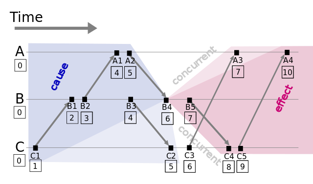
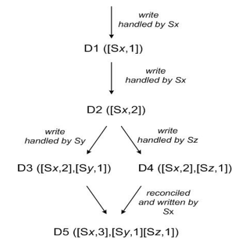
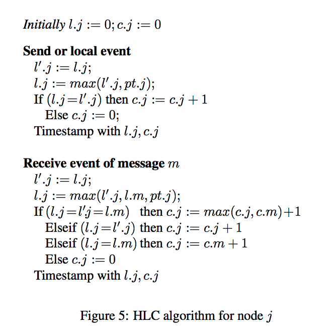

# 事务时序

逻辑时钟:
- 只保证有因果关系的事务间有序(因果序)
- 不能保证全局顺序

## TSO(Timestamp Oracle)

物理时钟

在事务中加入物理时钟时间戳

- 缺点: 依赖一个全局时间分配器

## Lamport timestamps

逻辑时钟

缺点:
- 没有判断同时发生的事务

## Vector clock

逻辑时钟

缺点:
- 无法(实时)解决冲突

## Version vector

逻辑时钟

缺点:
- 如果使用 client 作为 vector 源, 可能面临 vector 过多的情况(这种情况 Vector clock 也哟)

## HLC(HybirdLogicClock)

物理(48bits)+逻辑(16bits)时钟

- `l.j`: 本地 HLC
- `pt.j`: 物理时间戳
- `c.j`: 逻辑时间戳

特点:
- 写轻量, 本地事务不需要额外的网络负担
- 没有全局的时间误差勘测(NTP 等), 只能保证因果序, 不能保证全局时间序

## TrueTime

原理:
- 引入原子钟和 GPS 等硬件设备, 来确保集群中各个节点的物理时钟误差在一定范围内
- 假设 事务 A TrueTime-API 得到 `[t1-ε1,t1+ε1]`, 事务 B 得到 `[t2-ε2,t2+ε2]`, 需要保证 **`t1+ε1 < t2-ε2`**(即 `t2-t1 > ε1+ε2`)

特点:
- 带有全局时间误差的 TrueTime-API , 保证全局时间序
- 昂贵的额外硬件设备(GPS, 原子钟)
- 牺牲了延迟(`ε1+ε2`)
