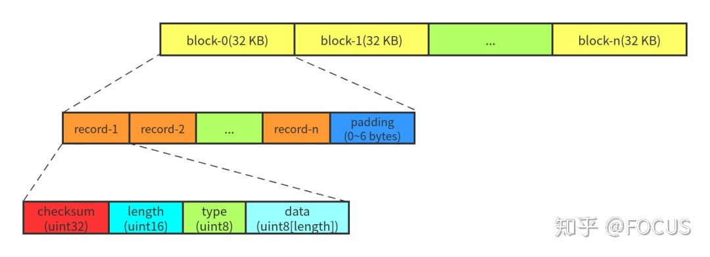
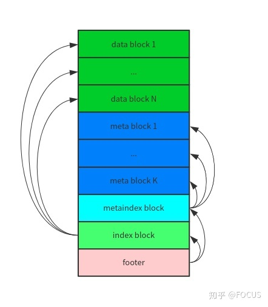

# LevelDB

## Log

[Write Ahead Log](https://github.com/google/leveldb/blob/master/doc/log_format.md)



- 如果 block 的末尾不足 7 字节(小于 header 的大小), 则全部填 0x00, 读取的时候会被忽略
- 如果 block 的末尾刚好 7 字节, 则填充一个 length 为 0 的 record (用于格式化等命令？)

```cpp
// block_record.type
enum RecordType {
  // Zero is reserved for preallocated files
  kZeroType = 0,

  kFullType = 1,

  // For fragments
  kFirstType = 2,
  kMiddleType = 3,
  kLastType = 4
};
```

## SSTable



- 为什么 index block 在 metaindex block 之前？是因为 metaindex block 是被可以被省略？
