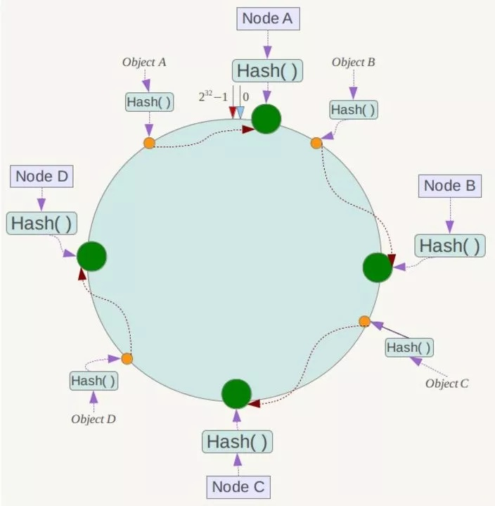
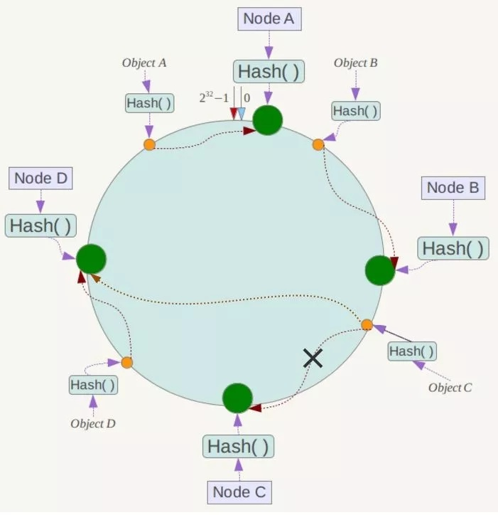
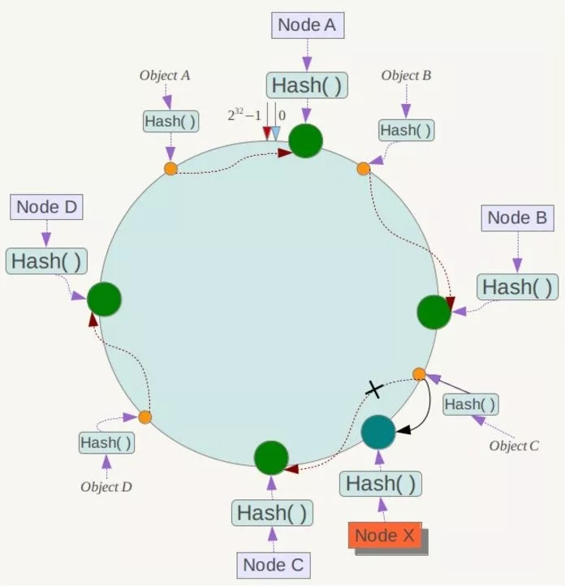

# Redis

## 概念

### 一致性 Hash

- [redis 一致性hash算法 - 浩子的博客 - CSDN博客](https://blog.csdn.net/u013851082/article/details/68063446)
- [面试必备: 什么是一致性Hash算法](https://zhuanlan.zhihu.com/p/34985026)







### hash_slot

redis 计算 cluster: `solt = crc16(key) & (16384-1)`

1. 集群规模: Redis 集群中主节点的数量基本不可能超过 1000 个
2. 心跳包: redis 的一个节点的心跳信息中需要携带该节点的所有配置信息, 而 16K 大小的槽数量所需要耗费的内存为 2K, 但如果使用 65K 个槽, 这部分空间将达到 8K, 心跳信息就会很庞大
3. slot/槽的利用率: Redis 主节点的配置信息中, 它所负责的哈希槽是通过一张 bitmap 的形式来保存的, 在传输过程中, 会对 bitmap 进行压缩, 但是如果 bitmap 的填充率 (slots/N) 很高的话, bitmap 的压缩率就很低, 所以 N 表示节点数, 如果节点数很少, 而哈希槽数量很多的话, bitmap 的压缩率就很低; 而 16K 个槽当主节点为 1000 的时候, 是刚好比较合理的, 既保证了每个节点有足够的哈希槽, 又可以很好的利用 bitmap
4. cnc16 结果的均匀分布: 选取了 16384 是因为 crc16 会输出 w16bit 的结果, 可以看作是一个分布在 0-2^16-1 之间的数, redis 的作者测试发现这个数对 2^14 求模的会将 key 在 0-2^14-1 之间分布得很均匀, 因此选了这个值

## 架构模式

### 集群(redis>=3.0)

从 redis 3.0 之后版本支持 redis-cluster 集群, redis-cluster 采用无中心结构, 每个节点保存数据和整个集群状态, 每个节点都和其他所有节点连接

特点:
1. **无中心架构**(不存在哪个节点影响性能瓶颈), 少了 proxy 层
2. 数据按照 slot 存储分布在多个节点, 节点间数据共享, 可动态调整数据分布
3. 可扩展性, 可线性扩展到 1000 个节点, 节点可动态添加或删除
4. 高可用性, 部分节点不可用时, 集群仍可用; 通过增加 Slave 做备份数据副本
5. 实现故障自动 failover, 节点之间通过 **gossip** 协议交换状态信息, 用投票机制完成 Slave 到 Master 的角色提升

缺点:
1. 资源隔离性较差, 容易出现相互影响的情况
2. 数据通过异步复制, 不保证数据的强一致性

## 功能

### 分布式锁

```shell
> set lock.key 1 EX expireTime NX

> setnx lock.key 1
(integer) 1
> expire lock.key expireTime
```

## 注意事项

### 缓存穿透/缓存雪崩

缓存穿透:
- 解释: 大量没有缓存在 redis 中的数据, 直接访问数据库
- 处理:
  - 建立 IP/内容黑名单, 对访问进行过滤
  - 对明确无效的数据也缓存, 但是时效更短

缓存雪崩:
- 解释: redis 重启等服务失效 或 大量缓存集中失效 期间的访问, 会全部集中到数据库
- 处理:
  - 对 redis 做主从复制, 做多级缓存
  - 缓存服务重启时, 对访问排队, 减缓处理
  - 不同的 key 设置不同的失效时间, 让缓存失效的时间点均衡

## 内存

### 内存使用统计

```shell
172.17.0.2:6379> info
...
# Memory
...
```

| 属性名                    | 属性说明                                                      |
| :-                        | :-                                                           |
| `used_memory`             | Redis 分配器分配的内存总量, 即 内部存储的所有数据的内存占用量 |
| `used_memory_human`       | 以可读的格式返回 `used_memory`                                |
| `used_memory_rss`         | 从 **操作系统** 的角度显示 Redis 进程占用的物理内存总量       |
| `used_memory_peak`        | 内存使用的最大值, 表示 `used_memory` 的峰值                   |
| `used_memory_peak_human`  | 同 `used_memory_human`                                        |
| `used_memory_lua`         | Lua 引擎所消耗的内存大小                                      |
| `mem_fragmentation_ratio` | `used_memory_rss`/`used_memory` 的比值, **内存碎片率**        |
| `mem_allocator`           | Redis 使用的内存分配器, 默认为 `jemalloc`                     |

> 注: 1) 当 mem_fragmentation_radio > 1 时, 说明 used_memory_rss - used_memory 多出的部分内存并没有用于数据存储, 而是被内存碎片所消耗, 如果两者相差很大, 说明碎片率严重
> 2) 当 mem_fragmentation_ratio < 1 时, 折衷情况一般出现在操作系统把 Redis 的内存交换 (Swap) 到硬盘导致, 由于硬盘速度远远慢于内存, Redis 性能会变得很差, 甚至僵死

### 内存消耗划分

只要包括: 自身内存 + 对象内存 + 缓冲内存 + 内存碎片

注意:
- 数据对齐
- 安全重启 -- 重启节点以便重新整理碎片

#### 自身内存

TODO

#### 对象内存

对象内存时 Redis 内存占用最大的一块

#### 缓冲内存

#### 内存碎片

### 子进程内存消耗

- 关闭 linux Transparent Huge Pages(THP) 机制, 防止 copy-on-write 期间内存过都消耗
- 预留部分内存以供 Redis 的子进程产生
- 设置 sysctl `vm.overcommit_memory = 1` 允许内核可以分配所有的物理内存, 防止 Redis 在 fork 时因系统剩余内存不足而失败

### 动态调整内存上限

- Redis 默认无限使用服务器内存, 为防止极端情况下导致的 系统内存耗尽, 建议为所有的 Redis 进程都要配置 `maxmemory`

### 内存回收策略

Redis 内存回收体现在:
- 删除到达过期时间的键对象
  - 惰性删除 -- 当客户端读取带有超时属性的键时, 如果已经超过键设置的过期时间, 则执行删除操作并返回空
  - 定时任务删除 -- 带 快/慢 速率的自适应算法
- 内存使用达到 `maxmemory` 上限时触发 内存溢出控制策略(maxmemory-policy)
  - neoviction
  - volatile-lru
  - allkeys-lru
  - allkeys-random
  - volatile-random
  - volatile-ttl

## 事务

Redis 的 "事务" 不满足 ACID 原则, 无跨行事务

- Redis 的事务只是将一系列的操作排成一个队列, 在 `EXEC` 后统一执行
- `watch` 指令监控的 key 如果在执行事务前发生了变化(expire 后 key 失效, watch 前 key 不存在但是 watch 后 key 被 set , so on), 那么后面的第一个事务不会被执行
- 后续的事务在没有任何 `watch` 的前提下能继续正常使用
