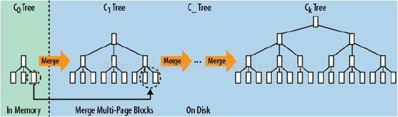

# 存储引擎

DAM(Disk-Access mode):
1. 一台机器有一个处理器、一个可以包含 M 个 objects 的内存以及无穷大小的外存
2. 在一次 I/O 操作中, 计算机可以在内存和外存之间传输包含 B objects 的 block, 其中 1 < B < M
3. 一个算法的 Running Time 可以定义为在算法执行期间 I/O 的次数、只用内存数据进行的计算可以认为是没有代价的
4. 一个数据结构的大小可以定义成可以包含它的 blocks 数的大小

- **写放大**: 实际写入磁盘的数据大小 和 程序要求写入数据大小 之比
- **读放大**: 一次查询所需要的 I/O 数

## B-Tree

为磁盘和内存而优化

1. 对 B 树的写入过程是一次 **原位写入** 的过程
2. 主要分为两个部分, 首先是查找到对应的块的位置, 然后将新数据写入到刚才查找到的数据块中, 然后再查找到块所对应的磁盘物理位置, 将数据写入去
3. 在内存比较充足的时候, 因为 B 树的一部分可以被缓存在内存中, 所以查找块的过程有一定概率可以在内存内完成, 不过为了表述清晰, 我们就假定内存很小, 只够存一个 B 树块大小的数据吧
4. 可以看到, 在上面的模式中, 需要两次随机寻道(一次查找, 一次原位写), 才能够完成一次数据的写入, 代价很高

B+Tree 的放大特性: 如果 B+Tree 的 block size 为 B, 故每个内部节点包含 O(B) 个叶子节点, 叶子节点包含 O(B) 条数据, 假设数据集大小为 N, 则 B+Tree 的高度为 O((log(N/B))/(logB))
- **写放大**: B+Tree 的每次 Insert 都会在叶子节点写入 B 的数据, 所以 写放大是 B
- **读放大**: B+Tree 的一次查询需要从根节点一路查到具体的某个叶子节点, 需要等同层数大小的 I/O, 也就是(读放大是) O((log N/B)/(logB))

## LSM 树(Log-Structured Merge Tree)

代表数据库: nessDB, levelDB, HBase, rocksdb

核心思想: 通过 **批量存储** 技术规避磁盘随机写入问题, 放弃部分读能力

> 假定内存足够大, 不需要每次有数据就必须将数据写入到磁盘中, 可以将 *最新* 的数据驻留(hold)在内存中
> 在积累到足够多后(达到 threadhold 后批量写入到磁盘), 通过 归并排序 将内存内的数据合并到磁盘队尾(rolling merge)

如果要最大化发挥磁盘的技术特性, 一次性的读取或写入固定大小的一块数据, 并尽可能的减少随机寻道操作的次数

特性:
- **批量写入, 存储延迟**
- 相比于 B-tree , 能显著地减少磁盘磁盘臂的开销, 并能在较长的时间内提供对文件的高速插入
- 在需要查询高速响应的时候性能不佳

适用于: 索引插入比检索更频繁的场景

### 放大特性

#### Leveld LSM Tree

如果数据集大小为 N, 放大因子为 k, 最小一层一个文件大小为 B, 每层文件的单个文件大小相同为 B, 不过每层文件个数不同

- **写放大**: 同一个 record, 会在本层 k 此后才会被 compact 到下一层(放大 k), 层数为 O((log N/B) / (log B)) , 故写放大为 O(k(log N/B) / (log B))
- **读放大**: 依次在每一层进行 **二分查找**, 直到最后一层找到:
  - R = (log N/B) + (log N/(Bk)) + (log N/(Bkk)) + ... + 1 = (log N/B) + (log N/B) - (log k) + (log N/B) - 2(log k) + ... + 1
  - 读放大为 O((log N/B)*(log N/B)/(log k))

#### Size-tiered LSM-Tree

假设数据集大小为 N，放大因子为 k，最大层有 k 个大小为 N/k 个文件，倒数第二层有 k 个 N/kk 个文件…那么一共有 O((log N/B)/(log k)) 层

- **写放大**: 同一个 record，在每一层只会写一次，所以写放大等于层数，即 O((log N/B)/(log k))
- **读放大**: 每一层读 k 个文件，一共 O((log N/B)/(log k)) 层，故一共需要读 O(k(log N/B)/(log k)) 个文件，不同于 Leveld LSM Tree，一个文件不只是一个 block B，而是有很多 blocks，近似 O(N/B) 个，在文件内部二分查找找到对应的 block 需要 O(log N/B)，故整体需要 O(k(log N/B)(log N/B)/(log k)) 次 I/O ，即读放大为 O(k(log N/B)(log N/B)/(log k))

#### 具体阐述

LSM-Tree 是由 两个或两个以上 存储数据的结构 组成的, 以两个部件为例:
- 一个部件常驻 内存 , 称为 C0 树(C0), 可以作为任何方便键值查找的数据结构
- 一个部件常驻 硬盘 , 称为 C1 树(C1), 其数据结构与 B-Tree 相似(C1 中经常被访问到的节点也会被缓存在内存中)

- 当插入一条新的数据条目后, 先向日志文件中写入插入操作的日志, 以备恢复
- 根据新条目的索引值将新条目插入到 C0 中
- 当C0 的大小达到阈值, 将一部分的条目从 C0 滚动合并到磁盘中的 C1 中
- C1 结构和 B-Tree 相似, 但其节点中的条目是满的, 节点的大小为 1 页, 树根之下的所有单页节点合并到地址连续的多页块中

### LSM-Tree 优化方案

#### Bloom filter

带随机概率的 Bitmap

#### Compact

## LSH 树()

## FractalTree Index

FTI 将每个 Block 从中分出一部分用作 buffer;
如果每个 block size 为 B, 每个内部节点拥有 K 个子节点, 则 FTI 的高度为 O((log N/B)/(log K))

- **写放大**: 每个 B/K 个 records 产生 1 次 I/O , 层数为 O((log N/B)/(log K)); 即当写入 K 时, 写放大是 O(K (log N/B) / (log K))
- **读放大**: O((log N/B) / (log K))

## Hash Map

特性:
- 支持 O(1) 的增删读写操作, 支持随机读写
- 不支持顺序读写, 不支持范围读写

## 读写放大总结

- Fractal Tree Index 在 **写放大和读放大** 方面表现的都很不错
- Leveld LSM Tree 在 **写放大** 方面和 FTI 差不多, 但是读放大比 FTI 要差
- Size-tiered LSM Tree 在 **写放大** 方面优于 FTI 和 Leveld LSM Tree, 但读放大方面表现最差, 一般 **少读多写并对写性能有较高要求** 的场景下考虑使用 Size-tired LSM Tree
- B+ Tree 有较高的写放大, 但是在 **读放大** 方面不错
