# TIDB

<!-- TOC -->

- [TIDB](#tidb)
	- [概念](#概念)
	- [TIDB 基础](#tidb-基础)
		- [存储](#存储)
			- [Region](#region)
			- [事务](#事务)
		- [计算](#计算)
			- [数据编码规则](#数据编码规则)
			- [SQL 运算](#sql-运算)
			- [SQL 架构](#sql-架构)
		- [调度](#调度)
			- [调度需求](#调度需求)
			- [调度的基本操作(Raft)](#调度的基本操作raft)
			- [信息收集](#信息收集)
			- [调度策略](#调度策略)
		- [事务模式](#事务模式)
			- [乐观事务(默认):](#乐观事务默认)
			- [悲观事务](#悲观事务)
	- [SQL 流程](#sql-流程)
		- [协议层](#协议层)
		- [SQL 处理](#sql-处理)
		- [执行 SQL 计划](#执行-sql-计划)
			- [Volcano Optimizer](#volcano-optimizer)
	- [Insert 概览](#insert-概览)
	- [SQL Parser 的实现](#sql-parser-的实现)
		- [definitions](#definitions)
		- [rules](#rules)
	- [Select 概览](#select-概览)
		- [逻辑优化 -- RBO/rule based optimization](#逻辑优化----rborule-based-optimization)
			- [列裁剪](#列裁剪)
			- [最大最小消除](#最大最小消除)
			- [投影消除](#投影消除)
			- [谓词下推](#谓词下推)
			- [构建节点属性](#构建节点属性)
		- [物理优化 -- CBO/cost based optimization](#物理优化----cbocost-based-optimization)
			- [代价评估](#代价评估)
	- [Hash Join](#hash-join)
		- [Classic Hash Join](#classic-hash-join)
		- [Grace Hash Join](#grace-hash-join)
		- [TiDB 的 Hash Join](#tidb-的-hash-join)
			- [(Main Thread)读 Inner 表数据](#main-thread读-inner-表数据)
			- [Outer Fetcher](#outer-fetcher)
			- [Join Worker](#join-worker)
			- [Main Thread](#main-thread)
			- [Hash Join FAQ](#hash-join-faq)
	- [Chuck 和执行框架](#chuck-和执行框架)
		- [Column](#column)
	- [Index Lookup Join](#index-lookup-join)
	- [统计信息](#统计信息)
		- [蓄水池抽样](#蓄水池抽样)
		- [Count-Min Sketch](#count-min-sketch)
		- [列直方图](#列直方图)
		- [索引直方图](#索引直方图)
	- [索引范围计算](#索引范围计算)
		- [抽取表达式](#抽取表达式)
			- [单列索引](#单列索引)
			- [多列索引](#多列索引)
		- [计算逻辑区间](#计算逻辑区间)
			- [单列索引](#单列索引-1)
			- [多列索引](#多列索引-1)
	- [Sort Merge Join](#sort-merge-join)
		- [内存 OOM](#内存-oom)
	- [Insert 详解](#insert-详解)
- [builddatabase](#builddatabase)
	- [TiDB 的异步 schema 变更实现](#tidb-的异步-schema-变更实现)
		- [概念](#概念-1)
		- [变更流程](#变更流程)
			- [模块](#模块)
			- [基本流程](#基本流程)
			- [详细流程](#详细流程)
			- [优化](#优化)
				- [实现](#实现)
	- [附加](#附加)
		- [概念](#概念-2)

<!-- /TOC -->

## 概念

- Timestamp Oracle (TO)
- The Server Oracle (TSO)
- Commit Table (CT)
- Shadow Cells (SCs)
- Transactional Clients (TCs)


- TiDB-Server:
  - 负责接收 SQL 请求, 处理 SQL 相关的逻辑, 并通过 PD 找到存储计算所需数据的 TiKV 地址, 与 TiKV 交互获取数据, 最终返回结果
  - TiDB 无状态, 本身不存储数据, 只负责计算
  - 可无限水平扩展, 可通过均衡负载组件(LVS/HAProxy/F5) 对外提供统一的接入地址
- PD-Server:
  - 集群管理模块
  - 存储集群的元数据
  - 对 TiKV 集群进行调度和负载均衡(数据迁移/Raft group leader 迁移)
  - 分配全局唯一且递增的事务 ID , 提供全局时钟服务
  - PD 通过 Raft 协议保证数据安全性; 因此建议部署奇数个 PD 节点
- TiKV-Server:
  - 分布式, 带事务的 Key-Value 存储引擎
  - 存储数据的基本单位是 Region, Region 负责存储一个 Key Range(从 StartKey 到 EndKey 的左闭右开区间)
  - 以 Raft 协议做复制, 保证数据一致性和容灾; 副本以 Region 为单位调度管理; 多个 Region 以 (?) 组成 Raft Group, 互为副本
- TiSpark
  - 用于解决复杂的 OLAP 需求, 将 Spark SQL 直接运行在 TiDB 存储层上

特性:
- 水平扩展:
  - 计算能力: TiDB
  - 存储能力: TiKV
  - 调度能力: PD

## TIDB 基础

### 存储

- RocksDB: 存储引擎
- Raft: 分布式一致性
  - Leader 选举
  - 成员变更
  - 日志复制

TiKV 写数据到 RocksDB 的过程:


#### Region

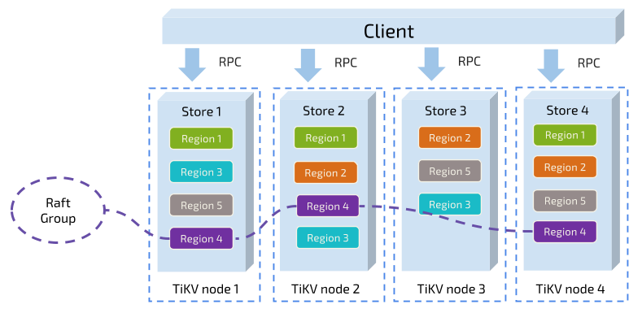

- 对于一个 KV 系统, TiKV 以一个连续的 Key 组作为一个 Region , 保存在一个存储节点上
- Region 的规则规定:
  - 以 Region 为单位, 将数据分散在集群中所有的节点上, 并且尽量保证每个节点上服务的 Region 数量差不多
  - 以 Region 为单位做 Raft 的复制和成员管理

#### 事务

Percolator 的两阶段提交
- `Client.Set()` 数据仅被缓存, 而不做刷写
- 在第二阶段, 只要有一个 percolator 事务的 [primary row 的 lock 字段] 被清除并且 [write record] 写好(这两个动作是在同一个 bigtable 事务中原子完成的), 那么就认为事务提交成功

### 计算

#### 数据编码规则

每行数据的编码规则:

```shell
Key: tablePrefix{tableID}_recordPrefixSep{rowID}
Value: [col1, col2, col3, col4]
```

(Unique )Index 数据的编码规则:

```shell
Key: tablePrefix{tableID}_indexPrefixSep_indexID_indexedColumnsValue
Value: rowID
```

(Ununique ) Index 数据的编码规则:

```shell
Key: tablePrefix{tableID}_indexPrefixSep_indexID_indexedColumnsValue_rowID
Value: null
```

上文的部分源码:

```go
var(
    tablePrefix     = []byte{'t'}
    recordPrefixSep = []byte("_r")
    indexPrefixSep  = []byte("_i")
)
```


#### SQL 运算

认为 SQL 可以映射到 KV , 那么一般的 SQL 运算:
1. 构建 Key-Range: 由于表中的 RowID 都在 [0, MaxInt64) 这个范围; 用 0 和 MaxInt64 根据 Row 的 Key 编码规则, 就能构造出一个 [StartKey, EndKey) 的左闭右开区间
2. 扫描 Key-Range
3. 过滤数据
4. 计算 Count

优化:
- 为了减少 RPC 开销, 将计算往 存储节点 移


#### SQL 架构


### 调度

#### 调度需求

调度的基本要求:
- 副本数量不能多也不能少
- 副本需要分布在不同的机器上
- 新加节点后, 可以将其他节点上的副本迁移过来
- 节点下线后, 需要将该节点的数据迁移走

调度的优化需求:
- 维持整个集群的 Leader 分布均匀
- 维持每个节点的储存容量均匀
- 维持访问热点分布均匀
- 控制 Balance 的速度, 避免影响在线服务
- 管理节点状态, 包括手动上线/下线节点, 以及自动下线失效节点

#### 调度的基本操作(Raft)

- 增加一个 Replica(AddReplica)
- 删除一个 Replica(RemoveReplica)
- 将 Leader 角色在一个 Raft Group 的不同 Replica 之间 transfer(TransferLeader)

#### 信息收集

TiKV 集群定期向 PD 汇报

**每个 TiKV 节点会定期向 PD 汇报节点的整体信息**:
- 总磁盘容量
- 可用磁盘容量
- 承载的 Region 数量
- 数据写入速度
- 发送 / 接受的 Snapshot 数量(Replica 之间可能会通过 Snapshot 同步数据)
- 是否过载
- 标签信息(标签是具备层级关系的一系列 Tag)

**每个 Raft Group 的 Leader 会定期向 PD 汇报信息**:
- Leader 的位置
- Followers 的位置
- 掉线 Replica 的个数
- 数据写入 / 读取的速度

#### 调度策略

### 事务模式

TiDB 3.0 支持两种事务模式: [乐观事务](https://zhuanlan.zhihu.com/p/87608202) 和 [悲观事务](https://zhuanlan.zhihu.com/p/79034576)

#### 乐观事务(默认):

- 乐观事务会在执行 **Commit 时才检查冲突**, 而不是 MySQL 的 **为数据上锁时(X/S lock)检查冲突**, 冲突检查的主要位置不同

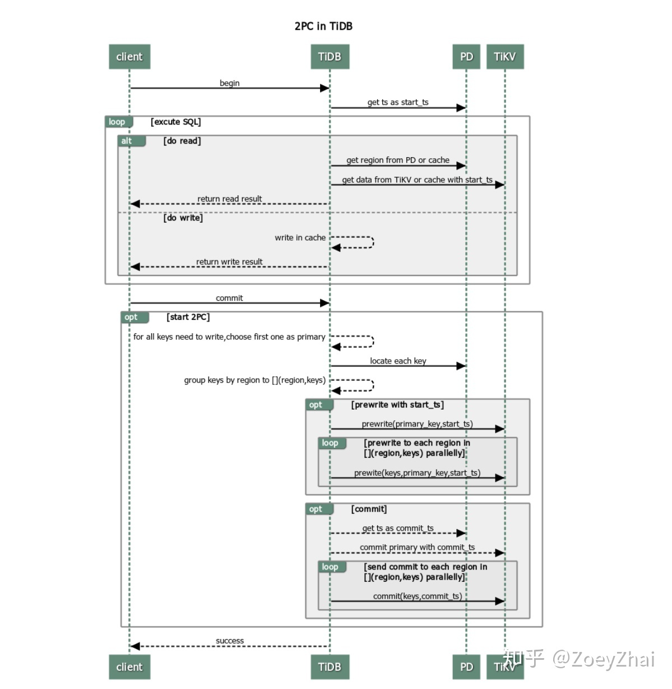

事务流程:
1. 客户端 begin 了一个事务
  1. TiDB 从 PD 获取一个全局唯一递增的版本号作为当前事务的开始版本号, 这里我们定义为该事务的 start_ts
2. 客户端发起读请求
  1. TiDB 从 PD 获取数据路由信息, 数据具体存在哪个 TiKV 上
  2. TiDB 向 TiKV 获取 start_ts 版本下对应的数据信息
3. 客户端发起写请求
  1. TiDB 对写入数据进行校验, 如数据类型是否正确、是否符合唯一索引约束等, 确保新写入数据事务符合一致性约束, 将检查通过的数据存放在内存里
4. 客户端发起 commit
5. TiDB 开始两阶段提交将事务原子地提交, 数据真正落盘
  1. 从当前要写入的数据中选择一个 Key 作为当前事务的 Primary Key
  2. 从 PD 获取所有数据的写入路由信息, 并将所有的 Key 按照所有的路由进行分类
  3. 并发向所有涉及的 TiKV 发起 prewrite 请求, TiKV 收到 prewrite 数据后, 检查数据版本信息是否存在冲突、过期, 符合条件给数据加锁
  4. 收到所有的 prewrite 成功
  5. 向 PD 获取第二个全局唯一递增版本, 作为本次事务的 commit_ts
  6. 向 Primary Key 所在 TiKV 发起第二阶段提交 commit 操作, TiKV 收到 commit 操作后, 检查数据合法性, 清理 prewrite 阶段留下的锁
  7. 收到 f 成功信息
6. TiDB 向客户端返回事务提交成功
7. TiDB 异步清理本次事务遗留的锁信息

鉴于 TiDB 默认的乐观事务和 MySQL 默认的悲观事务之间的冲突, TiDB 对失败的 Commit 操作有额外的 **重试机制**:
- `tidb_disable_txn_auto_retry`: 默认 1 ; 是否 **关闭** 自动重试
- `tidb_retry_limit`: 最多重试次数

注意: TiDB 的重试机制会 **重新获取版本号作为 start_ts, 可能会破坏 ReadRepeatable 隔离性**, 该机制不适合依赖查询结果以更新 SQL 的事务

为了减少 TiKV 的 prewrite 阶段冲突回滚, TiDB 会在内存中进行一次 **冲突预检**: 如果 TiDB 本身发现 **写写冲突**, 那么只会发送第一次的写入, 同时取消后续的写入

启用 TiDB 冲突预检 的 **事务内存锁**:

```yaml
[txn-local-latches]
enable = false
capacity = 1024000
```

capacity: hash 取模值; TiDB 通过 key 的 hash 来检查 TiDB 事务锁(判断冲突)

TiKV 的冲突检查:
```yaml
scheduler-concurrency = 2048000
```

#### 悲观事务

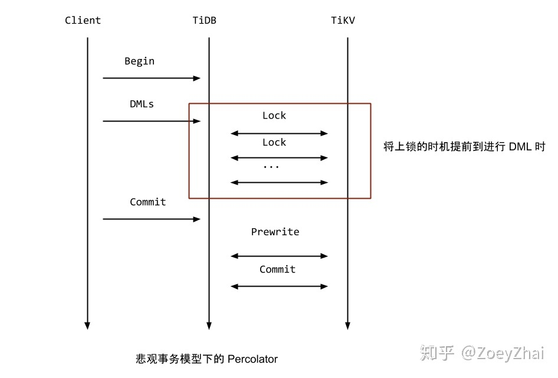

可以知道, 悲观事务使得 TiDB 支持交互式事务, 但是同时也可能会导致死锁

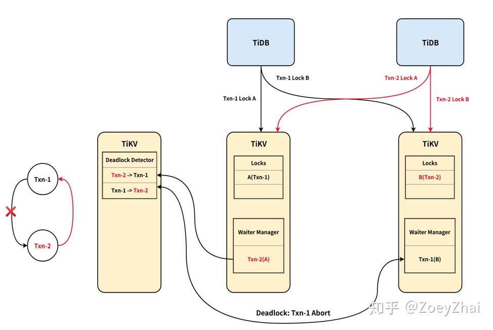

死锁检测实现:
- TiKV 使用 Region1 所在的 TiKV node 开辟一块内存的记录, 同时检测执行中的事务的依赖关系
- 悲观事务下, 等锁时会异步进行死锁检测
- 交互式悲观事务下, 第一个锁不会进行死锁检测

启用悲观事务, TiDB 配置文件:

```yaml
[pessimistic-txn]
enable = false
```

同时需要在开启 sql 事务语句时修改为:

```sql
BEGIN PESSIMISTIC
BEGIN /*!90000 PESSIMISTIC */
```

## SQL 流程

### 协议层

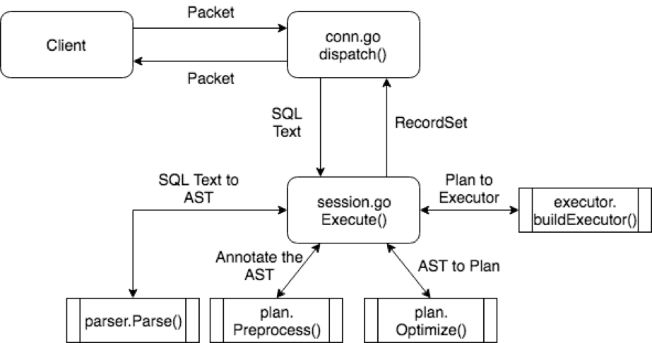

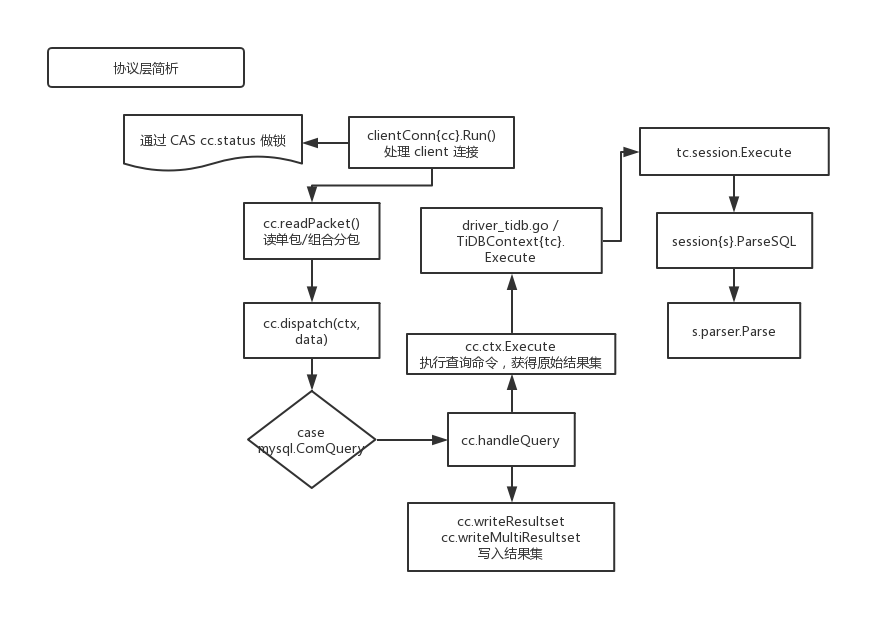

### SQL 处理

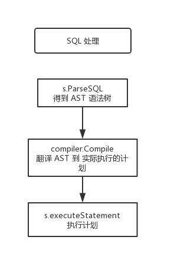

### 执行 SQL 计划

TiDB 的执行引擎是以 Volcano 模型运行的

如果以下 SQL 语句的执行计划

```sql
SELECT c1 FROM t WHERE c2 > 1;
```

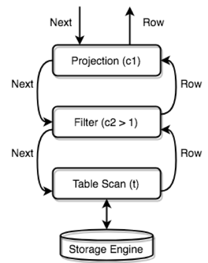

#### Volcano Optimizer

基于成本(Cost)的优化算法

"成本最优假设" 认为, 如果一个方案是由几个局部区域组合而成, 各个局部 "相似" , 那么在计算总成本时, 我们只考虑每个局部目前已知的最优方案和成本即可

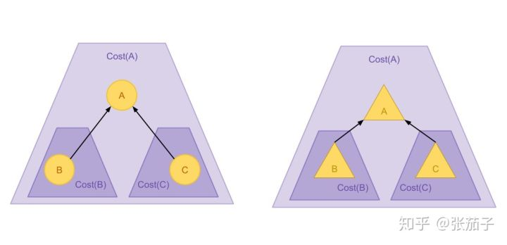

Calcite 实现的 Volcano Optimizer 支持以下三种终止条件:
- 时钟: 使用最大迭代计数或最大物理执行时间作为限制
- 成本阈值: 当优化方案的成本低于某个阈值是否结束算法(相比原始成本或固定值)
- 规则穷尽: 当无法再应用规则获得 新的关系代数结构 的时候结束算法

注意事项:
- 在最初的 Volcano Optimizer 论文中, 算法存在 逻辑优化 和 物理优化 两个步骤; 但是在后续的 Cascades 论文和 Calcite 的实现中, 逻辑变换的规则和物理变换的规则没有本质差别, 两者在一轮优化中同时使用, 以快速从 逻辑表示 转换为 物理执行
- Calcite 的 `Cost` 有 rows / IO / CPU 等字段, 但是计算依然以 rows 为基准, 因此需要考虑把其他方面的成本转换为行数
- 在关系代数树上查找 匹配的结构 是优化过程中最频繁的操作. Calcite 实现: 如果一个节点和每一匹配模式的根节点相互匹配, 则从该节点进行一次校验
- Calcite 默认并不进行枚举式优化方案计算, 而是结合启发式计算进行有限的搜索

各种优化方式:
- Vectorized Execution: 元素在关系代数节点之间的 获取批量化 以及利用 SIMD 指令集 优化, 借以提高 **并行性**
- Query Compilation: 通过 LLVM 等工具将优化后的执行方案编译成机器码
- 利用索引和物化视图

## Insert 概览

以以下语句为例

```sql
INSERT INTO t VAULES ("pingcap001", "pingcap", 3);
```

```go
// .../parser/ast/dml.go
type InsertStmt {
  IsReplace   bool
  IgnoreErr   bool
  Table       *TableRefsClause
  Columns     []*ColumnName
  Lists       [][]ExprNode
  Setlist     []*Assignment
  Priority    mysql.PriorityEnum
  OnDuplicate []*Assignment
  Select      ResultSetNode
}

// .../tidb/planner/core/planbuilder.go
func (b *PlanBuilder) Build(ctx context.Context, node ast.Node) (Plan, error)
...
    case *ast.InsertStmt:
        return b.buildInsert(ctx, x)
...

// .../tidb/planner/core/plan.go
type Plan interface {
    // Get the schema.
    Schema() *expression.Schema
    // Get the ID.
    ID() int
    // Get the ID in explain statement
    ExplainID() fmt.Stringer
    // replaceExprColumns replace all the column reference in the plan's expression node.
    replaceExprColumns(replace map[string]*expression.Column)

    context() sessionctx.Context

    // property.StatsInfo will return the property.StatsInfo for this plan.
    statsInfo() *property.StatsInfo
}
// .../tidb/planner/core/common_plans.go
type Insert struct {
    baseSchemaProducer

    Table       table.Table
    tableSchema *expression.Schema
    Columns     []*ast.ColumnName
    Lists       [][]expression.Expression
    SetList     []*expression.Assignment

    OnDuplicate        []*expression.Assignment
    Schema4OnDuplicate *expression.Schema

    IsReplace bool

    // NeedFillDefaultValue is true when expr in value list reference other column.
    NeedFillDefaultValue bool

    GenCols InsertGeneratedColumns

    SelectPlan PhysicalPlan
}

// .../tidb/executor/build.go
func (b *executorBuilder) build(p plannercore.Plan) Executor
...
    case *plannercore.Insert:
        return b.buildInsert(v)
...

// .../tidb/executor/executor.go
type Executor interface {
    base() *baseExecutor
    Open(context.Context) error
    Next(ctx context.Context, req *chunk.Chunk) error
    Close() error
    Schema() *expression.Schema
}
// .../tidb/executor/insert.go
type InsertExec struct {
        *InsertValues
        OnDuplicate []*expression.Assignment
        Priority    mysql.PriorityEnum
}

// .../tidb/executor/insert.go
insertExec.Next
↓
func (e *InsertValues) insertRows(ctx context.Context,
  exec func(ctx context.Context, rows [][]types.Datum) error) (err error)
↓
insertExec.exec
...
        for _, row := range rows {
            if _, err := e.addRecord(row); err != nil {
                return err
            }
    }
...

// .../tidb/executor/insert_common.go
type InsertValues struct {
        SelectExec Executor

        Table   table.Table
        Columns []*ast.ColumnName
        Lists   [][]expression.Expression
        SetList []*expression.Assignment

        GenColumns []*ast.ColumnName
        GenExprs   []expression.Expression

        // Has unexported fields.
}

func (e *InsertValues) addRecord(row []types.Datum) (int64, error)
...
    h, err := e.Table.AddRecord(e.ctx, row)
...

// .../tidb/table/table.go
type Table interface {
...
    // Indices returns the indices of the table.
  Indices() []Index
...
    // AddRecord inserts a row which should contain only public columns
  AddRecord(ctx sessionctx.Context, r []types.Datum, opts ...AddRecordOption) (recordID int64, err error)
...
}

// .../tidb/table/tables/tables.go
type tableCommon struct {
    tableID int64
    // physicalTableID is a unique int64 to identify a physical table.
    physicalTableID int64
    Columns         []*table.Column
    publicColumns   []*table.Column
    writableColumns []*table.Column
    writableIndices []table.Index
    indices         []table.Index
    meta            *model.TableInfo
    alloc           autoid.Allocator

  // recordPrefix / indexPrefix -- generated using physicalTableID
    recordPrefix kv.Key
    indexPrefix  kv.Key
}

// 索引创建
// addIndices adds data into indices.
func (t *tableCommon) addIndices(ctx sessionctx.Context, recordID int64, r []types.Datum, rm kv.RetrieverMutator,
  opts []table.CreateIdxOptFunc) (int64, error)
// .../tidb/table/tables/index.go
Index.Create(ctx sessionctx.Context, rm kv.RetrieverMutator, indexedValues []types.Datum, h int64, opts ...CreateIdxOptFunc) (int64, error)

// k/v 创建

tableCommon.AddRecord()
...
  key := t.RecordKey(recordID) // get key
  writeBufs.RowValBuf, err = tablecodec.EncodeRow(sc, row, colIDs, writeBufs.RowValBuf, writeBufs.AddRowValues) // get value
  txn.Set(key, value) // set into storage engine by transaction
...
```

## SQL Parser 的实现

- 词法解析 -- [lexer.go](https://github.com/pingcap/tidb/blob/source-code/parser/lexer.go)
- 语法解析 -- goyacc -> [parser.y](https://github.com/pingcap/tidb/blob/source-code/parser/parser.y)

### definitions

```yacc
%union {
    offset    int // offset
    item      interface{}
    ident     string
    expr      ast.ExprNode
    statement ast.StmtNode
}
```

### rules

TODO:

## Select 概览

```golang
// .../parser/ast/dml.go
type SelectStmt struct {
    *SelectStmtOpts
    Distinct    bool
    From        *TableRefsClause
    Wher e       ExprNode
    Fields      *FieldList
    GroupBy     *GroupByClause
    Having      *HavingClause
    WindowSpecs []WindowSpec
    OrderBy     *OrderByClause
    Limit       *Limit
    LockTp      SelectLockType
    TableHints []*TableOptimizerHint
    IsAfterUnionDistinct bool
    IsInBraces  bool
}

// .../tidb/planner/core/logical_plan_builder.go
func (b *PlanBuilder) buildSelect(ctx context.Context, sel *ast.SelectStmt) (p LogicalPlan, err error) {
...
    if sel.Wher e != nil {
        p, err = b.buildSelection(ctx, p, sel.Where, nil)
    }
...
}
func (b *PlanBuilder) buildSelection(ctx context.Context, p LogicalPlan, wher e ast.ExprNode, AggMapper map[*ast.AggregateFuncExpr]int) (LogicalPlan, error)

// .../tidb/planner/core/plan.go
type LogicalPlan interface {
    Plan
    PredicatePushDown([]expression.Expression) ([]expression.Expression, LogicalPlan)
    PruneColumns([]*expression.Column) error
    DeriveStats(childStats []*property.StatsInfo) (*property.StatsInfo, error)
    MaxOneRow() bool
    Children() []LogicalPlan
    SetChildren(...LogicalPlan)
    SetChild(i int, child LogicalPlan)
}

// .../tidb/planner/core/logical_plans.go
type LogicalSelection struct {
    baseLogicalPlan
    Conditions []expression.Expression
}

// .../tidb/session/session.go
func (s *session) Execute(ctx context.Context, sql string) (recordSets []sqlexec.RecordSet, err error) {
    ...
    func (s *session) execute(ctx context.Context, sql string) (recordSets []sqlexec.RecordSet, err error) {
        ...
        stmt, err := compiler.Compile(ctx, stmtNode)
        ==> func (c *Compiler) Compile(ctx context.Context,
        stmtNode ast.StmtNode) (*ExecStmt, error) {
            ...
            planner.Optimize()
            ==> func Optimize(ctx context.Context, sctx sessionctx.Context, node ast.Node, is infoschema.InfoSchema) (plannercore.Plan, error) {
                plannercore.TryFastPlan(sctx, node)
                ...
                plannercore.DoOptimize(ctx, builder.GetOptFlag(), logic)
            }
            ...
        }
        ...
    }
    ...
}


// .../tidb/planner/core/optimizer.go
func DoOptimize(ctx context.Context, flag uint64, logic LogicalPlan) (PhysicalPlan, error) {
    logic, err := logicalOptimize(ctx, flag, logic)
    ...
    physical, err := physicalOptimize(logic)
    ...
    finalPlan := postOptimize(physical)
    ...
}

// 逻辑优化 基于规则的优化
func logicalOptimize(ctx context.Context, flag uint64, logic LogicalPlan) (LogicalPlan, error)
// 物理优化 基于代价的优化
func physicalOptimize(logic LogicalPlan) (PhysicalPlan, error)

// TODO:
```

以上是 Select 的流程, 下面重点关注 `logicalOptimize`, `physicalOptimize` 的实现流程

### 逻辑优化 -- RBO/rule based optimization

```golang
var optRuleList = []logicalOptRule{
    &columnPruner{},
    &buildKeySolver{},
    &decorrelateSolver{},
    &aggregationEliminator{},
    &projectionEliminater{},
    &maxMinEliminator{},
    &ppdSolver{},
    &outerJoinEliminator{},
    &partitionProcessor{},
    &aggregationPushDownSolver{},
    &pushDownTopNOptimizer{},
    &joinReOrderSolver{},
}

// 逻辑优化 基于规则的优化
func logicalOptimize(ctx context.Context, flag uint64, logic LogicalPlan) (LogicalPlan, error)
```

以下 RBO 理论部分看 [PostgreSQL](IT/DBA/PostgreSQL.md)

部分重要函数:

```golang
// 从表达式中提取列及其信息
func ExtractColumnsFromExpressions(result []*Column, exprs []Expression, filter func(*Column) bool) []*Column
```

#### 列裁剪

```golang
func (p *LogicalJoin) PruneColumns(parentUsedCols []*expression.Column) error
```

#### 最大最小消除

#### 投影消除

```golang
func (pe *projectionEliminater) eliminate(p LogicalPlan, replace map[string]*expression.Column, canEliminate bool) LogicalPlan
```

#### 谓词下推

```golang
func (p *baseLogicalPlan) PredicatePushDown(predicates []expression.Expression) ([]expression.Expression, LogicalPlan)
```

#### 构建节点属性

主要是构建 `unique key` 和 `MaxOneRow` 属性

如果一个算子满足:
- 该算子的子节点是 `MaxOneRow` 算子
- 该算子是 `Limit 1`
- `Selection`: 且满足 `unique_key = CONSTANT`
- `Join`: 左右节点是 `MaxOneRow`

以上情况保证了 **该节点的输出肯定只有一行** , 因此可以设置该节点为 `MaxOneRow`

### 物理优化 -- CBO/cost based optimization

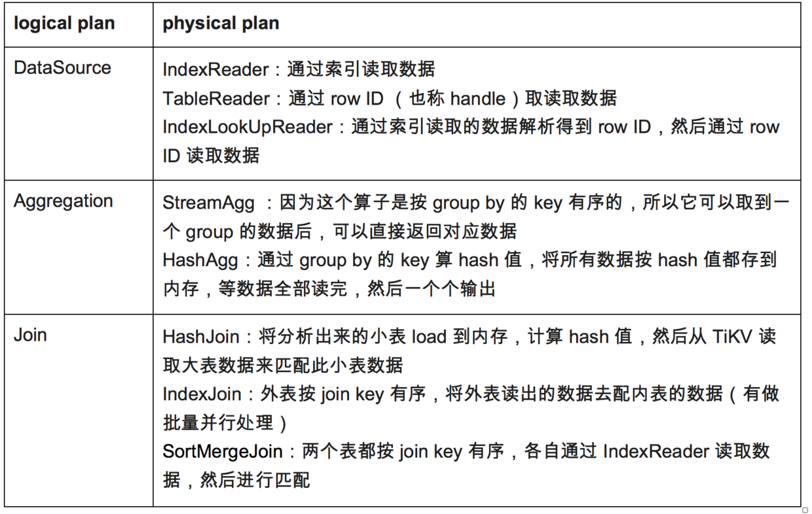

以以下 SQL 为例:

```sql
> select sum(s.a),count(t.b) from s join t on s.a = t.a and s.c < 100 and t.c > 10 group bys.a
```


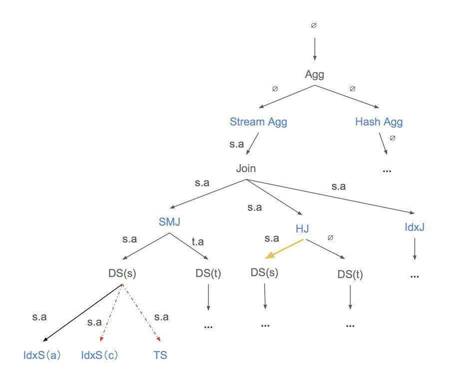

#### 代价评估

TODO:

## Hash Join

### Classic Hash Join

构建哈希表的连接关系称为 "构建(build)" 输入, 而另一个输入称为 "探测(probe)" 输入

1. For each tuple ${\displaystyle r}$ in the build input ${\displaystyle R}$
  1. Add ${\displaystyle r}$ to the in-memory hash table
  2. If the size of the hash table equals the maximum in-memory size:
    1. Scan the probe input ${\displaystyle S}$, and add matching join tuples to the output relation
    2. Reset the hash table, and continue scanning the build input ${\displaystyle R}$
2. Do a final scan of the probe input ${\displaystyle S}$ and add the resulting join tuples to the output relation

翻译:
- 如果 Hash Join 小于 最大可用内存 , 则将 匹配的连续元组 写入到 Hash Join memory 中
- 如果超过 最大可用内存 , 则在写满可用内存后, 删除已构建的元组, 从当前元组点重新构建(??)

适合于小表写入

### Grace Hash Join

特点:
- 首先 Hash R 和 S 元组并为此构建分区, 并将分区写入到 template disk file

### TiDB 的 Hash Join

```go
// HashJoinExec implements the hash join algorithm.
type HashJoinExec struct {
    baseExecutor

    outerExec   Executor
    innerExec   Executor
    outerFilter expression.CNFExprs
    outerKeys   []*expression.Column
    innerKeys   []*expression.Column

    prepared bool
    // concurrency is the number of partition, build and join workers.
    concurrency     uint
    hashTable       *mvmap.MVMap
    innerFinished   chan error
    hashJoinBuffers []*hashJoinBuffer
    // joinWorkerWaitGroup is for sync multiple join workers.
    joinWorkerWaitGroup sync.WaitGroup
    finished            atomic.Value
    // closeCh add a lock for closing executor.
    closeCh  chan struct{}
    joinType plannercore.JoinType

    isOuterJoin  bool
    requiredRows int64

    // We build individual joiner for each join worker when use chunk-based
    // execution, to avoid the concurrency of joiner.chk and joiner.selected.
    joiners []joiner

    outerKeyColIdx     []int
    innerKeyColIdx     []int
    innerResult        *chunk.List
    outerChkResourceCh chan *outerChkResource
    outerResultChs     []chan *chunk.Chunk
    joinChkResourceCh  []chan *chunk.Chunk
    joinResultCh       chan *hashjoinWorkerResult
    hashTableValBufs   [][][]byte

    memTracker *memory.Tracker // track memory usage.
}
```

- Build 阶段, 对 Inner 表建哈希表
- Probe 阶段, 对由 Outer 表驱动执行 Join 过程

Hash Join 实现:
- Main Thread, 一个; 负责:
  - 读取所有的 Inner 表数据
  - 根据 Inner 表数据构造哈希表
  - 启动 `Outer Fetcher` 和 `Join Worker` 开始后台工作, 生成 Join 结果, 各个 goroutine 的启动过程由 `fetchOuterAndProbeHashTable` 完成
  - 将 `Join Worker` 计算出的 Join 结果返回给 `NextChunk` 接口的调用方法
- `Outer Fetcher`: 一个; 负责读取 Outer 表的数据并分发给各个 `Join Worker`
- `Join Worker`: 多个; 负责查哈希表、Join 匹配的 Inner 和 Outer 表的数据, 并把结果传递给 Main Thread

#### (Main Thread)读 Inner 表数据

读 Inner 表数据 并且 构建 HashTable (MVMap):
- `fetchInnerRows` 通过 `e.Next` 获得 inner 表
- 将 inner 表的结果逐个发送给 `buildHashTableForList` 并行处理
- 启动 `fetchOuterAndProbeHashTable` 完成 probe 工作
- 将结果通过 result 返回

```go
// .../tidb/executor/join.go
func (e *HashJoinExec) fetchInnerAndBuildHashTable(ctx context.Context)

// fetchInnerRows fetches all rows from inner executor,
// and append them to e.innerResult.
func (e *HashJoinExec) fetchInnerRows(ctx context.Context, chkCh chan<- *chunk.Chunk, doneCh <-chan struct{})

// .../tidb/executor/table_reader.go
func (e *TableReaderExecutor) Next(ctx context.Context, req *chunk.Chunk) error

// buildHashTableForList builds hash table from `list`.
func (e *HashJoinExec) buildHashTableForList(innerResultCh <-chan *chunk.Chunk) error
```

#### Outer Fetcher

*这部分代码的逻辑与 `net/rpc.Client` 相似*

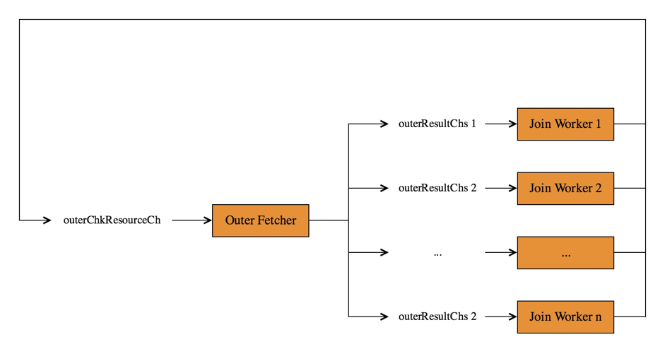

`fetchOuterChucks` 不停的读大表数据, 将 Outer 表数据分发到 Join Worker, 其中有两个 channel:
- `outerResultChs[i]`: 每个 Join Worker 一个, Outer Fetcher 将获取到的 Outer Chunk 写入到 该 channel 的 Join Worker 中
- `outerChkResourceCh`: 当 Join Worker 用完了当前的 Outer Chunk 后, 它需要该 Chunk 以及自身的 `outerResultChs[i]` 一起写入到 `outerResourceCh` 中, 目的是:
  - Outer Fetcher 用于申请内存(Chunk)供 Join Worker 使用
  - 通过 `outerChkResourceCh` 回收 Join Worker 拉取到的 Outer 数据

Outer Fetcher 计算逻辑:
1. 从 `outerChkResourceCh` 中获取一个 `outerChkResource` , 作为 `outerResource` 中
2. 从 Child 拉取数据, 将数据写入到 `outerResource` 的 `chk` 字段中
3. 这个信息记录在了(发送到) `outerResource.dest` 中, (这个 `chk` 发给需要 `Outer` 表的数据的 `Join Worker` 的 `outerResultChs[i]` 中去)

```go
// .../tidb/executor/join.go
func (e *HashJoinExec) fetchOuterAndProbeHashTable(ctx context.Context)

// fetchOuterChunks get chunks from fetches chunks from the big table in a background goroutine
// and sends the chunks to multiple channels which will be read by multiple join workers.
func (e *HashJoinExec) fetchOuterChunks(ctx context.Context)

func (e *HashJoinExec) runJoinWorker(workerID uint)
```

#### Join Worker

相关参数:
- `tidb_hash_join_concurrency`: session 变量

Join Worker 流程:
1. 获取一个 Outer Chuck (`outerResult`) 和 一个 Join Check Resource (`outerChkResource`)
2. 查哈希表, 将匹配的 Outer Row 和 Inner Rows 写到 Join Chunk 中(`e{HashJoinExec}.join2Chunk`)
3. 同时在 `e{HashJoinExec}.join2Chunk` 中等待取回 Join Chunk, 随后 Join Worker 继续匹配 Outer Row 和 Inner Row
4. 循环 2, 3 步直到匹配完成, Main Thread 主动关闭通道, Join Worker 结束

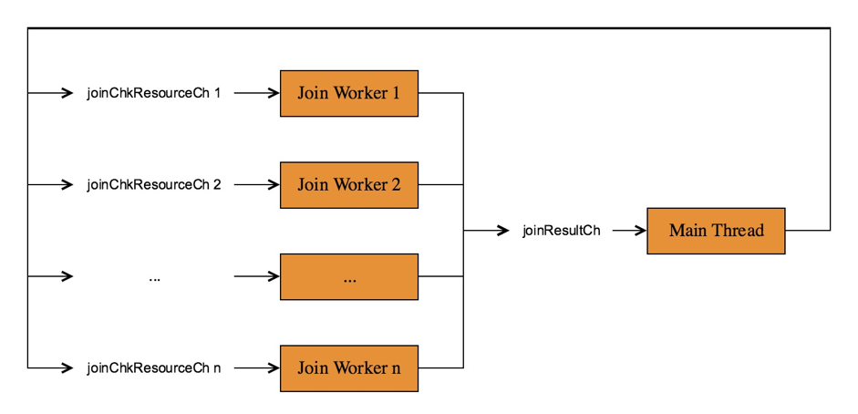

```go
func (e *HashJoinExec) runJoinWorker(workerID uint)
```

#### Main Thread

```go
// step 1. fetch data from inner child and build a hash table;
// step 2. fetch data from outer child in a background goroutine and probe the hash table in multiple join workers.
func (e *HashJoinExec) Next(ctx context.Context, req *chunk.Chunk) (err error) {
    // 只拿一次 ??
    result, ok := <-e.joinResultCh

    // 交换请求方和结果的数据(被选中的 cols, rows , 以及 0 列的 VirtualRows)
    req.SwapColumns(result.chk) // result.chk {Join Chuck}

    // 归还 result.chk
    result.src <- result.chk
}
```

#### Hash Join FAQ

[FAQ](https://pingcap.com/blog-cn/tidb-source-code-reading-9/)

## Chuck 和执行框架

`Chuck` 的特点:
- 只读
- **不** 支持随机写
- 只支持追加写
- **列存储** , 同一列的连续数据在内存中连续存放

`Chunk` 本质上是 `Column` 的集合

### Column

```go
// 划定 定长 Column 或 不定长 Column
func addColumnByFieldType

// Column stores one column of data in Apache Arrow format.
// See https://arrow.apache.org/docs/memory_layout.html
type Column struct {
    length     int // 行数量
    nullBitmap []byte // column 中每个元素是否为 `NULL`; bit 0 is null, 1 is not null
    offsets    []int64 // 变长 Column ; 每个数据在 data 这个 slice 中的偏移量
    data       []byte // 存储具体数据
    elemBuf    []byte // 定长 Column ; 用于辅助 encode 或 decode
}
```

TODO:

## Index Lookup Join

```go
// .../tidb/executor/index_lookup_join.go
type IndexLookUpJoin struct {
    baseExecutor

    resultCh   <-chan *lookUpJoinTask
    cancelFunc context.CancelFunc
    workerWg   *sync.WaitGroup

    outerCtx outerCtx
    innerCtx innerCtx

    task       *lookUpJoinTask
    joinResult *chunk.Chunk
    innerIter  chunk.Iterator

    joiner      joiner
    isOuterJoin bool

    requiredRows int64

    indexRanges   []*ranger.Range
    keyOff2IdxOff []int
    innerPtrBytes [][]byte

    // lastColHelper stor\e the information for last col if there's complicated filter like col > x_col and col < x_col + 100.
    lastColHelper *plannercore.ColWithCmpFuncManager

    memTracker *memory.Tracker // track memory usage.
}

func (e *IndexLookUpJoin) Open(ctx context.Context) error {
    err = e.children[0].Open(ctx)
    // ...
    e.startWorkers(ctx)
}

// one outerWorker & `concurrency` innerWorker
func (e *IndexLookUpJoin) startWorkers(ctx context.Context) {
    // ...
    e.workerWg.Add(1)
    go e.newOuterWorker(resultCh, innerCh).run(workerCtx, e.workerWg)

    e.workerWg.Add(concurrency)
    for i := 0; i < concurrency; i++ {
        go e.newInnerWorker(innerCh).run(workerCtx, e.workerWg)
    }
}

// outerWorker 工作内容:
// 1. 按 batch 遍历 Outer 表, 并封装对应的 task
// 2. 将 task 发送给 Inner Worker 和 Main Thread
func (ow *outerWorker) run(ctx context.Context, wg *sync.WaitGroup) {
    defer func() {
        // error handle
    }()
    for {
        // 封装 task
        task, err := ow.buildTask(ctx)
        // task 发送到 Inner Worker
        if finished := ow.pushToChan(ctx, task, ow.innerCh); finished {
        }
        // 发送到 Main Thread
        if finished := ow.pushToChan(ctx, task, ow.resultCh); finished {
        }
    }
}

func (ow *outerWorker) buildTask(ctx context.Context) (*lookUpJoinTask, error) {
    // 外连接 , 把所有的 requireRows 下推执行
    if ow.lookup.isOuterJoin { // if is outerJoin, push the requiredRows down
    }
    for !task.outerResult.IsFull() {
        // 将当前执行器切片添加到结果集
        task.outerResult.Append(ow.executorChk, 0, ow.executorChk.NumRows())
    }

    if ow.filter != nil {
        task.outerMatch, err = expression.VectorizedFilter(ow.ctx, ow.filter, chunk.NewIterator4Chunk(task.outerResult), outerMatch)
    }
}

// 将 filter 应用到 chunk , 返回一个表示当行是否通过 filter 的结果集
func VectorizedFilter(ctx sessionctx.Context, filters []Expression, iterator *chunk.Iterator4Chunk, selected []bool) ([]bool, error) {
}

// innerWorker 工作内容:
// 1. 读取 Outer Worker 构建的 task
// 2. 根据 task 中的 Outer 表数据, 构建 **Inner 表的扫描范围**, 并构造相应的物理执行算子读取该范围内的 Inner 表数据
// 3. 对读取的 Inner 表数据创建对应的哈希表并存入 task
func (iw *innerWorker) run(ctx context.Context, wg *sync.WaitGroup) {
    for ok := true; ok; {
        select {
        case task, ok = <-iw.taskCh:
        }

        err := iw.handleTask(ctx, task)

        // 完成本次 handleTask
        task.doneCh <- err
    }
}

func (iw *innerWorker) handleTask(ctx context.Context, task *lookUpJoinTask) error {
    lookUpContents, err := iw.constructLookupContent(task)

    lookUpContents = iw.sortAndDedupLookUpContents(lookUpContents)

    err = iw.fetchInnerResults(ctx, task, lookUpContents)

    err = iw.buildLookUpMap(task)

    // Inner Worker 向 task.doneCh 中发送数据
}

// 计算 Outer 表对应的 Join Keys 的值
func (iw *innerWorker) constructLookupContent(task *lookUpJoinTask) ([]*indexJoinLookUpContent, error) {
}

// 为 lookupContexts 去重
func (iw *innerWorker) sortAndDedupLookUpContents(lookUpContents []*indexJoinLookUpContent) []*indexJoinLookUpContent {
}

// 构建查询执行器 & 将查询结果存储于 `task.innerResult`
func (iw *innerWorker) fetchInnerResults(ctx context.Context, task *lookUpJoinTask, lookUpContent []*indexJoinLookUpContent) error {
}

// 对 task.innerResult 按照对应的 Join Keys 构建哈希表 & 存储于 task.lookupMap 中
func (iw *innerWorker) buildLookUpMap(task *lookUpJoinTask) error {
}
```

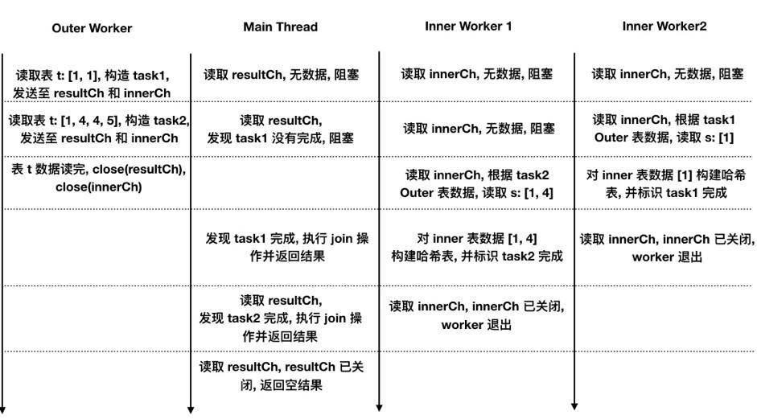

事例:

```sql
select /*+ TIDB_INLJ(t) */ * from t left join s on t.a = s.a;
```

通过添加 `/*+ TIDB_INLJ(t) */` 让优化器尽量选择 Index Lookup Join 算法

## 统计信息

*执行代价, 估计值*

直方图, Count-Min Sketch

### 蓄水池抽样

从 n 个对象中选择, n 未知

步骤:
- 总是选择第一个(?)
- 以 1/2 概率选择第二个, 以 1/3 概率选择第三个, 以此类推

证明:
第 m 个对象最终被选中的概率 `P=选择 m 的概率 * 其后面所有对象不被选择的概率`
或者说
`P=m 数据进入过蓄水池的概率 * 之后第 m 个数据不被替换的概率`


对应两种操作下的伪代码:

```
i = 0
while more input items
        with probability 1.0 / ++i
                choice = this input item
print choice
```

```cpp
int[] reservoir = new int[m];

// init
for (int i = 0; i < reservoir.length; i++)
{
    reservoir[i] = dataStream[i];
}

for (int i = m; i < dataStream.length; i++)
{
    // 随机获得一个 [0, i] 内的随机整数
    int d = rand.nextInt(i + 1);
    // 如果随机整数落在 [0, m-1] 范围内, 则替换蓄水池中的元素
    if (d < m)
    {
        reservoir[d] = dataStream[i];
    }
}
```

### Count-Min Sketch

bloom 过滤器在统计方面的变型

步骤:
1. 使用多个数组, 和多个哈希函数, 来计算一个元素对应的数组的位置索引
2. 查询某个元素的频率时, 返回这个元素在不同数组中的计数值中的 **最小值**

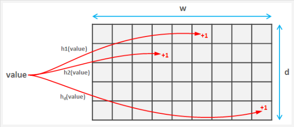

优点:
- 直观

缺点:
- hash 数组(w/d 参数)越小, 数值偏大越严重

### 列直方图

- 通过蓄水池抽样排序

### 索引直方图

- 数据量未知, 有序
- 设定一个初始的桶数, 将每个桶的初始深度设为 1, 用前面列直方图的创建方法插入数据, 这样如果到某一时刻所需桶的个数超过了当前桶深度, 那么将桶深扩大一倍, 将之前的每两个桶合并为 1 个, 然后继续插入

TODO:

## 索引范围计算

在使用索引时, TiDB 不直接从索引的头尾开始寻找满足条件的索引, 而是通过 **计算大概的索引范围** , 在从这个索引范围开始寻找满足实际条件的索引; 以下是计算大概的索引范围的方法:

> NOTICE/注意: TiDB 的主键在实现方式上限定了只有 **整数类型的单列主键会把主键值当做 RowID, 然后编码成 RowKey, 和这行数据存储在一起**; 其他类型的单列主键会作为 **普通的 Unique Key** 看待, 即: 当查询的列包含索引上没有的列时，需要一次查索引 + 一次扫表

```sql
CREATE TABLE t (a int primary key, b int, c int);
select * from t where ((a > 1 and a < 5 and b > 2) or (a > 8 and a < 10 and c > 3)) and d = 5;
```

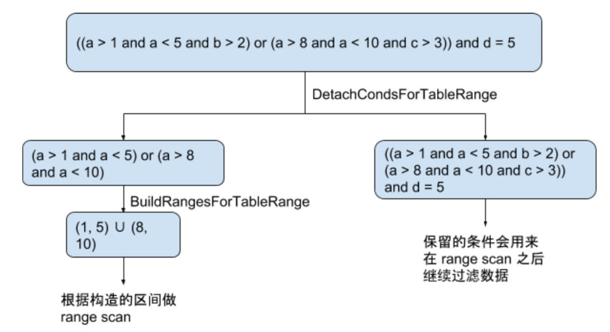

### 抽取表达式

从表达式集合中抽取用于 range 的表达式

#### 单列索引

从条件(where)解析出表达式:
- AND 表达式: 舍弃无关的 filter , 例如: `a>1 and a<5 and b>2` 中, 舍弃 `b>2`
- OR 表达式: 每个子项都要可以用来计算 range, 如果有不可以计算 range 的子项, 那么这整个表达式都不可用来计算 range

```go
// .../tidb/util/ranger/detacher.go
// DetachCondsForColumn detaches access conditions for specified column from other filter conditions.
func DetachCondsForColumn(sctx sessionctx.Context, conds []expression.Expression, col *expression.Column) (accessConditions, otherConditions []expression.Expression) {
    checker := &conditionChecker{
        colUniqueID: col.UniqueID,
        length:      types.UnspecifiedLength,
    }
    return detachColumnCNFConditions(sctx, conds, checker)
}

// 逻辑与 -- 认为最外层是 target_range AND ALL ?
// detachColumnCNFConditions detaches the condition for calculating range from the other conditions.
// Please make sur\e that the top level is CNF form.
func detachColumnCNFConditions(sctx sessionctx.Context, conditions []expression.Expression, checker *conditionChecker) ([]expression.Expression, []expression.Expression) {
        // 包含逻辑或(OR)表达式
        if sf, ok := cond.(*expression.ScalarFunction); ok && sf.FuncName.L == ast.LogicOr {
            // 将 ScalarFunction 分解成 []Expression
            dnfItems := expression.FlattenDNFConditions(sf)
            // 解析 OR 表达式
			colulmnDNFItems, hasResidual := detachColumnDNFConditions(sctx, dnfItems, checker)

            // 重新构建平衡 DNF 树
			rebuildDNF := expression.ComposeDNFCondition(sctx, colulmnDNFItems...)
        }
}

// 逻辑或
// detachColumnDNFConditions detaches the condition for calculating range from the other conditions.
// Please make sur\e that the top level is DNF form.
func detachColumnDNFConditions(sctx sessionctx.Context, conditions []expression.Expression, checker *conditionChecker) ([]expression.Expression, bool) {
        // 包含逻辑与(AND)表达式
        if sf, ok := cond.(*expression.ScalarFunction); ok && sf.FuncName.L == ast.LogicAnd {
            cnfItems := expression.FlattenCNFConditions(sf)
            columnCNFItems, others := detachColumnCNFConditions(sctx, cnfItems, checker)

            rebuildCNF := expression.ComposeCNFCondition(sctx, columnCNFItems...)
        } else if checker.check(cond) { // 检查是否为 唯一属性(unique?)的列(因为是单列索引, 因此即使是 unique column 也只有一列) 或者 常量表达式
        }
}

func ComposeDNFCondition(ctx sessionctx.Context, conditions ...Expression) Expression {
	return composeConditionWithBinaryOp(ctx, conditions, ast.LogicOr)
}

// composeConditionWithBinaryOp composes condition with binary operator into a balance deep tree, which benefits a lot for pb decoder/encoder.
func composeConditionWithBinaryOp(ctx sessionctx.Context, conditions []Expression, funcName string) Expression {
	return NewFunctionInternal(ctx, funcName,
		types.NewFieldType(mysql.TypeTiny),
		composeConditionWithBinaryOp(ctx, conditions[:length/2], funcName),
		composeConditionWithBinaryOp(ctx, conditions[length/2:], funcName))
}

// 以 标量函数/标量值 作为 解析树 叶子层
// newFunctionImpl creates a new scalar function or constant.
func newFunctionImpl(ctx sessionctx.Context, fold bool, funcName string, retType *types.FieldType, args ...Expression) (Expression, error) {
}
```

#### 多列索引

- AND 表达式中, 只有当之前的列均为点查的情况下, 才会考虑下一个列
  - e.g. 对于索引 `(a, b, c)`, 有条件 `a > 1 and b = 1`, 那么会被选中的只有 a > 1; 对于条件 `a in (1, 2, 3) and b > 1`, 两个条件均会被选到用来计算 range
  - 由于非点查的部分只会涉及到一个列, 所以可以直接复用 detachColumnCNFConditions
- OR 表达式中, **每个子项会视为 AND 表达式分开考虑**; 与单列索引的情况一样, 如果其中一个子项无法用来计算索引, 那么该 OR 表达式便完全无法计算索引

### 计算逻辑区间

从抽取的表达式中填写具体的逻辑区间

#### 单列索引

```go
// Point is the end point of range interval.
type point struct {
    // types.Datum -- 用于替代 interface{}
    value types.Datum
    // 是否为开区间
    excl  bool // exclude
    // 是否为左端点
    start bool
}

// Range represents a range generated in physical plan building phase.
type Range struct {
    LowVal  []types.Datum
    HighVal []types.Datum

    // 左边界是否为开区间
    LowExclude  bool // Low value is exclusive.
    // 右边界是否为开区间
    HighExclude bool // High value is exclusive.
}
```

各种 `buildFrom*` 函数表示一个具体函数的 range 方法(例如 `buildFromIn` 处理 in 函数)

```go
// .../tidb/util/ranger/detacher.go
func (r *builder) buildFromIn(expr *expression.ScalarFunction) ([]point, bool) {
}
```

```go
// 区间交
func (r *builder) intersection(a, b []point) []point {
    return r.merge(a, b, false)
}

// 区间并
func (r *builder) union(a, b []point) []point {
    return r.merge(a, b, true)
}

// TODO: merge 交/并的逻辑顺序 ==>
//
func (r *builder) merge(a, b []point, union bool) []point {
	if union {
		requiredInRangeCount = 1 // 并集
	} else {
		requiredInRangeCount = 2 // 交集
    }

		if val.start { // 求并集
			inRangeCount++
			if inRangeCount == requiredInRangeCount {
				// just reached the required in range count, a new range started.
				merged = append(merged, val)
			}
		} else { // 求交集
			if inRangeCount == requiredInRangeCount {
				// just about to leave the required in range count, the range is ended.
				merged = append(merged, val)
			}
			inRangeCount--
		}
}
```

#### 多列索引

- AND: 在多列索引下, "其形式必为 **索引前缀列上的等值条件** 再加上关于 **前缀之后一个列的复杂条件** 组成"
- OR: 重新实现区间并

```go
func appendPoints2Ranges(sc *stmtctx.StatementContext, origin []*Range, rangePoints []point,
    ft *types.FieldType) ([]*Range, error) {
}

func unionRanges(sc *stmtctx.StatementContext, ranges []*Range) ([]*Range, error) {
}

```

## Sort Merge Join

关键词: Index, Merge

假设:
- 外表为 A, 内表为 B
- join-key 为 a, 且 A, B 表上的 a 均有索引

执行步骤:
1. 顺序读取外表 A 直到 join-key 出现不同的值, 把相同的 key 的行放入到数组 a1 , 同样规则读取表 B , 把相同的 key 的行放入到数组 a2 ; 如果外表数据或者内表数组读完, 则退出
2. 从 a1 读取当前第一行数据, 记为 v1; 从 a2 读取当前第一行数据, 记为 v2
3. 根据 join-key 比较 v1, v2, 结果为 cmpResult
  - cmpResult>0 : v1 大于 v2 , 丢弃当前 a2 数据, 从内存中读取下一批数据
  - cmpResult<0 : v1 小于 v2 , 外表 v1 没有内表相同的值, (如果需要, 例如 outer join)把外表数据输出到 resultGenerator
  - cmpResult==0 : v1 等于 v2 , 那么遍历 a1 里面的数据, 跟 a2 的数据, 输出给 resultGenerator 作一次连接(Join)
4. 回到 1 , 直到完成 join

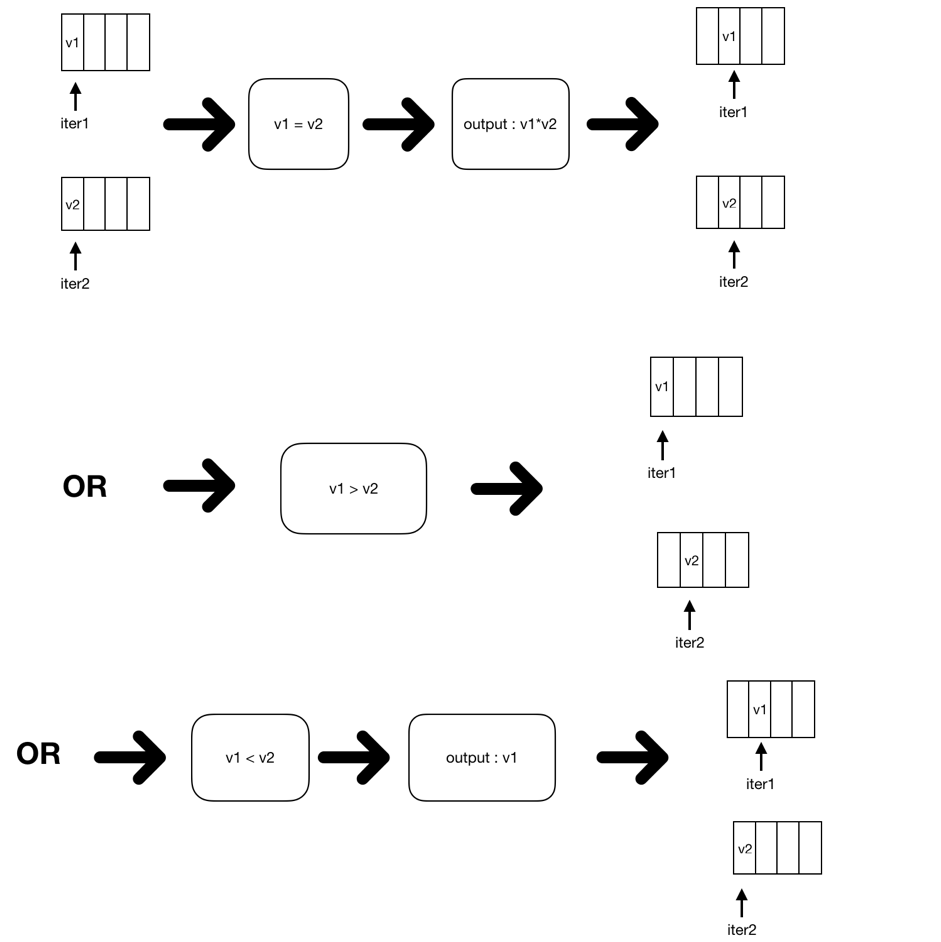

```go
// executor/merge_join.go
// Next implements the Executor Next interface.
func (e *MergeJoinExec) Next(ctx context.Context, req *chunk.Chunk) error {
    // 预读取?
	if !e.prepared {
		if err := e.prepare(ctx, req.RequiredRows()); err != nil {
			return err
		}
    }
}

func (e *MergeJoinExec) joinToChunk(ctx context.Context, chk *chunk.Chunk) (hasMor\e bool, err error) {
    for {
        // 是否到末尾 ? 末尾的 row 为 chunk.Row{}
        // ?? 为什么 outerTable 里会有 row 参数
		if e.outerTable.row == e.outerTable.iter.End() {
			err = e.fetchNextOuterRows(ctx, chk.RequiredRows()-chk.NumRows())
        }

		cmpResult := -1
		if e.outerTable.selected[e.outerTable.row.Idx()] && len(e.innerRows) > 0 {
            // 比对
            cmpResult, err = e.compare(e.outerTable.row, e.innerIter4Row.Current())
        }

		if cmpResult > 0 {
            err = e.fetchNextInnerRows()
        }

		if cmpResult < 0 {
            e.joiner.onMissMatch(false, e.outerTable.row, chk)
        }

        matched, isNull, err := e.joiner.tryToMatchInners(e.outerTable.row, e.innerIter4Row, chk)

		e.outerTable.hasMatch = e.outerTable.hasMatch || matched
        e.outerTable.hasNull = e.outerTable.hasNull || isNull

		if e.innerIter4Row.Current() == e.innerIter4Row.End() {
			if !e.outerTable.hasMatch {
                // 有 = 的内容但是 MissMatch ?
				e.joiner.onMissMatch(e.outerTable.hasNull, e.outerTable.row, chk)
			}
    }
}

// fetchNextInnerRows fetches the next join group, within which all the rows
// have the same join key, from the inner table.
func (e *MergeJoinExec) fetchNextInnerRows() (err error) {
    // 获取 key 相同的行
    e.innerRows, err = e.innerTable.rowsWithSameKey()
    // 转换为 interator
	e.innerIter4Row = chunk.NewIterator4Slice(e.innerRows)
}

// fetchNextOuterRows fetches the next Chunk of outer table. Rows in a Chunk
// may not all belong to the same join key, but ar\e guaranteed to be sorted
// according to the join key.
func (e *MergeJoinExec) fetchNextOuterRows(ctx context.Context, requiredRows int) (err error) {
	e.outerTable.selected, err = expression.VectorizedFilter(e.ctx, e.outerTable.filter, e.outerTable.iter, e.outerTable.selected)
}

func (t *mergeJoinInnerTable) rowsWithSameKey() ([]chunk.Row, error) {
	for {
        selectedRow, err := t.nextRow()
        compareResult := compareChunkRow(t.keyCmpFuncs, selectedRow, t.firstRow4Key, t.joinKeys, t.joinKeys)
    }
}

func (t *mergeJoinInnerTable) nextRow() (chunk.Row, error) {
    for {
			err := Next(t.ctx, t.reader, t.curResult)
    }
}

func (e *MergeJoinExec) compare(outerRow, innerRow chunk.Row) (int, error) {
    for i := range outerJoinKeys {
        cmp, _, err := e.compareFuncs[i](e.ctx, outerJoinKeys[i], innerJoinKeys[i], outerRow, innerRow)
    }
}

func () onMissMatch(hasNull bool, outer chunk.Row, chk *chunk.Chunk)
```

### 内存 OOM

针对 innerTable/outerTable 一次获取相同 key 导致 OOM 的情况, TiDB 的做法:
- 外表(outerTable)按次迭代外表数据, 再跟内表逐一对比作连接即可
- 对于内表, 用 memory.Tracker 这个内存追踪器来记录当前内表已经使用的中间结果的内存大小, 如果它超过已设置的阈值, 我们会采取输出日志或者终止 SQL 继续运行的方法来规避 OOM 的发生

## Insert 详解

---

# builddatabase

[build_database](https://github.com/ngaut/builddatabase)

## TiDB 的异步 schema 变更实现

### 概念

- 元数据记录: 为了简化设计, 引入 system database 和 system table 来记录异步 schema 变更过程中的一些元数据
- state: 根据 F1 的异步 schema 变更过程, 中间引入了一些状态, 该状态和 columns, index, table 和 database 绑定
  - 主要包括 none, delete-only, write-only, write-reorganization, public
  - 创建操作的状态与顺序相反(??), write-reorganization 改为 delete-reorganization
- Lease: 同时刻系统所有节点的 schema 最多只有 **两** 个不同版本
  - 一个租期内每个正常节点都主动加载 schema 信息; 如果不能租期内正常加载, 该节点自动退出系统
  - 即: **确保整个系统的所有节点都已经从某个状态更新到下个状态, 需要 2 倍的租期时间**
- Job: 每个单独的 DDL (Data Defined Language)操作都可看作一个 job
  - 在一个 DDL 操作开始时, 会将此操作封装成一个 job 并存放到 job queue, 等此操作完成时, 会将此 job 从 job queue 删除, 并在存入 history job queue, 便于查看历史 job
- Worker: 每个节点都有一个 worker 用于处理 job
- Owner
  - 一个独立的系统只有一个节点的 worker 能当选 owner
  - owner 角色有任期, owner 的信息会存储在 KV 层中, worker 定期获取 KV 层中的 owner 信息, 如果其中 ownerID 为空, 或者当前的 owner 超过了任期, 则 worker 可以尝试更新 KV 层中的 owner 信息(设置 ownerID 为自身的 workerID); 如果更新成功, 则该 worker 称为 owner
  - 这个用来确保整个系统同一时间只有一个节点在处理 schema 变更
- Background operations: 主要用于 delete reorganization 的优化处理; 总共引入了 background job, background job queue, background job history queue, background worker 和 background owner

### 变更流程


#### 模块

- TiDB Server: TiDB SQL 层中涉及异步 schema 变更的基本模块
- load schema: 每个节点启动时创建的 goroutine , 用于节点到达租期后加载 schema; 如果某个节点(因为超时等原因)加载失败, 该节点的 TiDB Server 会主动挂掉
- start job: TiDB SQL 层收到请求后, 为 job 分配 ID 并存入 KV 层; 之后等待 job 完成即返回
- worker: 每个节点起一个处理 job 的 goroutine, 它会定期检查是否有待处理的 job; 既会等待本节点的 start job 模块通知, 也会主动检查是否有待执行的 job
- owner: 可以认为是一个角色, 信息存储在 KV 层, 包括记录当前当选此角色的节点信息
- job queue: 是一个存放 job 的队列, 存储在 KV 层; 逻辑上整个集群系统只有一个
- job history queue: 是一个存放已经处理完成的 job 的队列, 存储在 KV 层; 逻辑上整个系统只有一个

#### 基本流程

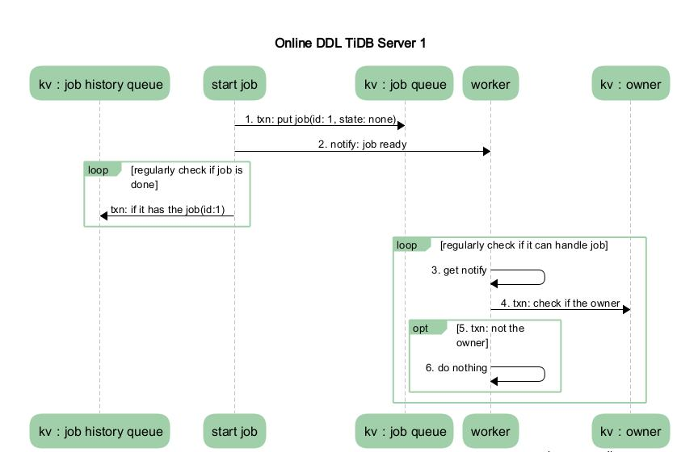

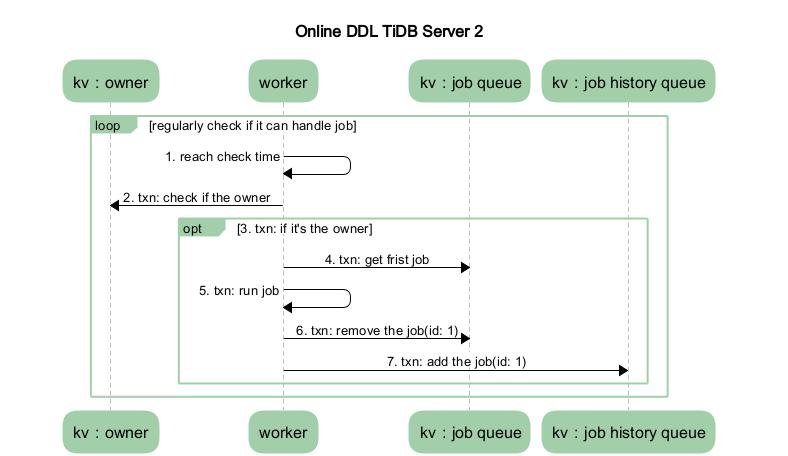

1. MySQL Client 发送给 TiDB Server 一个 DDL 请求
2. 某个 TiDB Server 收到请求, SQL 层执行(MySQL Protocol 收到请求/解析/优化); 这时 Server 生成一个 **Start Job** 并根据请求将请求内容封装成特定的 **DDL Job** , 并将 job 存储到 KV 层, 并通知 worker 有 job 可执行
3. 收到请求的 TiDB Server 的 worker 接收到处理 job 的通知后, 先判断自身是否是 owner(只有 owner 可以处理 DDL) , 如果是则直接处理该 job , 否则直接退出; 而没有收到请求的 worker 通过定时轮循检测未执行的 job , 发现该 DDL Job , 且该 worker 为 owner , 则获取该 job 权限, 且开始处理该 job
4. 当 worker 处理完 job 后, 它会将此 job 从 KV 层的 job queue 中移除, 并放入 job history queue
5. 之前封装 job 的 Start Job 模块会定期去 job history queue 查看是否有之前放进去的 job 对应 ID 的 job, 如果有则整个 DDL 操作结束
6. TiDB Server 将 response 返回 MySQL Client

#### 详细流程

下面是处理 **在 Table 中添加 columns** 的 worker 处理 job 的整个流程:

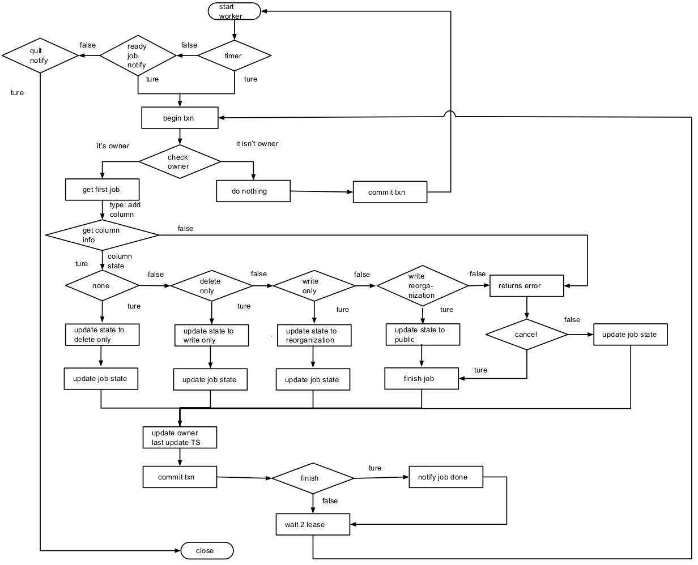

```go
type Job struct {
    ID       int64      `json:"id"`
    Type     ActionType `json:"type"`
    SchemaID int64      `json:"schema_id"`
    TableID  int64      `json:"table_id"`
    State    JobState   `json:"state"`
    Error    string     `json:"err"`
    // every time we meet an error when running job, we will increase it
    ErrorCount int64         `json:"err_count"`
    Args       []interface{} `json:"-"`
    // we must use json raw message for delay parsing special args.
    RawArgs     json.RawMessage `json:"raw_args"`
    SchemaState SchemaState     `json:"schema_state"`
    // snapshot version for this job.
    SnapshotVer uint64 `json:"snapshot_ver"`
    // unix nano seconds
    // TODO: use timestamp allocated by TSO
    LastUpdateTS int64 `json:"last_update_ts"`
}
```

TiDB Server 1 流程:
1. start job 给 start worker(??) 传递了 job 已经准备完成的信号
2. worker 开启一个事务, 检查自己是否是 owner 角色, 发现不是 owner 角色, 则提交事务退出处理 job 循环, 回到 start worker 等待信号的循环

TiDB Server 2 流程:
1. start worker 中定时器到达时间
2. 开启一个事务, 检查发现本节点为 worker 角色
3. 从 KV 层获取队列中第一个 job , 判断该 job 类型能否处理
4. 此时 job 类型为 add columns , 于是执行流程到达图中 get column information
&emsp;&emsp;a. 取对应 table info (通过 job 中的 schemaID 和 tableID), 然后确定添加的 columns 在原先表中是否不存在或者不可见
&emsp;&emsp;b. 如果新添加的 columns 在原先表中不存在, 那么将新的 columns 信息关联到 table info
&emsp;&emsp;c. 如果在未完成以上步骤, 且发生 job 被标记为 cancel 状态, 并返回 error , 之后到达图中 return error 流程(如: 对应的数据库、数据表的状态为不存在或者不可见(状态不为 public), columns 已存在并为可见状态)
5. (异步 schema update 开始) schema_version += 1
6. 将 job 状态的 schema 状态 和 table 中 columns 状态标记为 delete only , 更新 table info 到 KV 层
7. 由于 job 状态没有 finish (done 或 cancel) , 直接将 job 在上一步更新的信息写入到 KV 层
8. 在执行前面的操作时消耗了一定的时间, 所以这里将更新 owner 的 last update timestamp 为当前时间(防止经常将 owner 角色在不同服务器中切换), 并提交事务
9. 循环执行步骤 2、 3、 4.a、5、 6、 7 、8, 6 中的状态为 write only
10. 循环执行步骤 2、 3、 4.a、5、 6、 7 、8, 6 中的状态为 write reorganization
11. 循环执行步骤 2、 3、 4.a、5, 获取当前事务的快照版本, 开始给新添加的列填写数据; 得到对应版本的表的所有 handle (rowID) , 批处理 handle , 然后针对每行新添加的列做数据填充(以下操作都在一个事务中完成):
&emsp;&emsp;a. 用先前取到的 handle 确定对应行存在, 如果不存在则不对此行做任何操作
&emsp;&emsp;b. 如果存在, 通过 handle 和 新添加的 columnID 拼成的 key 获取对应列; 获取的值不为空, 则不对此行做任何操作
&emsp;&emsp;c. 如果值为空, 则通过对应的新添加行的信息获取默认值, 并存储到 KV 层
&emsp;&emsp;d. 将当前的 handle 信息存储到当前 job reorganization handle 字段, 并存储到 KV 层; 这样, 假如步骤 12 执行到一半, 由于某些原因要重新执行 write reorganization 状态的操作, 那么可以直接从这个 handle 开始操作(, 那么之前的 handle 不再处理了 ??)
12. 将调整 table info 中 column 和 index column 中的位置, 将 job 的 schema 和 table info 中新添加的 column 的状态设置为 public, 更新 table info 到 KV 层; 最后将 job 的状态改为 done
13. 因为 job 状态已经 finish, 将此 job 从 job queue 中移除并放入 job history queue 中
14. 执行步骤 8, 此时 12, 13, 14 和 15(??) 在一个事务中

TiDB Server 1 流程:
1. start job 的定时检查触发后, 会检查 job history queue 是否有之前自己放入 job queue 中的 job(通过 job.ID); 如果有则此 DDL 操作在 TiDB SQL 完成, 上抛到 MySQL Protocol 层, 最后返回给 Client, 结束这个操作

#### 优化

原本对于删除操作的状态变化是
 public -> write only -> delete only -> delete reorganization -> none,
 优化的处理是去掉 delete reorganization 状态, 并把此状态需要处理的元数据的操作放到 delete only 状态时,
 把具体删除数据的操作放到后台处理, 然后直接把状态标为 none

那么更改后对数据完整性和一致性的判断:
- 将删除具体数据这个操作异步处理: 在数据放到后台处理前, 此数据表的元数据已经被删除并事先放置到 background job 中; 保证元数据对以后的 job 不可见, 且完整暂存在 background job 中
- 客户端访问表处于 none 状态的 TiDB Server: 这个其实更没有做优化前是一致的, 即访问不到此表
- 客户端访问表处于 delete only 状态的 TiDB Server: 此时客户端对此表做读写操作会失败, 因为 delete only 状态对它们都不可见

##### 实现

此优化对于原先的代码逻辑基本没有变化, 除了对于删除操作(目前还只是删除数据库和表操作)在其处于 delete only 状态时, 就会把元数据删除, 而对起表中具体数据的删除则推迟到后台运行, 然后结束 DDL job

放到后台运行的任务的流程跟之前处理任务的流程类似, 详细过程如下:

1. 在 [add columns 具体流程](4.jpg) 中判定 finish 操作为 true 后, 判断如果是可以放在后台运行, 那么将其封装成 background job 放入 background job queue, 并通知本机后台的 worker 将其处理
2. 后台 job 也有对应的 owner, 假设本机的 backgroundworker 就是 background owner 角色, 那么他将从 background job queue 中取出第一个 background job, 然后执行对应类型的操作(删除表中具体的数据)
3. 执行完成, 那么从 background job queue 中将此 job 删除, 并放入 background job history queue 中(步骤 2 和步骤 3 需要在一个事务中执行)

---

## 附加

### 概念

- OLTP(联机事务处理/On-Line Transaction Processing):
  - 强调数据库内存效率, 强调内存各种指标的命令率, 强调绑定变量, 强调并发操作
- OLAP(联机分析处理/On-Line Analytical Processing):
  - 强调数据分析, 强调 SQL 执行市场, 强调磁盘 I/O, 强调分区
- DW(数据仓库/Data-Warehouse):
  - 存储从 DB 截取出的视图
- ETL(数据清洗/Extraction-Transformation-Loading):
  - 用于完成 DB 到 DW 的数据转存
  - 一般的 DB 都是 ER 模型, 遵从范式化设计原则; DW 则是 面向主题/面向问题 的, 一般是 星型/雪花型, 两者模型结构不同
- DM(数据挖掘/Data Mining):
  - 根据统计学理论, 将 DW 中的数据进行分析, 找出不能直观发现的规律
- BI(商业智能):
  - 获取了 OLAP 的统计信息, 和 DM 得到的科学规律之后, 对生产进行适当的调整

---
