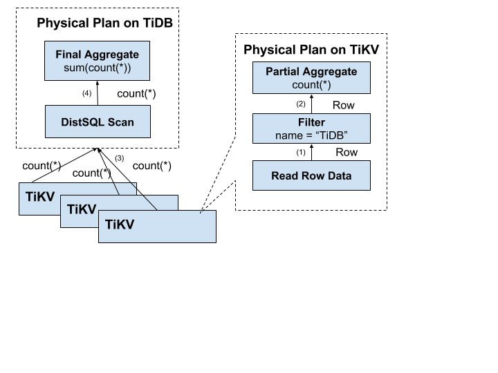

# TIDB

## 概念


- TiDB-Server:
  - 负责接收 SQL 请求, 处理 SQL 相关的逻辑, 并通过 PD 找到存储计算所需数据的 TiKV 地址, 与 TiKV 交互获取数据, 最终返回结果
  - TiDB 无状态, 本身不存储数据, 只负责计算
  - 可无限水平扩展, 可通过均衡负载组件(LVS/HAProxy/F5) 对外提供统一的接入地址
- PD-Server:
  - 集群管理模块
  - 存储集群的元数据
  - 对 TiKV 集群进行调度和负载均衡(数据迁移/Raft group leader 迁移)
  - 分配全局唯一且递增的事务 ID
  - PD 通过 Raft 协议保证数据安全性; 因此建议部署奇数个 PD 节点
- TiKV-Server:
  - 分布式, 带事务的 Key-Value 存储引擎
  - 存储数据的基本单位是 Region, Region 负责存储一个 Key Range(从 StartKey 到 EndKey 的左闭右开区间)
  - 以 Raft 协议做复制, 保证数据一致性和容灾; 副本以 Region 为单位调度管理; 多个 Region 以 (?) 组成 Raft Group, 互为副本
- TiSpark
  - 用于解决复杂的 OLAP 需求, 将 Spark SQL 直接运行在 TiDB 存储层上

特性:
- 水平扩展:
  - 计算能力: TiDB
  - 存储能力: TiKV
  - 调度能里: PD

## TIDB

### 存储

- RocksDB: 存储引擎
- Raft: 分布式一致性
  - Leader 选举
  - 成员变更
  - 日志复制

TiKV 写数据到 RocksDB 的过程:


#### Region


- 对于一个 KV 系统, TiKV 以一个连续的 Key 组作为一个 Region , 保存在一个存储节点上
- Region 的规则规定:
  - 以 Region 为单位, 将数据分散在集群中所有的节点上, 并且尽量保证每个节点上服务的 Region 数量差不多
  - 以 Region 为单位做 Raft 的复制和成员管理

#### 事务 -- Percolator 模型

Percolator 的两阶段提交
- `Client.Set()` 数据仅被缓存, 而不做刷写
- 在第二阶段, 只要有一个 percolator 事务的 [primary row 的 lock 字段] 被清除并且 [write record] 写好(这两个动作是在同一个 bigtable 事务中原子完成的), 那么就认为事务提交成功

### 计算

#### 数据编码规则

每行数据的编码规则:

```shell
Key: tablePrefix{tableID}_recordPrefixSep{rowID}
Value: [col1, col2, col3, col4]
```

(Unique )Index 数据的编码规则:

```shell
Key: tablePrefix{tableID}_indexPrefixSep_indexID_indexedColumnsValue
Value: rowID
```

(Ununique ) Index 数据的编码规则:

```shell
Key: tablePrefix{tableID}_indexPrefixSep_indexID_indexedColumnsValue_rowID
Value: null
```

上文的部分源码:

```go
var(
	tablePrefix     = []byte{'t'}
	recordPrefixSep = []byte("_r")
	indexPrefixSep  = []byte("_i")
)
```


#### SQL 运算

认为 SQL 可以映射到 KV , 那么一般的 SQL 运算:
1. 构建 Key-Range: 由于表中的 RowID 都在 [0, MaxInt64) 这个范围; 用 0 和 MaxInt64 根据 Row 的 Key 编码规则, 就能构造出一个 [StartKey, EndKey) 的左闭右开区间
2. 扫描 Key-Range
3. 过滤数据
4. 计算 Count

优化:
- 为了减少 RPC 开销, 将计算往 存储节点 移



#### SQL 架构


### 调度

#### 调度需求

调度的基本要求:
- 副本数量不能多也不能少
- 副本需要分布在不同的机器上
- 新加节点后, 可以将其他节点上的副本迁移过来
- 节点下线后, 需要将该节点的数据迁移走

调度的优化需求:
- 维持整个集群的 Leader 分布均匀
- 维持每个节点的储存容量均匀
- 维持访问热点分布均匀
- 控制 Balance 的速度, 避免影响在线服务
- 管理节点状态, 包括手动上线/下线节点, 以及自动下线失效节点

#### 调度的基本操作(Raft)

- 增加一个 Replica(AddReplica)
- 删除一个 Replica(RemoveReplica)
- 将 Leader 角色在一个 Raft Group 的不同 Replica 之间 transfer(TransferLeader)

#### 信息收集

TiKV 集群定期向 PD 汇报

**每个 TiKV 节点会定期向 PD 汇报节点的整体信息**:
- 总磁盘容量
- 可用磁盘容量
- 承载的 Region 数量
- 数据写入速度
- 发送 / 接受的 Snapshot 数量(Replica 之间可能会通过 Snapshot 同步数据)
- 是否过载
- 标签信息(标签是具备层级关系的一系列 Tag)

**每个 Raft Group 的 Leader 会定期向 PD 汇报信息**:
- Leader 的位置
- Followers 的位置
- 掉线 Replica 的个数
- 数据写入 / 读取的速度

#### 调度策略

## 附加

### 概念

- OLTP(联机事务处理/on-line transaction processing):
  - 强调数据库内存效率, 强调内存各种指标的命令率, 强调绑定变量, 强调并发操作
- OLAP(联机分析处理/On-Line Analytical Processing):
  - 强调数据分析, 强调 SQL 执行市场, 强调磁盘 I/O, 强调分区
- DW(数据仓库/Data-Warehouse):
  - 存储从 DB 截取出的视图
- ETL(数据清洗/Extraction-Transformation-Loading):
  - 用于完成 DB 到 DW 的数据转存
  - 一般的 DB 都是 ER 模型, 遵从范式化设计原则; DW 则是 面向主题/面向问题 的, 一般是 星型/雪花型, 两者模型结构不同
- DM(数据挖掘/Data Mining):
  - 根据统计学理论, 将 DW 中的数据进行分析, 找出不能直观发现的规律
- BI(商业智能):
  - 获取了 OLAP 的统计信息, 和 DM 得到的科学规律之后, 对生产进行适当的调整
