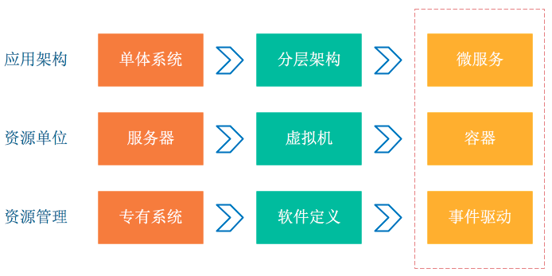
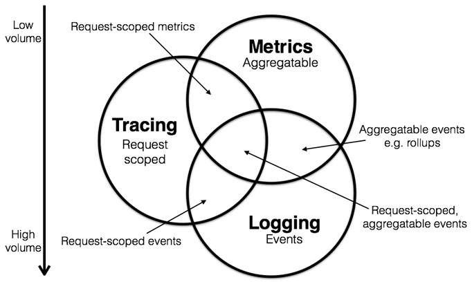

# 分布式系统的运维

- 集中式日志系统(Logging): 用于记录离散的事件(应用程序的调试信息或错误信息), 它是我们诊断问题的依据
  - glog/zap: 单机日志工具
  - ELK(ElasticSearch, Logstash, Kibana): 实时日志分析
    - ElasticSearch: 搜索引擎服务器
    - Logstash: 日志搜集处理
    - Kibana: 分析/可视化平台, 专门用于与 ElasticSearch 配合使用
- 集中式度量系统(Metrics): 用于记录可聚合的数据(队列的当前深度可被定义为一个度量值, 在元素入队或出队时被更新; HTTP 请求个数可被定义为一个计数器, 新请求到来时进行累加)
    - Prometheus/InfluxDB: TSDB(时序数据库)
    - Grafana: 可视化监控工具
- 分布式追踪系统(Tracing): 用于记录请求范围内的信息(一次远程方法调用的执行过程和耗时), 它是我们排查系统性能问题的利器
  - Opentracing/jaeger
    - Cassandra: NoSQL 文档型 分布式 列簇存储

[Metrics, tracing, and logging](http://peter.bourgon.org/blog/2017/02/21/metrics-tracing-and-logging.html)
