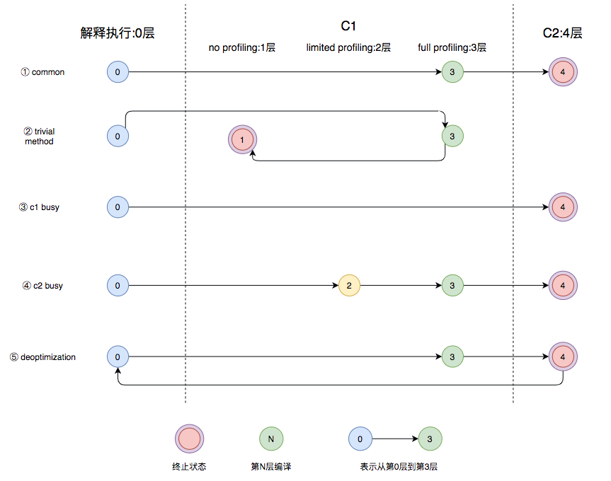

# Java

## 坑

### `ClassNotFoundException: javax.xml.bind.JAXBContext`

[stackoverflow](https://stackoverflow.com/questions/43574426/how-to-resolve-java-lang-noclassdeffounderror-javax-xml-bind-jaxbexception-in-j)

运行 springboot 项目出现: `Type javax.xml.bind.JAXBContext not present`

原因: java9+ 版本以后, JAXB 默认没有加载(但是在测试中, Java8 也没有启用 jaxb, 为什么 ?)

解决方案:
```xml
<!-- spring-boot 1.5.* -->
<!-- Java 6 = JAX-B Version 2.0   -->
<!-- Java 7 = JAX-B Version 2.2.3 -->
<!-- Java 8 = JAX-B Version 2.2.8 -->
<dependency>
    <groupId>javax.xml.bind</groupId>
    <artifactId>jaxb-api</artifactId>
    <version>2.2.11</version>
</dependency>
<dependency>
    <groupId>com.sun.xml.bind</groupId>
    <artifactId>jaxb-core</artifactId>
    <version>2.2.11</version>
</dependency>
<dependency>
    <groupId>com.sun.xml.bind</groupId>
    <artifactId>jaxb-impl</artifactId>
    <version>2.2.11</version>
</dependency>
<dependency>
    <groupId>javax.activation</groupId>
    <artifactId>activation</artifactId>
    <version>1.1.1</version>
</dependency>
```

```xml
<!-- spring boot 2.0.* -->
<dependency>
   <groupId>javax.xml.bind</groupId>
    <artifactId>jaxb-api</artifactId>
</dependency>
<dependency>
    <groupId>com.sun.xml.bind</groupId>
    <artifactId>jaxb-impl</artifactId>
    <version>2.3.0</version>
</dependency>
<dependency>
    <groupId>org.glassfish.jaxb</groupId>
    <artifactId>jaxb-runtime</artifactId>
    <version>2.3.0</version>
</dependency>
<dependency>
    <groupId>javax.activation</groupId>
    <artifactId>activation</artifactId>
    <version>1.1.1</version>
</dependency>
```

## 库

### ShardingSphere

#### 读写分离

- 提供了一主多从的读写分离配置, 可独立使用, 也可配合分库分表使用
- 同个调用线程, 执行多条语句, 其中一旦发现有非读操作, 后续所有读操作均从主库读取
- Spring 命名空间
- 基于 Hint 的强制主库路由

- 调用 getConnection 方法时, 先检查 ThreadLocal 是否有连接, 没有就尝试获取一个底层连接, 然后存储到 ThreadLocal 变量中去, 下次就直接在中获取了
- sharding-jdbc 在 PreparedStatement (实际上为 ShardingPreparedStatement)的 executeXX 层进行了主从库的连接处理

```java
// 获取连接
public Connection getConnection(final String dataSourceName, final SQLType sqlType) throws SQLException {
        if (getCachedConnections().containsKey(dataSourceName)) {
            return getCachedConnections().get(dataSourceName);
        }
        DataSource dataSource = shardingContext.getShardingRule().getDataSourceRule().getDataSource(dataSourceName);
        Preconditions.checkState(null != dataSource, "Missing the rule of %s in DataSourceRule", dataSourceName);
        String realDataSourceName;
        if (dataSource instanceof MasterSlaveDataSource) {
            NamedDataSource namedDataSource = ((MasterSlaveDataSource) dataSource).getDataSource(sqlType);
            realDataSourceName = namedDataSource.getName();
            if (getCachedConnections().containsKey(realDataSourceName)) {
                return getCachedConnections().get(realDataSourceName);
            }
            dataSource = namedDataSource.getDataSource();
        } else {
            realDataSourceName = dataSourceName;
        }
        Connection result = dataSource.getConnection();
        getCachedConnections().put(realDataSourceName, result);
        replayMethodsInvocation(result);
        return result;
    }

// 如果是 MasterSlaveDataSource 则尝试获取真正的数据源(master/slave)
public NamedDataSource getDataSource(final SQLType sqlType) {
    if (isMasterRoute(sqlType)) {
        DML_FLAG.set(true);
        return new NamedDataSource(masterDataSourceName, masterDataSource);
    }
    String selectedSourceName = masterSlaveLoadBalanceStrategy.getDataSource(name, masterDataSourceName, new ArrayList<>(slaveDataSources.keySet()));
    DataSource selectedSource = selectedSourceName.equals(masterDataSourceName) ? masterDataSource : slaveDataSources.get(selectedSourceName);
    Preconditions.checkNotNull(selectedSource, "");
    return new NamedDataSource(selectedSourceName, selectedSource);
}
private static boolean isMasterRoute(final SQLType sqlType) {
    return SQLType.DQL != sqlType || DML_FLAG.get() || HintManagerHolder.isMasterRouteOnly();
}
```

以下情况下, 会走主库
- DDL: 不是查询类型的语句, 比如更新字段(`isMasterRoute()==true`)
- DML: `DML_FLAG` 变量为 true 的时候
- 强制 Hint 方式走主库

在从库中查询, 会有一个 `getAndIncr%size` 的负载均衡

```java
public final class RoundRobinMasterSlaveLoadBalanceStrategy implements MasterSlaveLoadBalanceStrategy {

    private static final ConcurrentHashMap<String, AtomicInteger> COUNT_MAP = new ConcurrentHashMap<>();

    @Override
    public String getDataSource(final String name, final String masterDataSourceName, final List<String> slaveDataSourceNames) {
        AtomicInteger count = COUNT_MAP.containsKey(name) ? COUNT_MAP.get(name) : new AtomicInteger(0);
        COUNT_MAP.putIfAbsent(name, count);
        count.compareAndSet(slaveDataSourceNames.size(), 0);
        // 负载均衡
        return slaveDataSourceNames.get(count.getAndIncrement() % slaveDataSourceNames.size());
    }
}
```

## 分层编译



- 图中第①条路径, 代表编译的一般情况, 热点方法从解释执行到被3层的C1编译, 最后被4层的C2编译
- 如果方法比较小（比如Java服务中常见的getter/setter方法）, 3层的profiling没有收集到有价值的数据, JVM就会断定该方法对于C1代码和C2代码的执行效率相同, 就会执行图中第②条路径; 在这种情况下, JVM会在3层编译之后, 放弃进入C2编译, 直接选择用1层的C1编译运行
- 在C1忙碌的情况下, 执行图中第③条路径, 在解释执行过程中对程序进行profiling ，根据信息直接由第4层的C2编译
- 前文提到C1中的执行效率是1层>2层>3层, 第3层一般要比第2层慢35%以上, 所以在C2忙碌的情况下, 执行图中第④条路径; 这时方法会被2层的C1编译, 然后再被3层的C1编译, 以减少方法在3层的执行时间
- 如果编译器做了一些比较激进的优化, 比如分支预测, 在实际运行时发现预测出错, 这时就会进行反优化, 重新进入解释执行, 图中第⑤条执行路径代表的就是反优化
