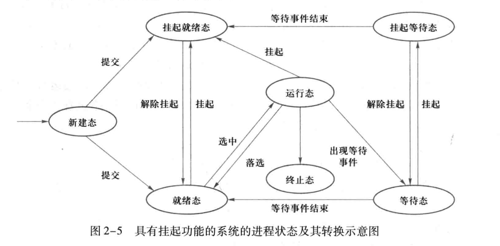

# Interview

## 进程状态

### 可运行状态 TASK_RUNNING/R

### 可中断的睡眠状态 TASK_INTERRUPTIBLE/S

进程由于某事件(socket, IPC, sleep)而挂起, 此时进程的 `task_struct` 被放入对应事件的等待队列中; 事件完成(中断/其他进程触发)后, 被唤醒

### 不可中断的睡眠状态 TASK_UNINTERRUPTIBLE/D

- `vfork` 的父进程(Ds)

### 暂停状态或跟踪状态 TASK_STOPPED TASK_TRACED/T

(除了在 `TASK_UNINTERRUPTIBLE` 不接收信号, )接收到 `SIGSTOP`

调试中(ts)

### 僵尸状态 TASK_DEADEXIT_ZOMBIE/Z

只遗留 `task_struct` 和 PCB 等少量数据

### 退出状态 TASK_DEAD_EXIT_DEAD/X

即将被销毁

## 僵尸进程

- 子进程在死亡后(PCB 等资源未被释放)需要被父进程 wait 捕获他们的状态
- 如果父进程没有 wait 而子进程结束, 会导致子进程的资源一直不释放(僵尸态)
- 如果父进程没有 wait 而结束进程, 子进程会被托管到 pid 为 1 的进程(`/sbin/init` OR `/lib/systemd/systemd`)
