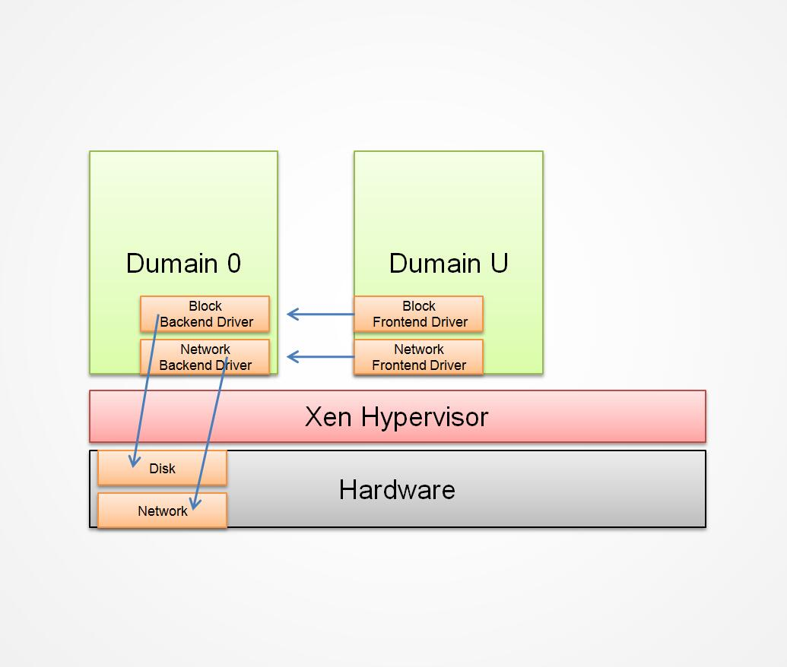

# Xen

## 虚拟化类型

1. 半虚拟化(PV)

2. 全虚拟化(HVM)

3. CPU 完全虚拟化, IO 半虚拟化 -- 硬件辅助的全虚拟化(PVHVM)

## Xen 的基本组件

- Xen Hypervisor - Xen 管理系统, Xen 客户操作系统和硬件的访问接口
- Domain 0 - 运行在 Xen 之上, 具有直接访问硬件和管理特权的 *客户操作系统*
- Domain U - 运行在 Xen 之上, 不能直接访问硬件, 可独立并行的

## Domian 管理和控制

### Xend
### Xm
### Xenstored
### Libxenctrl
### Qemu-DM
