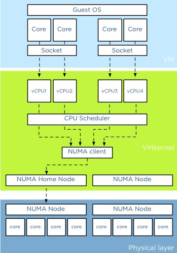
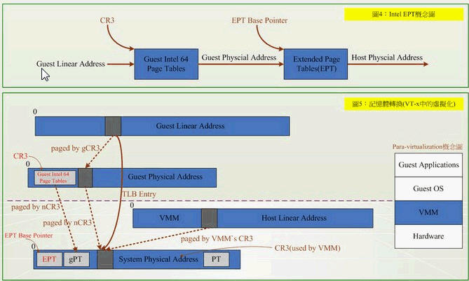
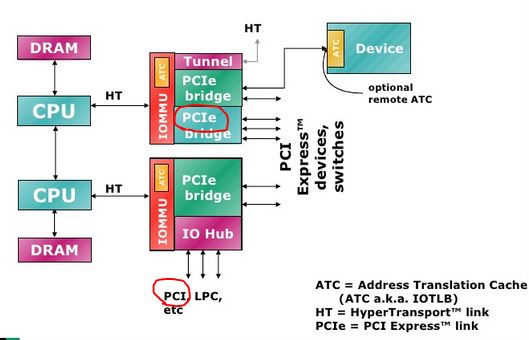
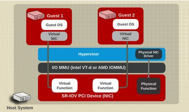
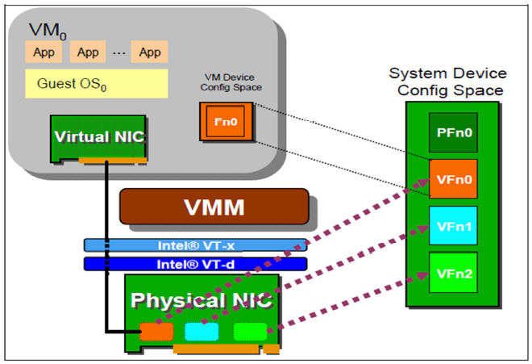

# KVM

## KVM 介绍

### 简单介绍

- 基于虚拟化扩展(*Intel VT* OR *AMD-V*)的 X86 硬件的 Linux 原生的全虚拟化解决方案
- 通过 /dev/kvm 接口设置一个客户端虚拟服务器的地址空间 并提供模拟 I/O

- Guset: 客户端系统, 提供 CPU(VCPU), 内存, 驱动; 被 KVM 置于一种受限制的 CPU 模式下运行
- KVM: 内核驱动, 提供 CPU 和 内存 的虚机化, 客户端的 I/O 拦截
- QEMU: 用户进程, 专供 KVM 虚机使用的 QEMU, Guest 的 I/O 被 KVM 拦截后, 将会最终由 QEMU 处理; 提供给 Guset 虚拟的硬件 I/O, 通过 IOCTL /dev/kvm 设备与 KVM 交互

### KVM 功能列表

- 支持 CPU 和 menory 超分 (Overcommit)
- 支持半虚拟化 I/O
- 支持热插拔(CPU, 块设备, 网络设备)
- 支持对称多处理器(SMP 架构)
- 支持实时迁移(Live Migration)
- 支持 PCI 设备直接分配和单根 I/O 虚拟化(SR-IOV)
- 支持内核同页合并(KSM)
- 支持 NUMA (非一致存储访问结构)

### KVM 工具

- libvirt: 操作/管理 KVM 虚机的虚拟化 API, 可操作 KVM vmware XEN Hyper-V LXC 等多重 Hypervisor
- Virsh: 基于 libvirt 的 CLI
- Virt-Manager: 基于 libvirt 的 GUI
- Virt-V2V: 虚机格式迁移工具
- Virt-install ...
- sVirt: 安全工具

## CPU 和内存虚拟化

### 为什么需要 CPU 虚拟化

X86 操作系统默认运行在 Ring0 的 CPU 级别上, 但是虚拟操作系统不知道, 此时, 需要 VMM(虚拟机管理程序) 来避免这种情况 -- 虚机通过 VMM 的以下方法访问硬件:

- 半虚拟化
- 全虚拟化
- 硬件辅助的虚拟化

### 基于二进制翻译的全虚拟化

客户端操作系统(Guest OS) 运行在 Ring 1, 当它在执行特权指令(Ring 0)时, 触发异常, VMM 捕获该异常, 在异常里翻译, 模拟, 最终返回给 Guest OS

该流程性能损耗大

### 超虚拟化(半虚拟化/操作系统辅助虚拟化)

通过修改操作系统内核, 替换不能虚拟化的指令, 通过**超级调用(hypercall)** 直接和底层的 **虚拟化层(hypervisor)** 通讯
hypervisor 同时也提供 **超级调用接口** 满足其他关键内核操作, 如*内存管理*, *中断*, *时间保持*

该流程不需要捕获和模拟, 性能损耗低

该流程只适用于 linux , 不适用于 Windows

|                           | 利用二进制翻译的全虚拟化               | 硬件辅助虚拟化                                                                       | 操作系统协助/半虚拟化                                                                                           |
| --                        | --                                     | --                                                                                   | --                                                                                                              |
| 实现技术                  | BT 和直接执行                          | 遇到特权指令转到 root 模式执行                                                       |                                                                                                                 |
| 客户端操作系统修改/兼容性 | 无需修改客户操作系统, 最佳兼容性       | 无需修改客户操作系统, 最佳兼容性                                                     | 客户操作系统需要修改来支持 hypercall , 因此不能运行在物理硬件本身和其他 Hypervisor 上, 兼容性差, 不支持 Windows |
| 性能                      | 差                                     | 全虚拟化下, CPU 需要在两种模式之间切换, 带来性能开销; 但是, 其性能在逐渐毕竟半虚拟化 | 好 半虚拟化下 CPU 性能开销几乎为 0, 虚机性能接近于物理机                                                        |
| 应用厂商                  | VMWare Workstation / QEMU / Virtual PC | VMware ESXi / Microsoft Hyper-V / Xen 3.0 / KVM                                      | Xen                                                                                                             |

### 硬件辅助的全虚拟化

Intel 和 AMD 的虚拟化技术

#### Intel-VT(Virtualization Technology)

该技术下 VMM 运行在 VMX root operation , 客户端 OS 运行在 VMX non-root operation

VM-entry: VMX root operation 通过调用 **VMLAUNCH/VMRESUME** 指令切换到 VMX non-root operation
VM-exit: 调用 **VMCALL** 指令调用 VMM 服务, 硬件挂起 Guest OS, 切换到 VMX root operation

### SMP MPP NUMA

#### SMP

多处理器架构

所有 CPU 共享全部资源(总线, 内存, IO 系统等) 操作系统或数据库只有一个副本

多个 CPU 之间没有区别, 平等的访问内存 外设 唯一一个操作系统

扩展能力有限, SMP 服务器 CPU 利用率最好在 2 到 4 个 CPU

#### MPP

海量并行处理结构: 分布式存储器模式

一个分布式存储器模式, 具有多个节点, 每个节点都有自己的(不共享的)存储器

能配置为 SMP 结构, 也能配置为非 SMP 结构

MPP 能理解为单一 SMP 的横向扩展集群, 需要软件实现

#### NUMA

非一致存储访问结构

由多个 SMP 服务器通过一定的节点以**互联网**的形式连接, 协同工作, 从用户的角度是一个完整的服务器系统

多个 SMP 系统通过节点互联网连接而成, 每个节点都只访问自己的本地资源(内存, 存储等), 是一种完全 **无共享(Share Nothing)** 结构

### KVM 的 CPU 虚拟化

1. qemu-kvm 通过对 /dev/kvm 的一系列 IOCTL 命令操作虚机

2. 一个 KVM 虚机即一个 Linux qemu-kvm 进程, 与其他 Linux 进程一样被 Linux 进程调度器调度

3. KVM 户级系统的内存是 qemu-kvm 进程的地址空间的一部分

4. KVM 虚机的 vCPU 作为进程运行在 qemu-kvm 进程的上下文中

### CPU 虚拟化

- 对于客户机, OS 运行在 ring 0 中, 应用运行在 ring 3 中
- 对于 KVM, QEMU 运行在 ring 3 中, KVM 运行在 ring 0 中

- QEMU 仅通过 KVM 控制虚机的代码被 CPU 执行, 本身不执行客户机代码
- 即, CPU 没有被虚级化成虚拟的 CPU 供客户机

上图部分概念:
- socket - 颗 - CPU 的物理单位
- core - 核 - 每个 CPU 的物理内核
- thread - 超线程 - CPU 核的虚拟化, 导致生成多个逻辑 CPU, 同时运行(有缺陷的)多线程

在 KVM 等虚拟化平台中, 会在 VM 层和物理层之间加入 VMKernel 层, 从而允许所有的 VM 共享物理层资源

- VM 层
- 物理层
- VMKernel 层

### 执行客户机系统代码

Linux 内核的执行模式
- 用户模式 - User -- 代表客户机系统执行 I/O 操作
- 内核模式 - Kernel -- 负责将 CPU 切换到 Guest Mode 执行 Guest OS 代码, 并在 CPU 退出时回到 Kernel 模式
- 客户机模式 - Guest - KVM 驱动为 **支持虚拟化的 CPU** 而添加 -- 执行客户机系统非 I/O 代码, 同时在需要的时间驱动 CPU 退出该模式

KVM 内核驱动作为 User mode 和 Guest mode 之间的桥梁
- **User Mode** 中的 Qemu-KVM 通过 IOCTL 运行虚拟机
- KVM 内核模块收到请求后, 将 VCPU 上下文加载到 **VMCS(virtual machine control structure)** ,驱动 CPU 进入 VMX non-root 模式, 执行 客户机代码

QEMU-KVM 相比原生 QEMU 的改动
- 原生 QEMU 通过 **指令翻译** 实现 CPU 虚拟化; 修改后的 QEMU-KVM 则通过 IOCTL 调用 KVM 模块
- 原生 QEMU 时单线程, QEMU-KVM 时多线程

一个 QEMU 进程的线程任务
- I/O 线程 -- 管理模拟设备
- vCPU 线程 -- 运行 Guest 代码
- 其他如 Event Loop, Offloaded Tasks

### 客户机线程到物理 CPU

- 客户机线程调度到客户机物理 CPU(KVM vCPU)
- vCPU 线程调度到主机物理 CPU, 由 Hypervisor(Linux) 负责

Linux 进程调度

- Linux 进程将一个 可运行(runnable)进程(依靠 CPU 亲和性规则)调度
- 处理器亲和性: 可设置 vCPU 在指定的物理 CPU 上运行
- vCPU 数目不超过物理 CPU 数, 否则, 会出现线程间 CPU 内核资源竞争

### 客户端 vCPU 分配规则

1. 根据负载需要分配最少 vCPU
2. 客户机 vCPU 总数不应超过物理 CPU 内核总数, 否则, 存在 CPU 竞争, CPU 核内线程切换, 导致 overhead
3. 负载分为 计算负载和 I/O 负载; 对于计算负载, 需要分配较多 vCPU, 甚至需要考虑 CPU 亲和性

### KVM 内存虚拟化

利用 mmap 系统调用, 在 QEMU 主线程的虚拟地址空间中模拟 MMU

- VA->PA -- *客户机虚拟地址* 到 *客户机内存物理地址* 的映射
- PA->MA -- VMM 负责的 *客户物理内存* 到 *实际机器内存* 的映射

VMM 内存虚拟化:
- 软件方式 -- 内存地址翻译, Shadow page table
- 硬件实现 -- 基于 CPU 的辅助虚拟化, AMD-NPT(Nested Page Tables) 和 Intel-EPT(Extended Page Tables)

EPT 硬件辅助虚拟化 -- **两阶段记忆体转换**:
- Guest Physical Address -> System Physical Address, VMM 不需要保留 SPT(Shadow Page Table), 不经过 SPT 转换过程
- 能耗低, 硬件指令集更可靠和稳定

### KSM(Kernel SamePage Merging OR Kernel Shared Memory)

#### 原理

作为 内核守护进程的 **KSMD** , 定期执行页面扫描, 识别副本页面并合并副本(借助 Linux 将内核相似的内存页合并成一个内存页)

增加了内核开销
提高了内存效率

能实现更多的内存超分, 运行更多的虚机

#### 实现过程 -- 合并过程

**TODO**

### KVM Huge Page Backed Memory(巨页内存技术)

- 技术链接 -- MongoDB

## I/O 全虚拟化和准虚拟化

在 QEMU/KVM 中 客户机可以使用的设备大致分为三类:

- 模拟设备: 完全由 QEMU 纯软件模拟的设备
- Virtio: 实现 VIRTIO API 的半虚拟化设备
- PCI 设备直接分配

### 全虚拟化 I/O 设备

软件模拟设备

过程:
- 客户机的设备驱动程序发起 I/O 请求操作请求
- KVM 模块中的 I/O 模块捕获代码拦截该 I/O 请求
- 经过处理后将本次 I/O 请求放到 **I/O 共享页(sharing page)** , 并通知用户空间的 QEMU 程序
- QEMU 获得 I/O 操作的具体信息后, 交由 **硬件模拟代码** 来模拟出本次 I/O 操作
- 完成后, QEMU 将结果放回 I/O 共享页, 并通知 KVM 模块中的 I/O 操作捕获代码
- KVM 模块的捕获代码读取 I/O 共享页中的操作结果, 返回给客户机

- 能模拟出各种硬件设备
- 上下文切换多, 数据复制多, 性能差

**注: 当客户机通过 DMA(Direct Memory Access) 访问大块 I/O 时, QEMU 通过内存映射(Memory Map)方式将结果直接写在客户机的内存中, 然后通知 KVM 模块告诉客户机 DMA 操作已经完成**

#### QEMU 模拟网卡的实现

全虚拟化下, KVM 虚机可以选择的**网络**模式包括:

1. 默认用户模式(User) -- [-net user[,vlan=n]]: 不需要管理员权限来运行, 没有指定 -net 选项下, 默认 [-net tap[,vlan=n][,fd=h]]
2. 基于网桥模式(Bridge)的模式 -- [-net nic[,vlan=n][,macaddr=adr]]: 创建一个新的网卡, 与 VLAN n 连接, 如果没有指定 -net 选项, 则创建一个单一的 NIC
3. 基于 NAT(Network Address Teanslation)的模式 -- [-net tap[,vlan=n][,fd=h][,iframe=name][,script=file]]: 将 TAP 网络接口 name 与 VLAN n 进行连接, 并用 网络配置脚本文件(Default Is /etc/qemu-ifup) 配置, 如果没有指定 name , OS 自动分配; fd=h 可以用来指定一个已打开的 TAP 主机接口的句柄

#### qemu-kvm 关于磁盘设备和网络设备的主要选项

| 类型                      | 选项                                                                                                                                                                                                                                                                                                                     |
| --                        | --                                                                                                                                                                                                                                                                                                                       |
| 磁盘设备(软盘 磁盘 CDROM) | -drive option[,option[,option[,...]]]: 定义一个硬盘设备; 可用子选项有很多                                                                                                                                                                                                                                                |
|                           | file=/path/to/somefile: 硬件映像文件路径                                                                                                                                                                                                                                                                                 |
|                           | if=interface: 指定硬盘设备所连接的接口类型, 即控制器类型, 如 ide、scsi、sd、mtd、floppy、pflash 及 virtio 等                                                                                                                                                                                                             |
|                           | index=index: 设定同一种控制器类型中不同设备的索引号，即标识号                                                                                                                                                                                                                                                            |
|                           | media=media: 定义介质类型为硬盘(disk)还是光盘(cdrom)                                                                                                                                                                                                                                                                     |
|                           | format=format: 指定映像文件的格式, 具体格式可参见 qemu-img 命令                                                                                                                                                                                                                                                          |
|                           | -boot [order=drives][,once=drives][,menu=on OR off]: 定义启动设备的引导次序, 每种设备使用一个字符表示; 不同的架构所支持的设备及其表示字符不尽相同, 在 x86 PC 架构上, a、b 表示软驱、c 表示第一块硬盘, d 表示第一个光驱设备, n-p 表示网络适配器; 默认为硬盘设备(-boot order=dc,once=d)                                    |
| 网络                      | -net nic[,vlan=n][,macaddr=mac][,model=type][,name=name][,addr=addr][,vectors=v]：创建一个新的网卡设备并连接至vlan n中；PC架构上默认的NIC为e1000，macaddr用于为其指定MAC地址，name用于指定一个在监控时显示的网上设备名称；emu可以模拟多个类型的网卡设备；可以使用“qemu-kvm -net nic,model=?”来获取当前平台支持的类型   |
|                           | -net tap[,vlan=n][,name=name][,fd=h][,ifname=name][,script=file][,downscript=dfile]：通过物理机的TAP网络接口连接至vlan n中，使用script=file指定的脚本(默认为/etc/qemu-ifup)来配置当前网络接口，并使用downscript=file指定的脚本(默认为/etc/qemu-ifdown)来撤消接口配置；使用script=no和downscript=no可分别用来禁止执行脚本 |
|                           | -net user[,option][,option][,...]：在用户模式配置网络栈，其不依赖于管理权限；有效选项有:                                                                                                                                                                                                                                 |
|                           | vlan=n: 连接至 vlan n, 默认 n=0                                                                                                                                                                                                                                                                                          |
|                           | name=name: 指定接口的显示名称, 常用于监控模式中                                                                                                                                                                                                                                                                          |
|                           | net=addr[/mask]: 设定 GuestOS 可见的 IP 网络，掩码可选, 默认为 10.0.2.0/8                                                                                                                                                                                                                                                |
|                           | host=addr: 指定 GuestOS 中看到的物理机的 IP 地址, 默认为指定网络中的第二个, 即 x.x.x.2                                                                                                                                                                                                                                   |
|                           | dhcpstart=addr: 指定 DHCP 服务地址池中 16 个地址的起始 IP, 默认为第 16 个至第 31 个, 即 x.x.x.16-x.x.x.31                                                                                                                                                                                                                |
|                           | dns=addr: 指定 GuestOS 可见的 dns 服务器地址; 默认为 GuestOS 网络中的第三个地址，即 x.x.x.3                                                                                                                                                                                                                              |
|                           | tftp=dir: 激活内置的 tftp 服务器, 并使用指定的 dir 作为 tftp 服务器的默认根目录                                                                                                                                                                                                                                         |
|                           | bootfile=file:BOOTP 文件名称, 用于实现网络引导 GuestOS; 如: qemu -hda linux.img -boot n -net user,tftp=/tftpserver/pub,bootfile=/pxelinux.0                                                                                                                                                                             |

#### 准虚拟化(Para-virtualization) I/O 驱动 virtio

Linux 的 设备驱动标准框架

##### virtio 框架

在 Guest OS 内核中安装前端驱动(Front-end driver) 和在 QEMU 中实现后端驱动(Back-end)的方式
前后端采用 **Vring** 直接通信, 从而绕过 KVM 模块

纯软件模拟和 Virtio 的区别:
    Virtio 省去了纯模拟的异常捕捉, 即 Guest OS 直接和 QEMU 的 I/O 模块**直接通信**

Virtio 的完整虚机流程

- KVM 通过中断的方式通知 QEMU 去获取数据, 放到 Virtio Queue 中
- KVM 再通知 Guest 去 virtio 中取数据

##### Virtio 的 Linux 下实现

- 前端驱动: 客户机(Guest OS)中安装的驱动程序模块
- 后端驱动: 在 QEMU 中实现, 调用主机上的物理设备, 或者完全由软件实现
- virtio 层: 虚拟队列接口, 从概念上连接 前端和后端; 根据需要使用不同数量的队列, 如 virtio-net 使用两个队列, virtio-block 使用一个队列; 该队列使用 virtio-ring 虚拟
- virtio-ring: 实现虚拟队列的环形缓冲区

Linux 内核中实现的前端驱动:

- 块设备(磁盘等)
- 网络设备
- PCI 设备
- 气球驱动设备(动态管理客户机 *内存* 使用情况)
- 控制台驱动程序

当 Guest OS 使用某个 virtio 设备时, 对应的驱动会被加载

示例: virtio-net

特点

- 多个虚机共享主机网卡 eth0
- QEMU 使用标准 tun/tap 将虚机的网络桥接到主机网卡上
- 每个虚机看起来有一个直接连接到主机 PCI 总线的私有 virtio 网络设备
- 需要在虚机中安装 virtio 驱动

Virtio 优缺点:
- 优点: 更高的 I/O 性能, 几乎和原生系统相近
- 缺点: 客户端必须安装特定的 virtio 驱动, 难以兼容旧版 Linux(< 2.6.24), 部分 Windows 需要安装特定驱动

##### Vhost-net(kernel-level virtio server)

将 Virtio-net 的后端处理任务放在内核空间中执行

virtio-net 与 vhost-net 对比

##### virtio-balloon(Linux-2.6.27 qemu-kvm-0.13)

针对内存的 Ballooning 技术

- 当宿主机内存紧张, 请求客户机回收部分内存; 甚至可能回收利用已分配给客户机的部分内存
- 当客户机内存不足, 释放部分主机内存到客户机

##### RadHat 的多队列 Virtio

多队列 virtio-net 提供一个随着虚机的虚拟 CPU 增加而增强网络性能的方法;
同时多队列 virtio-net 会相应增加 CPU 的负担, 可能会降低 **对外数据流** 的性能

### Tun/Tap

虚拟网卡驱动
- tun - 虚拟的点对点设备
- tap - 虚拟的以太网设备

通过虚拟 *设备文件* 实现用户态和核心态的数据交互

#### 驱动程序
1. 网卡驱动: 接收来自 TCP/IP 协议栈的网络分包并发送 OR 将接收到的网络分包传给协议栈处理
2. 字符设备驱动: 将网络分包在内核与用户态间传送, 模拟物理链路的数据接收和发送

与真实网卡设备的区别:
1. 获取的数据不来自物理链路, 而是来自于用户区, Tun/Tap 设备驱动通过 **字符设备文件** 来实现数据从用户区获取
2. 发送时通过字符设备发送到用户区, 再由用户区程序通过其他渠道发送

#### 发送过程:

1. 目标数据 -> hard_start_xmit --> tun_net_xmit
2. skb(?) 将会被加入 skb 链表, 唤醒被阻塞的使用 Tun/Tap 设备字符驱动读数据的进程
3. --> tun_chr_read 读取 skb 链表, 发送到目标用户区

#### 接受过程:

1. 目标数据 -> Tun/Tap 设备字符驱动 --> tun_chr_write --> tun_get_user(从用户区接收数据)
2. 将数据存入 skb 中, 然后调用 netif_rx(skb) 将 skb 送给 tcp/ip 协议栈处理

## KVM I/O 设备直接分配和 SR-IOV

### PCI/PCI-E 设备直接分配给虚机 (PCI Pass-through)

PCI-E 直接连接在 IOMMU 上, PCI 连接在一个 IO Hub 上, 所以 PCI 卡的性能没有 PCI-E 高

主要的 PCI 设备
- Network cards(wired or wireless)
- SCSI adapters
- Bus controllers: USB, PCMICIA, I2C, FireWire, IDE
- Graphics and Video cards
- Sound cards

#### PCI/PCIe Pass-through 原理

- KVM 支持客户机以 **独占方式** 访问主机的 PCI/PCIe 设备, 客户机对该设备的 I/O 交互操作和实际的物理设备操作完全一样, 不需要或者很少需要 KVM 的参与
- 几乎所有的 PCI/PCIe 设备都支持直接分配, 除了 *显卡* 除外
- 一般的 SATA 或者 SAS 等硬盘的控制器都是直接接入 PCI 或者 PCIe 总线的, 所以也可以将硬盘作为普通的 PCI 设备直接分配给客户机, 这时候分配的是 SATA 或者 SAS 的 **控制器**

设备直接分配的优势和不足

优势
- 在执行 I/O 操作时大量减少或者避免 VM-Exit(进入 root operation VMX) 陷入到 Hypervisor 中, 极大提高了性能
- VT-d 克服了 virtio 兼容性不好, CPU 使用频率高的问题

不足:
- 一块主板允许添加的 PCI/PCIe 设备是有限的, 大量使用 VT-d 独立分配设备给客户机, 硬件设备数量增加, 导致硬件投资成本高
- VT-d 直接分配的做法, 导致其动态迁移功能受限, 不过能通过 *热插拔* 或者 *libvirt* 等工具解决

解决方案:
- 对网络性能要求高的客户机使用 VT-d 直接分配, 其他使用 纯模拟 或者 virtio 实现多个客户机共享一个设备
- 对于 网络 I/O, 选择 SR-IOV 使一个网卡产生多个独立的虚拟网卡, 在单独分配到每一个客户机

### SR-IOV 设备分配

单根 I/O 虚拟化, SR-IOV 使的一个单一的功能单元能看起来像多个独立的物理设备; 一个带有 SR-IOV 功能的物理设备能被配置为多个功能单元

SR-IOV 使用两种功能
- 物理功能(Physical Functions-PF): 完整的带有 SR-IOV 能力的 PCIe 设备; PF 能像 PCI 设备那样被发现, 管理和配置
- 虚拟设备(Virtual Functions-VF): 简单的 PCIe 功能, 只能处理 I/O; 每个 VF 都是从 PF 分离出来的; 一个 PF 最多能被虚拟成 **有限制数目** 的 VF, 供虚拟机使用

网卡 SR-IOV 例子:

#### SR-IOV 条件

1. 需要 CPU 支持 Intel VT-x 和 VT-D(或者 AMD 的 SVM 和 IOMMU)
2. 需要支持 SR-IOV 规范的设备 (Intel 的中高端网卡等)
3. 需要 QEMU/KVM 支持

#### 优势和不足

优势:
1. 真正实现设备共享(多个客户机共享一个 SR-IOV 设备的物理端口)
2. 接近原生性能
3. 相比 VT-D, SR-IOV 可以使用更少的设备来支持更多的客户机, 提高数据中心的空间利用率

不足:
1. 对设备有依赖(需要支持 SR-IOV 规范的设备)
2. 不方便动态迁移客户机: 由于此时虚机直接使用主机上的物理设备, 即虚机的迁移(migiration)和保存(save)目前都不支持

Virtio 和 Pass-Through 的比较

#### 综合结论

- I/O 设备尽量使用准虚拟化(virtio 和 vhost_net)
- 如果需要实施迁移, 不能使用 SR-IOV
- 有更高的 I/O 要求, 且不需要实时迁移的, 可以使用 SR-IOV
