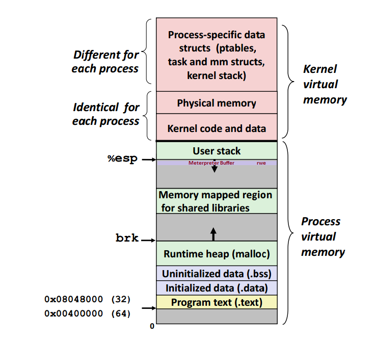

# 深入理解 linux 内核

<!-- TOC -->

- [深入理解 linux 内核](#深入理解-linux-内核)
	- [概念](#概念)
		- [页表](#页表)
		- [虚拟内存分配](#虚拟内存分配)
			- [缺页中断](#缺页中断)
			- [内存结构](#内存结构)
		- [物理内存分配](#物理内存分配)
			- [伙伴系统](#伙伴系统)
			- [slab 缓存](#slab-缓存)
			- [页面交换和页面回收](#页面交换和页面回收)
			- [页类型](#页类型)
			- [对象管理与引用计数](#对象管理与引用计数)
				- [类型](#类型)
				- [引用计数](#引用计数)
		- [进程管理和调度](#进程管理和调度)
			- [state](#state)
			- [namespace](#namespace)
			- [进程 ID](#进程-id)
		- [锁与进程间通信](#锁与进程间通信)
			- [近似的 pre-CPU](#近似的-pre-cpu)
			- [锁竞争与细颗粒度锁](#锁竞争与细颗粒度锁)
			- [SysV 进程间通信](#sysv-进程间通信)
	- [内核调度的不完全抢占](#内核调度的不完全抢占)
		- [禁用/使能可抢占条件的操作](#禁用使能可抢占条件的操作)
		- [什么时候不允许抢占](#什么时候不允许抢占)
			- [内核正在进行中断操作](#内核正在进行中断操作)
			- [内核正在进行中断上下文的 Bottom Half (中断下部分)处理](#内核正在进行中断上下文的-bottom-half-中断下部分处理)
			- [内核的代码段帧持有 spinlock 自旋锁](#内核的代码段帧持有-spinlock-自旋锁)
			- [内核正在执行调度程序 Scheduler](#内核正在执行调度程序-scheduler)
			- [内核正在对每个 CPU "私有"的数据结构操作](#内核正在对每个-cpu-私有的数据结构操作)
		- [临界区](#临界区)
		- [文件系统(filesystem)](#文件系统filesystem)
			- [EXT4](#ext4)
			- [XFS](#xfs)
			- [Brtfs](#brtfs)

<!-- /TOC -->

## 概念

### 页表

(内存的)虚拟地址到物理地址的映射一般由**多级页表**完成

1. 第一级称为全局页目录(PGD). PGD 用于索引进程中的一个数组(每个进程中有且仅有一个 PGD 数组), PGD 项指向另一些项的起始地址, 即中间页目录(PMD)
2. PMD 指向的下级页目录, 称为页表或页目录(PTE)
3. 偏移量 -- 指向页内部的一个字节位置

优: 对未使用的区域不需要建立中间页目录或页表
劣: 每次访问内存都需要逐级访问多个数组才能将虚拟地址转换为物理地址

CPU 优化:

1. MMU
2. 对于地址转换最频繁的那部分地址, 保存到 **地址转换后备缓冲器(TLB)** 的 CPU 高速缓存中

### 虚拟内存分配

#### 缺页中断

```shell
ps -o majflt,minflt -C $program
```

- majflt 代表 major fault
- minflt 代表 minor fault

当某进程发生缺页中断, 进程陷入内核态:
1. 检查要访问的虚拟地址是否合法
2. (通过 MMU)查找/分配一个物理页
3. 填充物理页内容(读取磁盘(如果需要读取磁盘, 那么这次缺页中断就是 majflt), 或者直接置 0, 或者直接略过)
4. 建立映射关系(虚拟地址 -> 物理地址)

进程分配主要有两种方式: brk 和 mmap(不考虑共享内存):
1. brk 是将数据段 (`.data`) 的最高地址指针 `_edata` 往高地址推
2. mmap 是在进程的虚拟地址空间中(堆和栈的文件映射区域)找一块空闲的虚拟内存

这两种方式分配的都是虚拟内存, 没有分配物理内存

#### 内存结构



- 内核态/Kernel virtual memory:
  - 共享部分
    - Physical memory
    - Kernel code and data
  - 非共享部分
    - `task_struct`, `mm_struct`, kernel stack
- 用户态/Process virtual memory:
  - 栈/User stack
  - `%esp`
  - Memory mapped(shared)
  - `brk`
  - Runtime heap(malloc/free)
  - `.bss` 段: 可读写, 未初始化/初始化为 0 的全局变量/静态变量
  - `.data` 段: 可读写, 已初始化的全局变量
  - `.text` 段: 代码段, 只读, 执行代码/只读的常数变量

```shell
size a.out
```

### 物理内存分配

#### 伙伴系统

- 系统中的空闲内存块总是两两分组, 每组中的俩个内存块称为伙伴
- 内核对大小相同的伙伴(1, 2, 4, 8, 16...), 都放置到同一个列表中管理

#### slab 缓存

对于需要比完整帧小的小内存, 则使用一般性缓存 -- slab 缓存

- 对频繁使用的对象, 内核定义了只包含了所需*类型对象实例*的缓存(slab 自动维护与伙伴系统的交互, 在缓存用尽时会请求新的页帧)
- 对通常情况下的小内存块的分配, 内核针对不同大小的对象定义了一组 slab 缓存, 可以通过 kmalloc/kfree 交互
- *slab 缓存*一般作为伙伴系统的下一级缓存

#### 页面交换和页面回收

- 页面交换
  - 将硬盘空间作为扩展内存

- 页面回收
  - 用于将内存映射被修改的内容与底层的块设备同步

#### 页类型

可供分配的页有以下类型:

```c
#define MIGRATE_UNMOVABLE     0 /* 不可移动页: 这类页在内存中有 固定的位置 , 不能移动(内核中 核心分配 的页面大多属于这种页面) */
#define MIGRATE_RECLAIMABLE   1 /* 可回收页: 同样不能移动, 但 可删除 , 其内容页可以从其它地方重新生成(从文件映射的数据页) */
#define MIGRATE_MOVABLE       2 /* 可移动页: 可以 随意移动, 从 slab 页表分配的应用程序页内容属于该类型 */
#define MIGRATE_PCPTYPES      3 /* the number of types on the pcp lists */ /* per_cpu_pageset: 用于表示每 CPU 页框高速缓存的数据结构中链表的迁移类型数目 */
#define MIGRATE_RESERVE       3 /* 前三种列表中都没有可满足分配的页时, 则从该类型分配 */
#define MIGRATE_ISOLATE       4 /* can't allocate from here */ /* 用于跨越 NUMA 节点移动物理内存页 */
#define MIGRATE_TYPES         5 /* 迁移类型的数目 */
```

当一个指定的迁移类型所对应的链表中没有空闲块, 将按照以下定义的顺序到其它迁移类型的链表中寻找

```c
static int fallbacks[MIGRATE_TYPES][MIGRATE_TYPES-1] = {
	[MIGRATE_UNMOVABLE]   = { MIGRATE_RECLAIMABLE, MIGRATE_MOVABLE,   MIGRATE_RESERVE },
	[MIGRATE_RECLAIMABLE] = { MIGRATE_UNMOVABLE,   MIGRATE_MOVABLE,   MIGRATE_RESERVE },
	[MIGRATE_MOVABLE]     = { MIGRATE_RECLAIMABLE, MIGRATE_UNMOVABLE, MIGRATE_RESERVE },
	[MIGRATE_RESERVE]     = { MIGRATE_RESERVE,     MIGRATE_RESERVE,   MIGRATE_RESERVE }, /* Never used */
};
```

#### 对象管理与引用计数

在内核中跟踪/记录/管理 C 的结构实例

部分功能
- 引用计数
- 管理对象链表(集合)
- 集合加锁
- 将对象属性导出到用户空间(通过 sysfs)

```c
struct kobject {
    const char          * k_name;
    struct kref         kref; // 引用技术 -- 方便原子操作
    struct list_head    entry;
    struct kobject      * parent;
    struct kset         * kset; // 类型集合
    struct kobj_type    * ktype; // 详细信息, 析构
    struct sysfs_dirent * sd;
}
```

##### 类型

```c
struct kobj_type {
    struct sysfs_ops * sysfs_ops;
    struct attribute ** default_attrs;
}
```

##### 引用计数

```c
struct kref {
  atomic_t refconunt;
}
```

### 进程管理和调度

```c
struct task_struct {
  volatile long state;  /* -1:不可运行 0:可运行 >0:停止 */
  void          *stack;
  atomic_t      usage;
  unsigned long flags;  /* 进程标志 */
  unsigned long ptrace;
  int           lock_depth;       /* 大内核锁深度 */

  int prio, static_prio, normal_prio;
  struct list_head run_list;
  const struct sched_class *sched_class;
  struct sched_entity se;

  unsigned short ioprio;

  unsigned long policy;
  cpumask_t cpus_allowed;
  unsigned int time_slice;

#if defined(CONFIG_SCHEDSTATS) || defined (CONFIG_TASK_DELAY_ACCT)
  struct sched_info sched_info;
#endif

  struct list_head tasks;

  /*
    ptrace_list/ptrace_children -- ptrace 观测到的当前进程的子进程列表
  */

  struct list_head ptrace_children;

  struct list_head ptrace_list;

  struct mm_struct *mm, *active_mm;

  /* 进程状态 */
  struct linux_binfmt *binfmt;
  long exit_state;
  int exit_code, exit_signal;
  int pdeath_signal; /* 在父进程终止时发送的信号 */

  unsigned int personality;
  unsigned did_exec:1;
  pid_t pid;
  pit_t tpid;

  /*
   * 分别指向(原)父进程, 最年轻的子进程, 年幼的兄弟进程, 年长的兄弟进程(??在哪)
   */
  struct task_struct *real_parent; /* 真正的父进程 -- 调式下 */
  struct task_struct *parent;

  /*
   * children/sibling 链表外加当前调试的进程, 构成了单签进程的所有子进程
   */
  struct list_head children;
  struct list_head sibling;
  struct taks_struct *group_leader;

  /* PID 与 PID 散列表的联系 */
  struct pid_link pids[PIDTYPE_MAX];
  struct list_head thread_group;

  struct completion *vfork_done; /* 用于 vfrok() */
  int __user *set_child_tid; /* CLONE_CHILD_SETTID */
  int __user *clear_child_tid; /* CLONE_CHILD_CLEARTID */

  unsigned long rt_priority;
  cputime_t utime, stime, utimescaled, stimescaled;
  unsigned long nvcsw, nivcsw;
  struct timespec start_time;
  struct timespec real_start_time;

  /* 内存管理器失效和页交换信息(有争议)
   * 既可以看作是特定于 内存管理器 的,
   * 也可以看作特定于 线程 的
   */
  unsigned long min_flt, maj_flt;

  cputime_t it_prof_expires, it_virt_expires;
  unsigned long long it_sched_expires;
  struct list_head cpu_times[3];

  /* 进程身份凭据 */
  uid_t uid, euid, suid, fsuid;
  gid_t gid, egid, sgid, fsgid;
  struct group_info *group_info;
  kernel_cap_t cap_effective, cap_inheritable, cap_permitted;

  unsigned keep_capabilities:1;
  struct user_struct *user;

  /* 删除路径后的 可执行文件名称
   * 用 [gs]et_task_comm 访问 (用 task_lock() 锁定)
   * 用 flush_old_exec 初始化
   */
  char comm[TASK_COMM_LEN];

  /* 文件系统信息 */
  int link_count, total_link_count;
  /* ipc 相关 */
  struct sysv_sem, sysvsem;
  /* 当前进程特定于 CPU 的状态信息 */
  struct thread_struct thread;
  /* 文件系统信息 */
  struct fs_struct *fs;
  /* 命名空间 */
  struct nsproxy *nsproxy;
  /* 信号处理程序 */
  struct signal_struct *signal;
  struct sighand_struct *sighand;

  sigset_t blocked, real_blocked;
  sigset_t saved_sigmask; /* 用 TIF_RESTORE_SIGMASK 恢复 */
  struct sigpending pending;

  unsigned long sas_ss_sp;
  size_t sas_ss_size;
  int (*notifier)(void *priv);
  void *notifier_data;
  sigset_t *notifier_mask;

#ifdef CONFIG_SECURITY
  void *security;
#endif

  /* 线程组跟踪 */
  u32 parent_exec_id;
  u32 self_exec_id;

  /* 日志文件系统信息 */
  void journal_info;

  /* 虚拟内存状态 */
  struct reclaim_state *reclaim_state;

  struct backing_dev_info *backing_dev_info;

  struct io_context *io_context;

  unsigned long ptrace_message;
  siginfo_t *last_siginfo; /* 由 ptrace 使用 */
}
```

#### state

- TASK_RUNNING
- TASK_INTERRUPTIBLE
- TASK_UNINTERUPTIBLE
- TASK_STOPPED
- TASK_TRACED

以下常量对 state 和 exit_state 字段都有效

- EXIT_ZOMBIE
- EXIT_DEAD

#### namespace

#### 进程 ID

1. 进程 ID
  1. 线程组 -- TGID
  2. 进程组 -- PGID
  3. 会话 -- SID

### 锁与进程间通信

#### 近似的 pre-CPU

通过 **链式结构** 把多 CPU 的操作分散, 但是导致值的中间态很可能是 **不准确** 的

#### 锁竞争与细颗粒度锁

锁的目的:
- 防止对代码的并发访问
- 对性能的影响必须尽可能的小

较细颗粒度的锁的问题:
- 获取多个锁会增加操作的开销, 很自然会出现一个操作需要同时访问数个受保护的区域, 即安全的锁**获取/释放**顺序

#### SysV 进程间通信

```c
struct kern_ipc_perm {
  int id;
  key_t key; // 标识用的魔数
  uid_t uid;
  gid_t gid;
  uid_t cuid;
  gid_t cgid;
  mode_t mode; // 访问权限 掩码
  unsigned long seq; // 分配 IPC 对象
}
```

## 内核调度的不完全抢占

### 禁用/使能可抢占条件的操作

对 **preempt_count** 操作

```C
add_preempt_count
sub_preempt_count
inc_preempt_count
dec_preempt_count
```

- 使能: preempt_enable
- 禁能: preempt_disable

### 什么时候不允许抢占

- **preempt_count()** 获取 preempt_count 的值
- **preemptible()** 判断内核是否可抢占

#### 内核正在进行中断操作

_中断_ 只能被其他(优先级更高的) _中断_ 中止/抢占, _进程_ **不允许**中止/抢占 _中断_

*进程调度函数 schedule() 会对此作出判断, 如果是在中断中调用, 会打印出错信息*

#### 内核正在进行中断上下文的 Bottom Half (中断下部分)处理

硬件中断返回前会执行 **软中断**, 此时仍然处于中断上下文

#### 内核的代码段帧持有 spinlock 自旋锁

- 内核中的锁是为了在 SMP 系统中短时间内保证不同 CPU 上运行的程序并发执行的正确性
- 当持有这些锁时, 内核不能被抢占

#### 内核正在执行调度程序 Scheduler

抢占的目地就是为了进行调度

#### 内核正在对每个 CPU "私有"的数据结构操作

在 SMP 中, 对于 per-CPU 数据结构未使用 spinlock 保护, 因为这些数据结构隐含的被 CPU 自身保护
若允许抢占, 可能导致 per-CPU 数据调度到其他 CPU 上

### 临界区

处于**内核**临界区的程序不能被调度
处于**用户**临界区的程序是可以的

### 文件系统(filesystem)

#### EXT4

#### XFS

#### Brtfs
