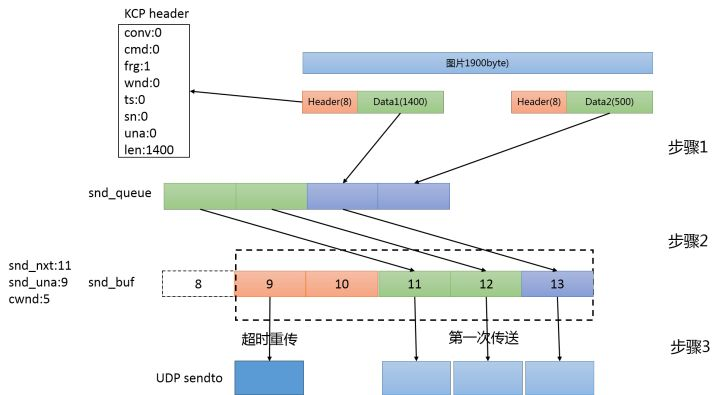
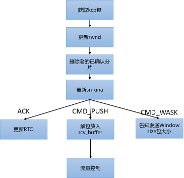
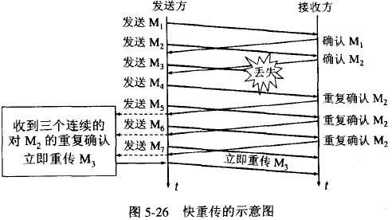

# KCP

## 知识

- `MTU`: 最大传输单元
- `RTO`: Retransmission Timeout, 重传超时时间
- `cwnd`: Congestion Windows, 拥塞窗口, 表示发送方可发送多少个 KCP 数据包
  - 接收方窗口相关
  - 网络状况(拥塞控制)相关
  - 与发送窗口相关
- `rwnd`: Receiver Windows, 接收方窗口大小, 表示接收方还可以接收多少个 KCP 数据包
- `snd_queue`: 待发送 KCP 数据包队列
- `snd_nxt`: 下一个即将发送的 KCP 数据包序列号
- `snd_una`: 下一个待确认的序列号

## API

ikcp_nodelay(ikcpcb *kcp, int nodelay, int interval, int resend, int nc)

- `nodelay`: 是否启用 nodelay 模式 -- 0-不启用, 1-启用
- `interval`: 协议内部工作的 interval, 单位毫秒, 比如 10ms 或者 20ms
- `resend`: 快速重传模式 -- 0/关闭(默认), 建议设置 2 (2 次 ACK 跨越将会直接重传)
- `nc`: 是否关闭流控, 默认是 0 代表不关闭, 1 代表关闭

建议:
- 普通模式: ikcp_nodelay(kcp, 0, 40, 0, 0)
- 急速模式: ikcp_nodelay(kcp, 1, 10, 2, 1)

## KCP 原理

|0|conv|4 |cmd|5|frg|6|wnd|8|ts|12|sn|16|una|20|len|24|DATA(optional) |

- `conv`: 连接号 -- 代替 TCP 的连接
- `cmd`: 命令字 -- `IKCP_CMD_ACK` 确认命令, `IKCP_CMD_WASK` 接收窗口大小询问命令, `IKCP_CMD_WINS` 接收窗口大小告知命令
- `frg`: 分片 -- 用户数据的分片
- `wnd`: 接收窗口大小 -- 发送方发送窗口 <= 接收方接收窗口
- `ts`: 时间序列
- `sn`: 序列号
- `una`: 下一个可接收的序列号 -- `(sn+1)`
- `len`: 数据长度
- `data`: 用户数据

### MTU 关键

MTU: 数据链路层规定的每一帧的最大长度, 超过该长度, 数据会被分片
MSS: 最大输出大小 -- KCP 数据的大小 MTU-KCP(24bytes); IP 数据包越短, 路由转发越快, 但是资源利用率越低

以太网的 MTU 通常为 1500 字节-IP(20bytes 固定+40bytes 可选) - UDP(8bytes) = 1472

### KCP 发送步骤:
- 把 `snd_queue` 待发送队列中的 KCP 包, 移到 `snd_buf` 发送队列, 且包数量不超过 (`snd_una`+`cwnd`-`snd_nxt`), 确保发送的数据不会导致 **接收方的接收队列溢出**
  - cwnd = min(snd_wnd, rmt_wnd, kcp->cwnd): `kcp->cwnd` 与网络质量有关, 当网络状况差, kcp 认为应当降低发送的数据
- 发送发送数组的数据
  - 发送队列中包括两种类型的数据: 已发送但是尚未被确认/没被发送的数据
  - 对于已发送但未被接收方确认的数据, KCP 由三种策略来确定
    - 超时重传
      - KCP 在 *快速模式* 下每次+RTO, 急速模式下 +0.5*RTO
    - 快速重传: 发送端发送 1,2,3,4,5; 收到远端的 ACK: 1,3,4,5, 在收到 3 时知道 2 被跳过 1 次, 在收到 4 时知道被跳过 2 次, 则直接重传 2 号包
    - 选择重传: 选择性重传, 只重传实际丢失的数据包
- 数据发送

### KCP 接收过程

1. IKCP_CMD_PUSH 数据发送命令

- `kcp_input` 输入 UDP 收到的数据包, KCP 包对前面的 24 个字节解压, 包括 conv/frg/cmd/wnd/ts/sn/una/len; 然后
  - 根据 una, 删除 una 之前的 KCP 数据包
  - 根据 wnd 更新接收窗口的大小
- 接收到的数据首先被放置到 `rcv_buf` 队列, 对其接收窗口之外和重复的包; 再将 rcv_buf 中的包, 移至 `rcv_queue`
  - 从结果看: **`rcv_queue` 中的数据时连续的, `rcv_buf` 中的数据可能时间隔的**

- IKCP_CMD_ACK 数据确认包 (TODO)
1. RTO 更新
2. 确认发送包接收方已收到

### 流量控制与拥塞控制

- RTT: 一个报文段发送出去, 到收到对应确认包的时间差
- SRTT(kcp->rx_srtt): RTT 的一个加权 RTT 平均/平滑值
- RTTVAR(kcp->rx_rttval): RTT 的平均偏差, 用来衡量 RTT 的抖动

## TCP 的拥塞控制

### 慢开始 -- 低起始, 指数增长

用于探测网络拥塞状况

每次发送 MSS(最大报文数) * n(次数) , 逐步增大发送方的窗口

### 拥塞避免 -- ssthresh , 线性增长

让拥塞窗口 cwnd 缓慢地增大, 即每经过一个往返时间 RTT 就把发送方的拥塞窗口 cwnd 加 1, 而不是加倍; 这样拥塞窗口 cwnd 按线性规律缓慢增长, 比慢开始算法的拥塞窗口增长速率缓慢得多

ssthresh: 慢开始门限

### 快重传 -- 3 次后立即重传

1. 发送方接受到 **3 次重复确认** 后, 立即重传丢失的帧, 而不需要等待重传计时器
2. 乘法减小, 使得 慢开始门限 ssthresh 减半

### 快恢复 -- ssthresh 的一半, 线性增长

TCP Reno

- 在采用快恢复算法时, 慢开始算法只是在 TCP 连接建立时和网络出现超时时才使用
- 接收方根据自己的接收能力设定了接收窗口(通知窗口) rwnd, 并把这个窗口值写入 TCP 首部中的窗口字段, 传送给发送方; ; 因此, 从接收方对发送方的流量控制的角度考虑, 发送方的发送窗口 cwnd 一定不能超过对方给出的接收窗口 rwnd
- 发送方窗口的上限值 = $Min [ rwnd, cwnd ]$
  - 当 rwnd < cwnd 时, 是接收方的接收能力限制发送方窗口的最大值
  - 当 cwnd < rwnd 时, 则是网络的拥塞限制发送方窗口的最大值
